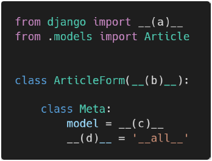

1. 각 문항을 읽고 맞으면 T, 틀리면 F 를 작성하시오
   1.
   ModelForm 을 사용할 때 Meta 클래스 내부에 model 과 fields 변수는
   반드시 작성해야 한다

   ->` T`

   2.
   ModelForm 을 사용할 때는 렌더링 되는 input element 속성은 Django 에서
   제공 해주는 대로만 사용해야 한다

   -> `F` widget 을 사용해서 커스텀 가능

   ex. input 태그에 class, placeholder, required, maxlength
   
   3.
   화면에 나타나는 각 element 위치는 html 에서 form.as_p() 를 사용하지 않아도
   직접 위치시킬 수 있다

   -> `T` widget 속성 활용..?
   
   ex. form.title , form.content 등 각 필드들 수동으로 직접 불러와서 사용하는 방법
   
   view에서 넘겨받으느 form을 DTL로 for문을 사용하여 각 요소들을 직접 위치 시킬 수 도 있었다
   
2. 다음 빈칸 (a) ~ (d) 에 적합한 코드를 작성하시오

   

(a) - forms

(b) - forms.ModelForm

(c) - Article

(d) - fields 또는 exclude 사용 가능