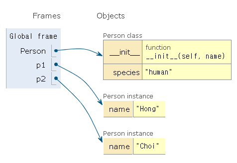
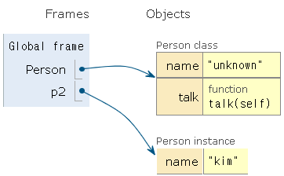

# 객체(Object)

> Python에서 **모든 것은 객체(object)**입니다.
>
> 모든 객체는 **타입(type), 속성(attribute), 조작법(method)**을 가집니다.


객체(Object)의 특징

- **타입(type)**: 어떤 연산자(operator)와 조작(method)이 가능한가? 
- **속성(attribute)**: 어떤 상태(데이터)를 가지는가?
- **조작법(method)**: 어떤 행위(함수)를 할 수 있는가?


### 기본 문법

```python
# 클래스 정의 #클래스는 공통된 속성(attribute)과 조작법(method)을 가진 객체들의 분류
class MyClass:
    pass

# 인스턴스 생성
# 특정 클래스(class)의 실제 데이터 예시(instance)입니다. 
# 파이썬에서 모든 것은 객체이고, **모든 객체는 특정 클래스의 인스턴스**
my_instance = MyClass()

# 속성 접근 #속성(attribute)은 객체(object)의 상태/데이터를 뜻합니다.
my_instance.my_attribute

# 메서드 호출 #메서드는 특정 객체가 할 수 있는 행위(behavior)
my_instance.my_method()
```


## 인스턴스 변수
* 인스턴스의 속성(attribute)
* 각 인스턴스들의 고유한 데이터
* 생성자 메서드에서 `self.변수명`로 정의(생성자 메서드는 뒤에 학습합니다.)
* 인스턴스가 생성된 이후 `인스턴스.변수명`로 접근 및 할당
  

```python
class Person:
    pass

p1 = Person() #인스턴스 생성하여 p1에 저장
p1.name = 'jack'# #p1의 인스턴스 변수 name에 이름을 설정
```


## 인스턴스 메서드

> 메서드란?
> - 특정 데이터 타입(또는 클래스)의 객체에 공통적으로 적용 가능한 행위(behavior)들을 의미합니다.

* 인스턴스 메서드는 인스턴스가 사용할 메서드에 해당합니다.
* 클래스 내부에 정의되는 메서드는 기본적으로 인스턴스 메서드로 생성됩니다.
* **메서드 호출시, 첫번째 인자로 인스턴스 자기자신에 해당하는 `self`가 전달됩니다**

```python
class MyClass:
    def instance_method(self, arg1, arg2, ...):
        ...

my_instance = MyClass()
# 인스턴스 생성 후 메서드를 호출하면 자동으로 첫 번째 인자로 인스턴스(my_instance)가 들어갑니다.
my_instance.instance_method(.., ..)  
```


##  `self` 

> 인스턴스 자신(self)

* Python에서 인스턴스 메서드는 **호출 시 첫번째 인자로 인스턴스 자신이 전달**되게 설계되었습니다. 


* 보통 매개변수명으로 `self`를 첫번째 인자로 정의


### 생성자(constructor) 메서드
- 인스턴스 객체가 생성될 때 자동으로 호출되는 함수입니다.
- 반드시 `__init__` 이라는 이름으로 정의합니다.

**활용법**

```python
class MyClass:
    def __init__(self):
        print('생성될 때 자동으로 호출되는 메서드입니다.')
```

- 생성자를 활용하면 인스턴스가 생성될 때 인스턴스의 속성을 정의할 수 있습니다.


### 소멸자(destructor) 메서드
- 인스턴스 객체가 소멸(파괴)되기 직전에 자동으로 호출되는 함수입니다.
- 반드시 `__del__` 이라는 이름으로 정의합니다.

**활용법**

```python
# 소멸자 정의
def __del__(self):
    print('소멸될 때 자동으로 호출되는 메서드입니다.')
    
# 소멸자 활용
del 인스턴스

```


## 속성(Attribute) 정의

- 특정 데이터 타입(또는 클래스)의 객체들이 가지게 될 상태/데이터를 의미합니다.

- `self.<속성명> = <값>` 혹은 `<인스턴스>.<속성명> = <값>`으로 설정합니다

- ---
  **활용법**

  ```python
  class Person:
      def __init__(self, name):
          self.name = name
          
      def talk(self):
          print(f'안녕, 나는 {self.name}')
  ```


## 매직(스페셜) 메서드
- 더블언더스코어(`__`)가 있는 메서드는 특별한 일을 하기 위해 만들어진 메서드이기 때문에 `스페셜 메서드` 혹은 `매직 메서드`라고 불립니다.
- 매직(스페셜) 메서드 형태: `__someting__`
```python
 '__str__(self)',
 '__len__(self)',
 '__repr__(self)',
 '__lt__(self, other)', #less than
 '__le__(self, other)', #little or equal
 '__eq__(self, other)', #equal
 '__ne__(self, other)', #not equal
 '__gt__(self, other)', #greater than
 '__ge__(self, other)', #greater or equl
```

### `__str__(self)` 

```python
class Person:
    def __str__(self):
        return '객체 출력(print)시 보여줄 내용'
```

- 특정 객체를 출력(`print()`) 할 때 보여줄 내용을 정의할 수 있습니다.


```python
#활용법
class Person:
    def __init__(self,name,age):
        self.name = name
        self.age = age
    def __gt__(self,other):
        return self.age > other.age
    def __eq__(self,other):
        return self.age == other.age
p1 = Person('1', 1)
p2 = Person('2', 2)
p3 = Person('3', 1)

print(p1 > p2)
print(p1 == p3)
print(p1 == p2)
###실행시
False
True
False
```


# 클래스 (class)

> `class`: 객체들의 분류(class)를 정의할 때 쓰이는 키워드

## 클래스(Class) 생성

* 클래스 생성은 `class` 키워드와 정의하고자 하는 `<클래스의 이름>`으로 가능합니다.

* `<클래스의 이름>`은 `PascalCase`로 정의합니다.

* 클래스 내부에는 데이터와 함수를 정의할 수 있고, 이때 데이터는 **속성(attribute)** 정의된 함수는 **메서드(method)**로 부릅니다.

---

**활용법**

```python
class <클래스이름>:
    <statement>
```

```python
class ClassName:
    statement
```


## 클래스 변수
* 클래스의 속성(attribute)
* 모든 인스턴스가 공유
* 클래스 선언 내부에서 정의
* `클래스.변수명`으로 접근 및 할당

---

**활용법**

```python
class Circle:
    pi = 3.14
    
print(Circle.pi)
```


## 클래스 메서드(class method)
* 클래스가 사용할 메서드에 해당합니다.
* `@classmethod` 데코레이터를 사용하여 정의합니다.
* **메서드 호출시, 첫 번째 인자로 클래스 `cls`가 전달됩니다**

---

**활용법**

```python
class MyClass:
    @classmethod
    def class_method(cls, arg1, arg2, ...):
        ...

# 자동으로 첫 번째 인자로 클래스(MyClass)가 들어갑니다.
MyClass.class_method(.., ..)  
```

## 스태틱 메서드(static method)
* 클래스가 사용할 메서드에 해당합니다.
* 인스턴스와 클래스의 속성과 무관한 메서드입니다.
* `@staticmethod` 데코레이터를 사용하여 정의합니다.
* **호출시, 어떠한 인자도 전달되지 않습니다**
* 속성을 다루지 않고 단지 기능(행동)만을 하는 메서드를 정의할 때 사용합니다.


---

**활용법**

```python
class MyClass:
    @staticmethod
    def static_method(arg1, arg2, ...):
        ...

MyClass.static_method(.., ..)
```


## 인스턴스와 클래스 간의 이름 공간 (namespace)

* 클래스를 정의하면 클래스와 해당하는 이름 공간이 생성됩니다.
* 인스턴스를 만들면 인스턴스 객체가 생성되고 이름 공간이 생성됩니다.
* 인스턴스에서 특정 속성에 접근하면, 인스턴스-클래스 순으로 탐색합니다.

```python
#예씨1
class Person:
    species = 'human'
    
    def __init__(self, name):
        self.name = name 
        
p1 = Person('Hong')
p2 = Person('Choi')
```



클래스를 위한 이름 공간 그리고 인스턴스별로 이름 공간이 따로 구성

```python
#예시2
class Person:
    name = 'unknown'
    def talk(self):
        print(self.name)
        
p1 = Person()
p1.talk()
p2 = Person()
p2.talk()
p2.name = 'kim'
p2.talk()
####실행시
unknown
unknown
kim
```



Person 클래스의 값이 Kim으로 변경된 것이 아니므로 p2 인스턴스의 이름 공간에 name이 Kim으로 저장됩니다.


`비교정리`

### 인스턴스와 메서드
- 인스턴스는 3가지 메서드(인스턴스, 클래스, 정적 메서드) 모두에 접근할 수 있습니다.
    - 인스턴스에서 클래스 메서드와 스태틱 메서드는 호출하지 않습니다. (가능하다 != 사용한다)
- 인스턴스가 할 행동은 모두 인스턴스 메서드로 한정 지어서 설계합니다.


### 클래스와 메서드
- 클래스는 3가지 메서드(인스턴스, 클래스, 정적 메서드) 모두에 접근할 수 있습니다.
    - 클래스에서 인스턴스 메서드는 호출하지 않습니다. (가능하다 != 사용한다)
- 클래스가 할 행동은 다음 원칙에 따라 설계합니다. (클래스 메서드와 정적 메서드)
    - 클래스 자체(`cls`)와 그 속성에 접근할 필요가 있다면 **클래스 메서드**로 정의합니다.
    - 클래스와 클래스 속성에 접근할 필요가 없다면 **정적 메서드**로 정의합니다.
        - 정적 메서드는 `cls`, `self`와 같이 묵시적인 첫번째 인자를 받지 않기 때문입니다.


# OOP의 핵심 개념

- 추상화 (Abstraction)
- 상속 (Inheritance)
- 다형성 (Polymorphism)
- 캡슐화 (Encapsulation)

## 추상화(Abstraction)란?

- 객체 지향 프로그래밍에서의 추상화는 세부적인 내용은 감추고 필수적인 부분만 표현하는 것을 뜻합니다.
- 현실 세계를 프로그램 설계에 반영하기 위해 사용됩니다.
- 여러 클래스가 공통적으로 사용할 속성 및 메서드를 추출하여 기본 클래스로 작성하여 활용합니다.


## 상속(Inheritance)이란?


클래스에서 가장 큰 특징은 `상속`이 가능하다는 것입니다. 

부모 클래스의 모든 속성이 자식 클래스에게 상속 되므로 코드 재사용성이 높아집니다.

---

**활용법**


```python
class ChildClass(ParentClass):
    <code block>
```


### `super()`

* 자식 클래스에 메서드를 추가로 구현할 수 있습니다.

* 부모 클래스의 내용을 사용하고자 할 때, `super()`를 사용할 수 있습니다.

---

**활용법**


```python
class ChildClass(ParentClass):
    def method(self, arg):
        super().method(arg) 
```

```python
#예시
class Person:
    def __init__(self,name,age,number,email):
        self.name = name
        self.age = age
        self.number = number
        self.email = email
    def greeting(self):
        print(f'안녕, {self.name}')
        
class Student(Person):
    def __init__(self,name,age,number,email,student_id):
        super().__init__(name,age,number,email)
        self.student_id = student_id
```

## 캡슐화(Encapsulation)란?

- 객체의 일부 구현 내용에 대해 외부로부터의 직접적인 액세스를 차단하는 것을 말합니다.
  - 예시: 주민등록번호
  
- 다른 언어와 달리 파이썬에서 캡슐화는 암묵적으로는 존재하지만, 언어적으로는 존재하지 않습니다.

### Protected Member

- 언더바 1개로 시작하는 메서드나 속성들이 이에 해당합니다.
- 암묵적 규칙에 의해 부모 클래스 내부와 자식 클래스에서만 호출 가능합니다.
- 하위 클래스에서 메서드 오버라이딩을 허용합니다.

`활용예시`

```python
# 실제 나이(age)에 해당하는 값을 언더바 한 개를 붙여서 Protected Member로 지정하였습니다.
class Person:
    def __init__(self,name,age):
        self.name = name
        self._age = age
    def get_age(self) :
        return self._age
# 인스턴스를 만들고 get_age 메서드를 활용하여 호출할 수 있습니다.
p1 = Person('김누리',30)
p1.get_age() #===> 30
# _age에 직접 접근하여도 확인이 가능합니다.
# 파이썬에서는 암묵적으로 활용됩니다.
print(p1.get_age()) #===> 30
```

### Private Member

- 언더바 2개로 시작하는 메서드나 속성들이 이에 해당합니다.
- 본 클래스 내부에서만 사용이 가능합니다.
- 하위 클래스 상속 및 호출이 불가능합니다.
- 외부 호출이 불가능합니다.

`활용예시`

```python
# Person 클래스를 다시 재정의해봅시다.
# 실제 나이(age)에 해당하는 값을 언더바 두 개를 붙여서 Private Member로 지정하였습니다.
class Person:
    def __init__(self, name, age):
        self.name = name
        self.__age = age
    def get_age(self): 
        return self.__age
# 인스턴스를 만들고 get_age 메서드를 활용하여 호출할 수 있습니다.
# 실행시켜 확인해봅시다.
p1 = Person('김싸피', 30)
p1.get_age() # ===> 30
# __age에 직접 접근이 불가능합니다.
p1.__age #===>AttributeError

```

### `getter` 메서드와 `setter` 메서드

변수에 접근할 수 있는 메서드를 별도로 생성할 수 있습니다.

- `getter` 메서드: 변수의 값을 읽는 메서드입니다.
  - `@property` 데코레이터를 사용합니다.
- `setter` 메서드: 변수의 값을 설정하는 성격의 메서드입니다.
  - `@변수.setter`를 사용합니다.

`활용예시`

```python
class Person:
    
    def __init__(self, age):
        self._age = age 
        
    @property
    def age(self):
        return self._age
    
    @age.setter
    def age(self, new_age):
        if new_age <= 19:
            raise ValueError('Too Young For SSAFY')
            return
        
        self._age = new_age
# Person의 인스턴스를 만들어서 나이에 접근하면 정상적으로 출력됩니다.
p1 = Person(20)
p1.age #20
# p1 인스턴스의 나이를 다른 값으로 바꿔도 정상적으로 반영됩니다.
p1.age = 33
print(p1.age) #33
# setter 함수에는 "나이가 19살 이하면 안된다는" 조건문이 하나 작성되어 있습니다.
# 따라서 나이를 19살 이하인 값으로 변경하게 되면 오류가 발생합니다.
p1.age = 19
print(p1.age) #==> ValueError: Too Young For SSAFY
```

### 다중 상속
* 두개 이상의 클래스를 상속받는 경우, 다중 상속이 됩니다.
    * 상속 받은 모든 클래스의 요소를 활용 가능
    * 중복된 속성이나 메서드가 있는 경우 상속 순서에 의해 결정

`활용예시`

```python

class Person:
    def __init__(self, name):
        self.name = name
class Mom(Person):
    gene = 'XX'
    
    def swim(self):
        return '엄마가 수영'
class Dad(Person):
    gene = 'XY'

    def walk(self):
        return '아빠가 걷기'
class FirstChild(Dad,Mom):
    def swim(self):
        return '첫째가 수영'
    def cry(self):
        return '첫째가 응애'
##실행시
baby1=FirstChild('김누리')
baby1.cry() #'첫째가 응애'
baby1.swim() #'첫째가 수영'
baby1.walk() #'아빠가 걷기'
baby1.gene #'XY' ==> 상속 순서가 먼저 이기 때문이다.
```

### 상속관계에서의 이름 공간과 MRO (Method Resolution Order)

- 기존의 `인스턴스 -> 클래스` 순으로 이름 공간을 탐색해나가는 과정에서 상속관계에 있으면 아래와 같이 확장됩니다.
    * 인스턴스 -> 자식 클래스 -> 부모 클래스
    
- MRO는 해당 인스턴스의 클래스가 어떤 부모 클래스를 가지는지 확인하는 속성 또는 메서드입니다.

---

**활용법**


```python
ClassName.__mro__

# 또는
ClassName.mro()
```
