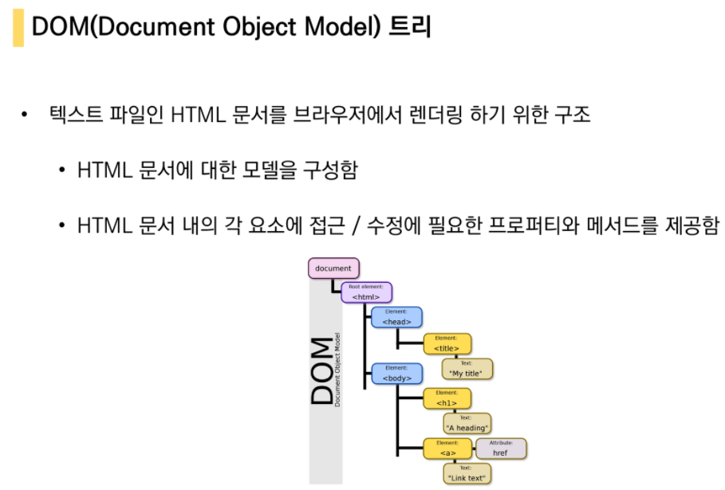
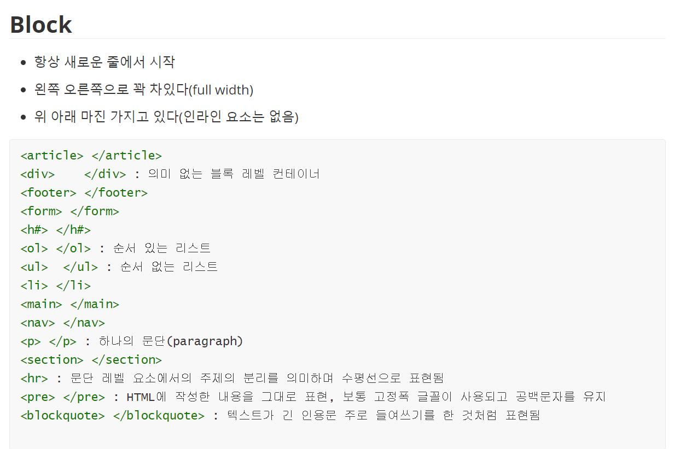
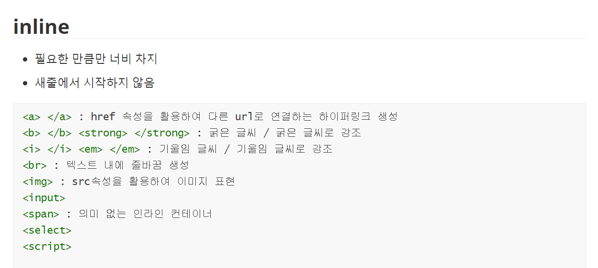

# HTML

### 웹 페이지를 작성 구조화 하기 위한 언어


### - DOM 트리 구조




### - HTML 기본 구조


- head 예시

  

```html
#head 예시
<head>
  <title>HTML 수업</title>
  <meta charset="UTF-8">
  <link href="style.css" rel="stylesheet">
  <script src="javascript.js"></script>
  <style>
      p {
          color: black;
      }
  </style>
</head>
```

### - 요소

- 내용과 태그로 구성

```html
<h1>contents</h1>
```

- 내용이 없는 태그(self-closed)

  br, hr, img, input, link, meta


### - 속성

- 속성명 = "속성값"

```html
<a href="https://google.com"></a>
```

- HTML Global Attribute


```html
<!DOCTYPE html>
<html lang="en">
<head>
  <meta charset="UTF-8">
  <title>Hello, HTML</title>
</head>
<body>
  <!-- 이것은 주석입니다. -->
  <h1>나의 첫번째 HTML</h1>
  <p>이것은 본문입니다.</p>
  <span>이것은 인라인 요소</span>
  <a href="https://www.naver.com">네이버로 이동!!</a>
</body>
</html>
```


### - 시멘틱 태그


```html
#시멘틱 태그 활용 예시
<header>
  <nav></nav>
</header>
<section>
  <article></article>
  <article></article>
</section>
<footer></footer>
```


### - HTML 문서 구조화

- 텍스트 요소


- 그룹 컨텐츠

  

- table

```html
<body>
    <table>
      <thead>
        <tr>
          <th>ID</th>
          <th>Name</th>
          <th>Major</th>
        </tr>
      </thead>
      <tbody>
        <tr>
          <td>1</td>
          <td>홍길동</td>
          <td>Computer Science</td>
        </tr>
        <tr>
          <td>2</td>
          <td>김철수</td>
          <td>Business</td>
        </tr>
      </tbody>
      <tfoot>
        <tr>
          <td>총계</td>
          <td colspan = "2">2명</td>
        </tr>
      </tfoot>
      <caption>1반 학생 명단</caption>
    </table>
</body>
```


### - form

 

```html
<form action="/search" method = "GET">
    
</form>
```


### - input


```html
<form action="/search" method="GET">
  <input type="text" name="q">
</form>
```

- 활용예시

```html
<body>
  <h1>Form 활용 실습</h1>
  <form action="">
    <!--autofocus 및 label확인-->
    <div class="input-group"
      <label for="username">아이디</label>
      <input type="text" name="usermane" id="username" autofocus>
  </div>
  <!--disabled 및 value확인-->
  <div class="input-group">
    <label for="name">이름</label>
    <input type="text" name="name" value="홍길동" id="name" disabled>

  </div>
  <!--label 확인-->
  <div class="input-group">
    <label for="agreement">개인정보 수집에 동의합니다.</label>
    <input type="checkbox" name="agreement" id="agreement">
  </div>
  <div class="input-group">
    <label>최종제출을 확인합니다.</label>
    <input type="checkbox"
  </div>
  <input type="submit" value="제출"
  </form>
</body>
```


- input 요소 활용 예시

```html

    <!-- 일반 입력 -->
    <div>
      <p>text</p>
      <input type="text" name="q" autofocus><!--input 태그에 적어놓은 name과 value에 따라서 form 태그의 action이 실행된다-->
      <hr>
    </div>
    
    <div>
      <p>password</p>
      <input type="password">
      <hr>
    </div>

    <div>
      <p>email</p>
      <input type="email">
      <hr>
    </div>

    <div>
      <p>number</p>
      <input type="number" min="3" max="10" >
      <hr>
    </div>

    <div>
      <p>file</p>
      <input type="file">
      <hr>
    </div>
    
    <!-- 항목 중 선택 -->
    <!-- check box -->
    <div>
      <p>checkbox</p>
      <input id="html" type="checkbox" name="language" value="html">
      <label for="html">HTML</label>
      <input id="python" type="checkbox" name="language" value="python">
      <label for="python">파이썬</label>
      <input id="java" type="checkbox" name="language" value="java">
      <label for="java">자바</label>
      <hr>
    </div>

    <!-- radio button -->
     <div>
      <p>radio button</p>
      <input id="happy" type="radio" name="mood" value="happy">
      <label for="happy">행복</label>
      <input id="sadness" type="radio" name="mood" value="sadness">
      <label for="sadness">슬픔</label>
      <input id="neutral" type="radio" name="mood" value="neutral">
      <label for="neutral">중립</label>
      <hr>
    </div> 

    <!-- 기타 -->
    color 
     <div>
      <p>color</p>
      <input type="color">
      <hr>
    </div> 

    date 
    <div>
      <p>date</p>
      <input type="date">
      <hr>
    </div> -->

    <!-- hidden -->
    <div>
      <p>hidden</p>
      <input type="hidden">
      <hr>
    </div> 
```


# CSS

## CSS 구문

### - 기초문법


### - CSS 정의 방법

- 인라인
- 내부참조 - <style>
- 외부 참조- 분리된 CSS 파일


### - 선택자

- 선택자 유형

  


- 선택자 예제

  ```html
  <!DOCTYPE html>
  <html lang="en">
  <head>
    <meta charset="UTF-8">
    <meta name="viewport" content="width=device-width, initial-scale=1.0">
    <title>Document</title>
    <style>
      /* 전체 선택자 */
      * {
        color: red;
      }
  
      /* 요소 선택자 */
      h2 {
        color: orange;
      }
  
      h3, 
      h4 {
        font-size: 10px;
      }
  
      /* 클래스 선택자 */
      .green {
        color: green;
      }
  
      /* id 선택자 */
      #purple {
        color: purple;
      }
  
      /* 자식 결합자 */
      .box > p {
        font-size: 30px;
      }
  
      /* 자손 결합자 */
      .box p {
        color: blue;
      }
    </style>
  </head>
  <body>
    <h1 class="green">SSAFY</h1>
    <h2>선택자 연습</h2>
    <div class="green box">
      <p>box contents</p>
      <div>
        <p>지역 목록</p>
        <ul>
          <li>서울</li>
          <li id="purple">인천</li> <!--단일 id 사용 권장-->
          <li>강원</li>
          <li>경기</li>
        </ul>
      </div>
      <p>Lorem ipsum dolor sit amet consectetur adipisicing elit. Quia laboriosam, sit hic tempore ducimus debitis! Consequuntur dolor provident, molestiae sit beatae eius rerum, dolorem ex ab quibusdam nulla temporibus minus.</p>
    </div>
    <h3>HELLO</h3>
    <h4>CSS</h4>
  </body>
  </html>
  ```


### -CSS 적용 우선순위


```html
<head>
  <meta charset="UTF-8">
  <meta name="viewport" content="width=device-width, initial-scale=1.0">
  <title>Document</title>
  <style>
    h2 {
      color: darkviolet !important;
    }

    p {
      color: orange;
    }
    
    .blue {
      color: blue;
    }

    .green {
      color: green;
    }

    #red {
      color: red;
    }
  </style>
</head>
<body>
  <p>1</p>
  <p class="blue">2</p> 
  <p class="blue green">3</p>
  <p class="green blue">4</p>
  <p id="red" class="blue">5</p>
  <h2 id="red" class="blue">6</h2>
  <p id="red" class="blue" style="color: yellow;">7</p>
  <h2 id="red" class="blue" style="color: yellow;">8</h2>
</body>
```


### -CSS 상속


### -CSS 기본 스타일

```html
<!DOCTYPE html>
<html lang="en">
<head>
  <meta charset="UTF-8">
  <meta name="viewport" content="width=device-width, initial-scale=1.0">
  <title>Document</title>
  <style>
    .em {
      font-size: 1.5em;
    }

    .rem {
      font-size: 1.5rem;
    }
    .box{
      width : 50vw; /* 디바이스 화면을 기준으로 상대적인 사이즈 결정*/
      height: 100px;
      background-color: rgba(255, 166, 0, 0.795);
    }
    .parent{
      width : 100%;
      height : 300px;
      background-color: gray;
    }
    .child{
      width : 50%;
      height: 100px;
      background-color: blue;
    }
  </style>
</head>
<body>
  <div class="parent">
  <div class="box">
    vw체크
  </div>

  <hr>
  <div class="child">
    %체크
   </div> 
  <ul class="em">
    <li class="em">1.5em</li> <!--16*1.5*1.5 = 36px, 바로 위/부모 요소에 대한 상속의 영향을 받음-->
    <li class="rem">1.5rem</li> <!--16*1.5 = 24px, 최상위 요소(html)의 사이즈를 기준-->
    <li>no class</li>
  </ul>
</body>
</html>

```


- 결합자

  


### -CSS 박스모델

모든 요소는 네모이고 좌측 상단에 배치


- BOX MODEL 구성

  


- margin/padding

  

  * 시계방향

- Box model

  ```html
  <!DOCTYPE html>
  <html lang="en">
  <head>
    <meta charset="UTF-8">
    <meta name="viewport" content="width=device-width, initial-scale=1.0">
    <title>Document</title>
    <style>
      .box1 {
        width: 500px;
        /* dashed border */
        border-width : 2px;
        border-style: dashed;
        border-color: black;
        padding-left: 50px;
        margin:30px; /*margin은 상하는 상쇄 border의 두께에 영향받음 따라서 border-box로 box sizing*/
  
      }
  
      .box2 {
        width: 500px;
        /* solid border */
        border:2px solid red;
        padding:20px 30px;
        margin: 10px 40px;
      }
    </style>
  </head>
  <body>
    <div class="box1">div</div>
    <div class="box2">div</div>
  </body>
  </html>
  ```

  

- Box Size

  ```html
  <style>    
  .box-sizing {
    margin-top: 50px;
        /* border box */
        
    box-sizing: border-box;
      }
  </style>
  ```

  

  


### -CSS display


- 블록레벨 요소와 인라인레벨 요소

  

  





- block 과 inline과 inline-block의 display

  ```html
  <!DOCTYPE html>
  <html lang="en">
  <head>
    <meta charset="UTF-8">
    <meta name="viewport" content="width=device-width, initial-scale=1.0">
    <title>Document</title>
    <style>
      div {
        width: 100px;
        height: 100px;
        border: 2px solid black;
        background-color: crimson;
      }
  
      .none {
        display: none; /*아예 안보이는애*/
      }
  
      .hidden {
        visibility: hidden; /*공간만 차지*/
      }
      p{
        background-color: red;
      }
      .inline-block{
        display:inline-block;
        height:300px;
        background-color:gray;
  
      }
    </style>
  </head>
  <body>
    <h1>나는 block입니다</h1>
    <div>block</div>
    <p>나는 <span class="inline-block">인라인</span>속성입니다.</p> 
    <hr>
    <h2>display none vs visibility hidden</h2>
    <div>1</div>
    <div class="none">2</div>
    <div class="hidden">3</div>
    <div class="opacity">4</div>
  </body>
  </html>
  ```

  

- block과 inline의 수평정렬

  


### -CSS position


```html
<!DOCTYPE html>
<html lang="en">
<head>
  <meta charset="UTF-8">
  <meta name="viewport" content="width=device-width, initial-scale=1.0">
  <title>Document</title>
  <style>
    /* 공통 스타일링 */
    div {
      box-sizing: border-box;
      width: 100px;
      height: 100px;
      border: 1px solid black;
    }

    .parent {
      position: relative;
      width: 300px;
      height: 300px;
      margin: 100px auto;
    }

    .brother {
      background-color: crimson;
    }
    
    .sibling {
      background-color: deepskyblue;
    }

    /* 개별 클래스 */
     .absolute {
      position: absolute;
      top: 100px;
      left: 100px;
    } 

     .relative {
      position: relative;
      top: 50px;
      left: 50px;
    } 
    .fixed{
      position : fixed;
      bottom: 0;
      left : 0;

    }
    .sticky{
      position: sticky;
      top:0;
      right:0;
    }
  </style>
</head>
<body>
  
  <div class="parent">
    <div class="sticky">
      sticky<!--스틱키는 내 부모 위치까지만 따라온다-->
    </div>
    <div class="fixed">
      fixed
    </div>
    <!-- 기본 확인 -->
    <div class="brother">형</div>
    <div class="sibling">동생</div>
  </div>
  <hr>
  
  <!-- absolute 확인-->
  <!-- 만일 부모가 static이라면 body를 기준으로 이동 + 형이 떠나간 자리에 동생이 올라감_absolute 특성상 자기 공간이 없어지므로 -->
  <div class="parent">
    <div class="absolute brother">형</div>
    <div class="sibling">동생</div>
  </div>
  <hr>

  <!-- relative 확인 : 원래 있었던 공간에서 떨어지는것이므로 동생이 위로 올라가지 못함-->
  <div class="parent">
    <div class="relative brother">형</div>
    <div class="sibling">동생</div>
  </div>
</body>
</html>
```


### -CSS 원칙 요약


