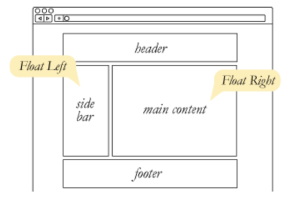
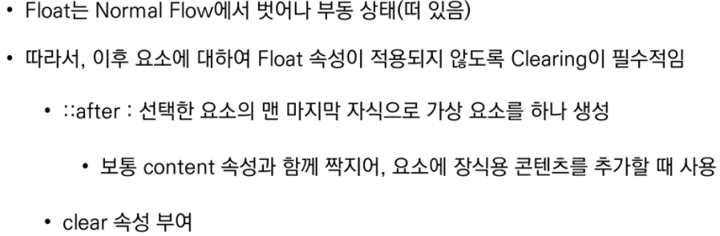
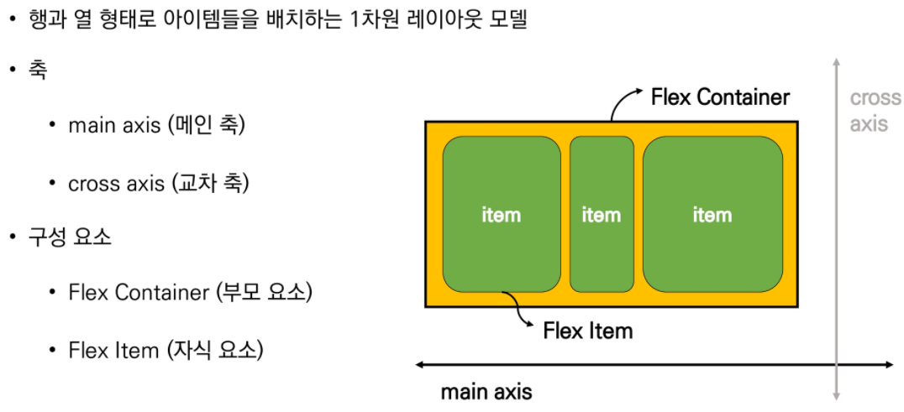
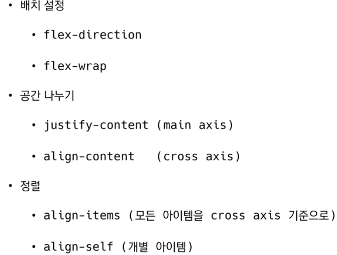
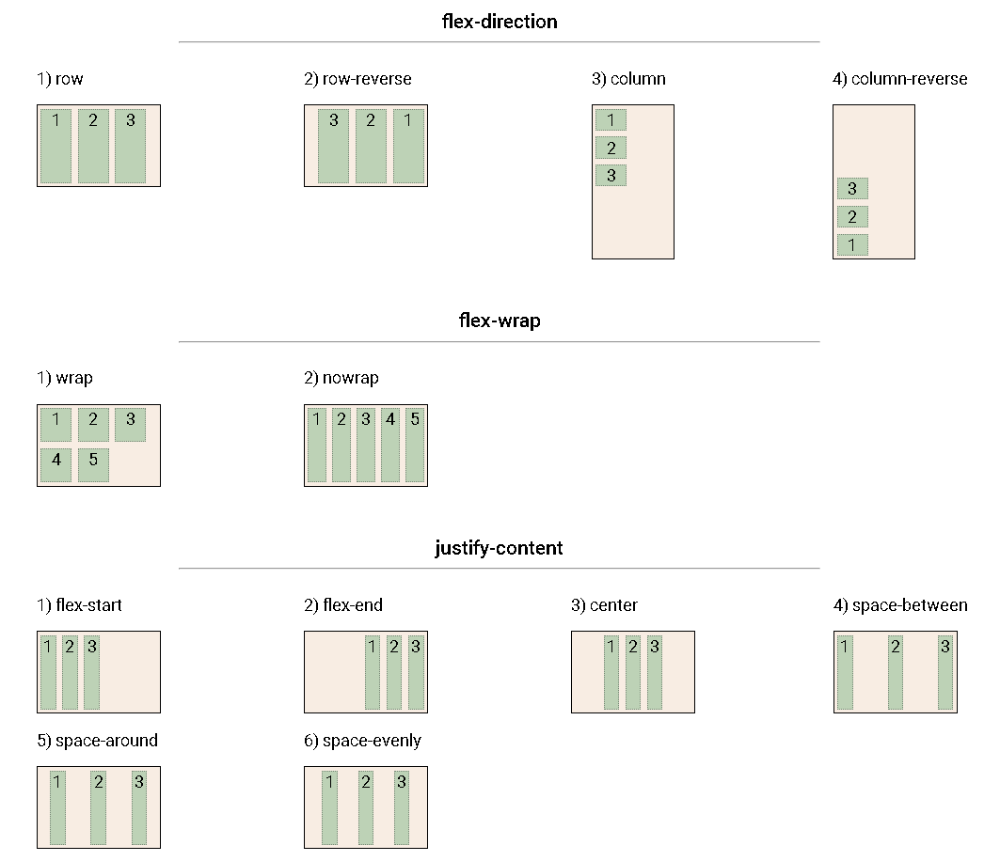
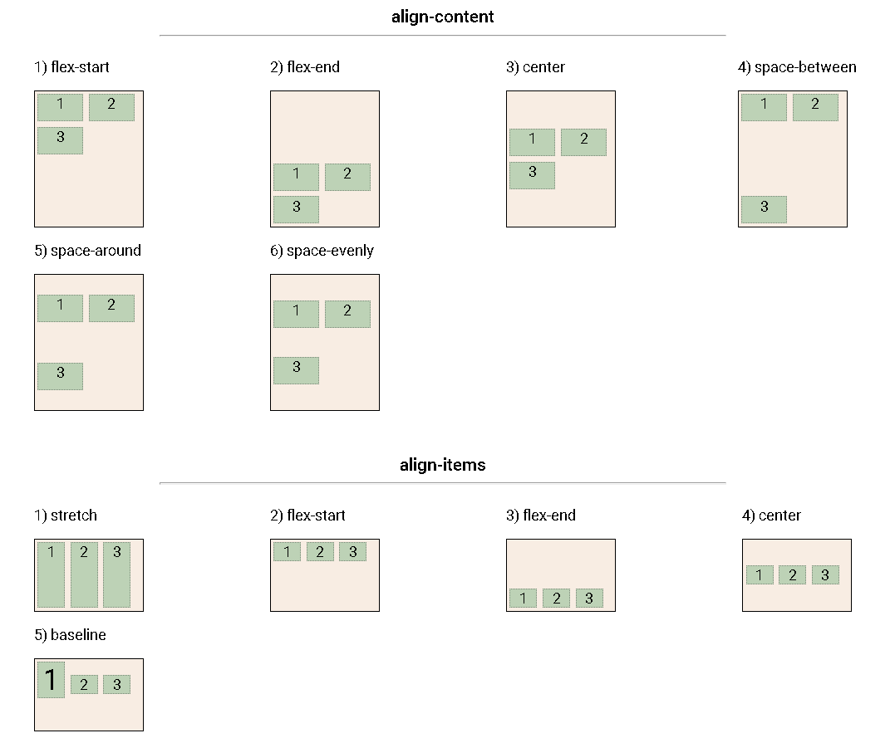
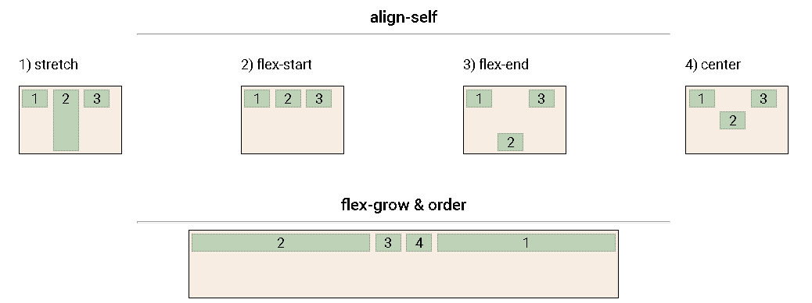
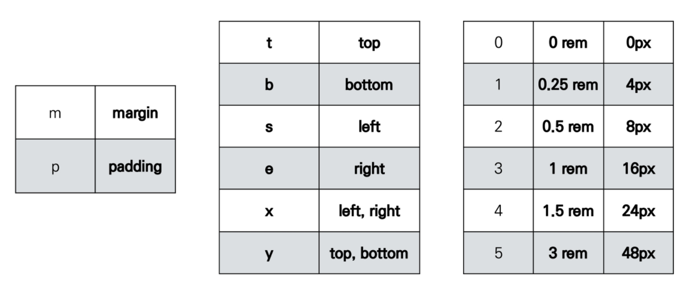
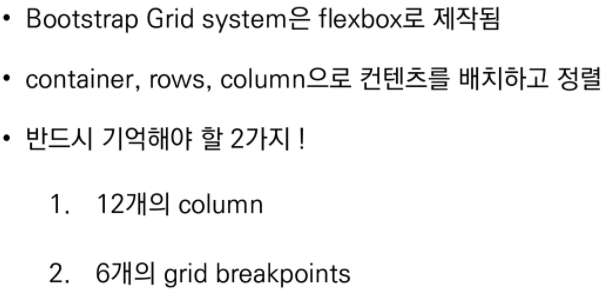
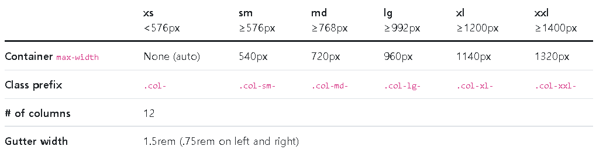

## Float

- 박스를 왼쪽 혹은 오른쪽으로 이동시켜 텍스트를 포함 인라인 요소들이 주변을 wrapping

- 요소가 normal flow를 벗어남

  

### float 속성

- 
- left : 왼쪽으로 띄우기
- right : 오른쪽으로 띄우기
- none : 기본값


### claring float



- clearing float는 이후 요소 부터 normal flow를 가지도록 지정하는 것

```html
<!DOCTYPE html>
<html lang="en">
<head>
    <meta charset="UTF-8">
    <meta http-equiv="X-UA-Compatible" content="IE=edge">
    <meta name="viewport" content="width=device-width, initial-scale=1.0">
    <title>Document</title>
    <style>
        .box1 {
            /* 10rem => 160px (root -> 16px) */
            width: 10rem;
            height: 10rem;
            border: 1px solid black;
            background-color: crimson;
        }

        .box2 {
            /* 10rem => 160px (root -> 16px) */
            width: 20rem;
            height: 10rem;
            border: 1px solid black;
            background-color: cornflowerblue;
        }

        .left {
            float: left;
        }

        .clearfix::after {
            content: "";
            display: block;
            clear: both;
        }
    </style>
</head>
<body>
    <!-- clearfix 
    1. float 요소의 부모로 div!
    2. 부모에게 .clearfix
    -->
    <div class="clearfix">
        <div class="box1 left">box1</div>
    </div>
    <div class="box2">box2</div>
</body>
</html>
```


## Flexbox

### CSS Flexible Box Layout




### Flex 속성










## Bootstrap

### CDN


### spacing




### bootstrap 기초 활용

```html
<!DOCTYPE html>
<html lang="en">
<head>
    <meta charset="UTF-8">
    <meta http-equiv="X-UA-Compatible" content="IE=edge">
    <meta name="viewport" content="width=device-width, initial-scale=1.0">
    <title>Document</title>
    <link href="https://cdn.jsdelivr.net/npm/bootstrap@5.1.3/dist/css/bootstrap.min.css" rel="stylesheet" integrity="sha384-1BmE4kWBq78iYhFldvKuhfTAU6auU8tT94WrHftjDbrCEXSU1oBoqyl2QvZ6jIW3" crossorigin="anonymous">
    <style>
        div {
            width: 10rem;
            height: 10rem;
        }

        .box {
            background-color: crimson;
        }

        body {
            height: 100000px;
        }
        
        .position-container {
            width: 300px;
            height: 300px;
        }
    </style>
</head>
<body>
    <h1>bootstrap 기초 활용</h1>
    <h2>spacing</h2>
    <div class="box mt-5">mt-5, 3rem</div>
    <div class="box mx-auto">mx-auto</div>
    <div class="box ms-auto">ms-auto</div>
    <div class="box py-3 my-3">py-3, my-3</div>

    <h2>color</h2>
    <div class="bg-primary"></div>
    <div class="bg-danger"></div>
    <div class="bg-warning"></div>
    <p class="text-secondary">Lorem ipsum dolor sit amet consectetur adipisicing elit. Blanditiis consequuntur doloremque distinctio odit incidunt soluta ut magni. Recusandae et laboriosam delectus cum, fuga perferendis neque mollitia tenetur minima ut dicta.</p>
    <h3 class="text-info text-start">안녕하세요</h3>
    <h3 class="text-info text-center">안녕하세요</h3>
    <h3 class="text-info text-end">안녕하세요</h3>
    <h3 class="text-info fw-bold">안녕하세요</h3>
    <h3 class="text-info fw-normal">안녕하세요</h3>
    <h3 class="text-info fw-light">안녕하세요</h3>
    <h3 class="text-info fst-italic">안녕하세요</h3>
    <a href="#" class="text-decoration-none">Non underlined link</a>

    <h2>Display</h2>
    <div class="d-inline text-white bg-primary">d-inline</div>
    <div class="d-inline text-white bg-primary">d-inline</div>
    <span class="d-block">d-block</span>
    <span class="d-block">d-block</span>

    <div class="d-none d-sm-block bg-warning">sm이상에서 보임</div>
    <div class="d-none d-md-block d-lg-none bg-warning">md에서만 보임</div>

    <h2>Position</h2>
    <div class="position-container position-relative bg-warning">
        <div class="position-absolute top-0 start-0 bg-primary"></div>
        <div class="position-absolute bottom-0 end-0 bg-info"></div>
        <div class="box fixed-top opacity-50">fixed-top</div>
        <div class="box fixed-bottom opacity-50">fixed-bottom</div>
    </div>
    <script src="https://cdn.jsdelivr.net/npm/bootstrap@5.1.3/dist/js/bootstrap.bundle.min.js" integrity="sha384-ka7Sk0Gln4gmtz2MlQnikT1wXgYsOg+OMhuP+IlRH9sENBO0LRn5q+8nbTov4+1p" crossorigin="anonymous"></script>
</body>
</html>
```


## Responsive web design

- 다양한 크기의 디바이스 등장에 따라 반응형 웹디자인 대두
- ex. Media Queries, Flexbox, Bootstrap Grid System, The viewport meta tag


### Grid System

- Bootstrap grid system

  

- 기본구조

  ```html
  <div class="container">
    <div class="row">
      <div class="col"></div>
      <div class="col"></div>    
      <div class="col"></div>   
    </div>
  </div>
  ```

- breakpoint

  

​		`참고` Gutter는 col과 col 사이간격


## Grid System 기초활용

```html
<!DOCTYPE html>
<html lang="en">
<head>
  <meta charset="UTF-8">
  <meta http-equiv="X-UA-Compatible" content="IE=edge">
  <meta name="viewport" content="width=device-width, initial-scale=1.0">
  <title>Document</title>
  <link href="https://cdn.jsdelivr.net/npm/bootstrap@5.1.3/dist/css/bootstrap.min.css" rel="stylesheet" integrity="sha384-1BmE4kWBq78iYhFldvKuhfTAU6auU8tT94WrHftjDbrCEXSU1oBoqyl2QvZ6jIW3" crossorigin="anonymous">
  <style>
    body {
      height: 3000px;
    }
    
    .box {
      background-color: lightgoldenrodyellow;
      border: 1px solid black;
      text-align: center;
    }
    </style>
</head>
<body>
  <div class="container">
    <div class="row">
      <div class="box col">1</div>
      <div class="box col">2</div>
      <div class="box col">3</div>
    </div>
    <hr>
    <div class="row">
      <div class="box col">1</div>
      <div class="box col">2</div>
      <div class="w-100"></div>
      <div class="box col">3</div>
      <div class="box col">4</div>
    </div>
    <hr>
    <div class="row">
      <div class="box col">1</div>
      <div class="box col">2</div>
    </div>
    <div class="row">
      <div class="box col">3</div>
      <div class="box col">4</div>
    </div>
    <hr>
    <!-- 전체 1:2:1
    전체 12 => 3:6:3
    -->
    <div class="row">
      <div class="box col-3">col-3</div>
      <div class="box col-6">col-6</div>
      <div class="box col-3">col-3</div>
    </div>
    <hr>
    <!-- 전체가 12를 넘어서면?
      div.row>div.box.col-1*13
     -->
     <div class="row">
       <!-- ctrl+alt 방향키 (위아래), multi line selector -->
       <div class="box col-1">col-1</div>
       <div class="box col-1">col-1</div>
       <div class="box col-1">col-1</div>
       <div class="box col-1">col-1</div>
       <div class="box col-1">col-1</div>
       <div class="box col-1">col-1</div>
       <div class="box col-1">col-1</div>
       <div class="box col-1">col-1</div>
       <div class="box col-1">col-1</div>
       <div class="box col-1">col-1</div>
       <div class="box col-1">col-1</div>
       <div class="box col-1">col-1</div>
       <div class="box col-1">col-1</div>
     </div>
     <hr>
     <div class="row">
       <div class="box col-9">col-9</div>
       <div class="box col-4">col-4</div>
       <div class="box col-3">col-3</div>
     </div>
     <hr>
     <div class="row">
       <!-- 총 4개 -->
       <!-- 가장 작은 2개, 그 다음은 3개, 그 다음은 4개
      (sm, md) -->
      <div class="box col-6 col-sm-4 col-md-3">1</div>
      <div class="box col-6 col-sm-4 col-md-3">1</div>
      <div class="box col-6 col-sm-4 col-md-3">1</div>
      <div class="box col-6 col-sm-4 col-md-3">1</div>
      <div class="box col-6 col-sm-4 col-md-3">1</div>
      <div class="box col-6 col-sm-4 col-md-3">1</div>
      <div class="box col-6 col-sm-4 col-md-3">1</div>
      <div class="box col-6 col-sm-4 col-md-3">1</div>
      <div class="box col-6 col-sm-4 col-md-3">1</div>
      <div class="box col-6 col-sm-4 col-md-3">1</div>
      <div class="box col-6 col-sm-4 col-md-3">1</div>
      <div class="box col-6 col-sm-4 col-md-3">1</div>
     </div>
    <hr>
    <h2>Nesting</h2>
    <div class="row">
      <div class="box col-6">
        <div class="row">
          <div class="box col-3">1</div>
          <div class="box col-3">2</div>
          <div class="box col-3">3</div>
          <div class="box col-3">4</div>
        </div>
      </div>
      <div class="box col-6">1</div>
      <div class="box col-6">1</div>
      <div class="box col-6">1</div>
    </div>
    <hr>
    <h2>김치냉장고 레이아웃</h2>
    <div class="row">
      <div class="box col-6">고</div>
      <div class="box col-6">
        <div class="row">
          <div class="col-6">김</div>
          <div class="col-6">치</div>
          <div class="col-6">냉</div>
          <div class="col-6">장</div>
        </div>
      </div>
    </div>
    <hr>
    <h2>offset</h2>
    <div class="row">
      <div class="box offset-2 col-3">offset-2 col-3</div>
      <div class="box col-3">col-3</div>
    </div>
    <hr>
    <div class="row">
      <div class="box col-md-4 offset-4">md-4 offset-4</div>
      <div class="box col-md-4 offset-md-4 offset-lg-2">md-4 offset-md-4 offset-lg-2</div>
    </div>

  </div>
  <script src="https://cdn.jsdelivr.net/npm/bootstrap@5.1.3/dist/js/bootstrap.bundle.min.js" integrity="sha384-ka7Sk0Gln4gmtz2MlQnikT1wXgYsOg+OMhuP+IlRH9sENBO0LRn5q+8nbTov4+1p" crossorigin="anonymous"></script>
</body>
</html>
```


## Bootstrap Grid System & flex box 활용예시

```html
<!DOCTYPE html>
<html lang="en">
<head>
  <meta charset="UTF-8">
  <meta http-equiv="X-UA-Compatible" content="IE=edge">
  <meta name="viewport" content="width=device-width, initial-scale=1.0">
  <title>Document</title>
  <link href="https://cdn.jsdelivr.net/npm/bootstrap@5.1.3/dist/css/bootstrap.min.css" rel="stylesheet" integrity="sha384-1BmE4kWBq78iYhFldvKuhfTAU6auU8tT94WrHftjDbrCEXSU1oBoqyl2QvZ6jIW3" crossorigin="anonymous">
  <style>
    body {
      height: 3000px;
    }

    .box {
      background-color: lightgoldenrodyellow;
      border: 1px solid black;
      text-align: center;
      /* padding-top: 0.75rem;
      padding-bottom: 0.75rem; */
    }

    .parent {
      border: 1px solid black;
      height: 600px;
      background-color: lightpink;
    }
  </style>
</head>
<body>
  <div class="container">
    <div class="row parent justify-content-center align-items-center">
      <div class="box col-4">1</div>
    </div>
    <div class="row parent">
      <div class="box col-4 align-self-start">1</div>
      <div class="box col-4 align-self-center">2</div>
      <div class="box col-4 align-self-end">3</div>
    </div>
  </div>
  <script src="https://cdn.jsdelivr.net/npm/bootstrap@5.1.3/dist/js/bootstrap.bundle.min.js" integrity="sha384-ka7Sk0Gln4gmtz2MlQnikT1wXgYsOg+OMhuP+IlRH9sENBO0LRn5q+8nbTov4+1p" crossorigin="anonymous"></script>
</body>
</html>
```

