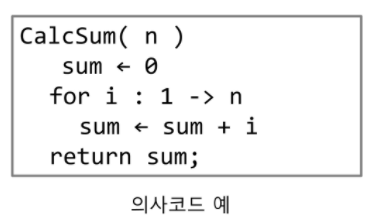
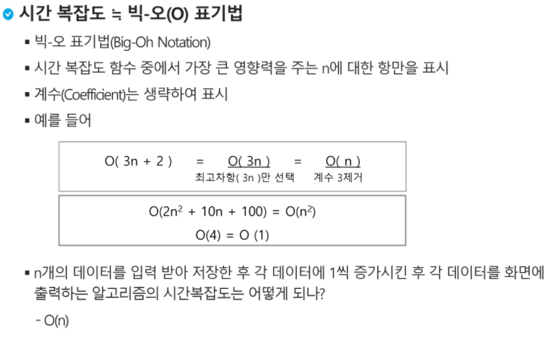
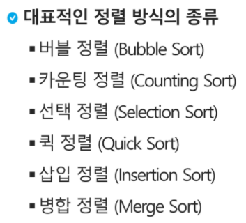
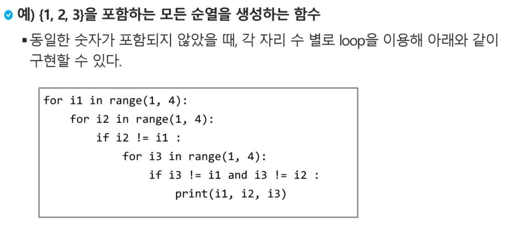
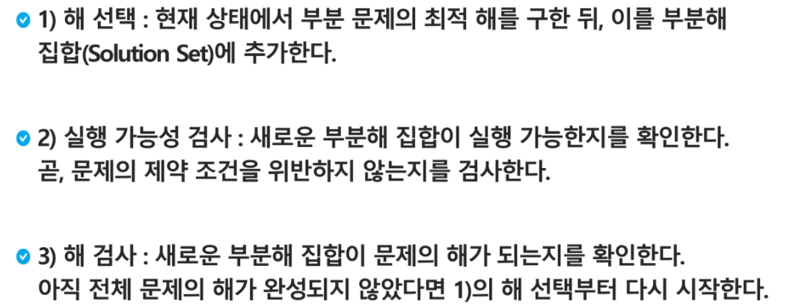
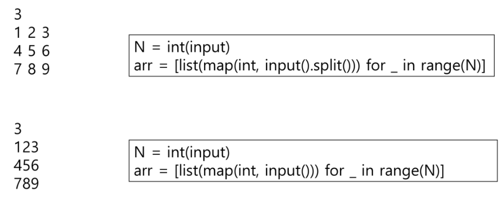
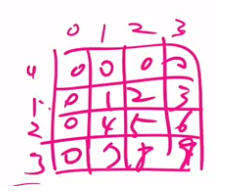
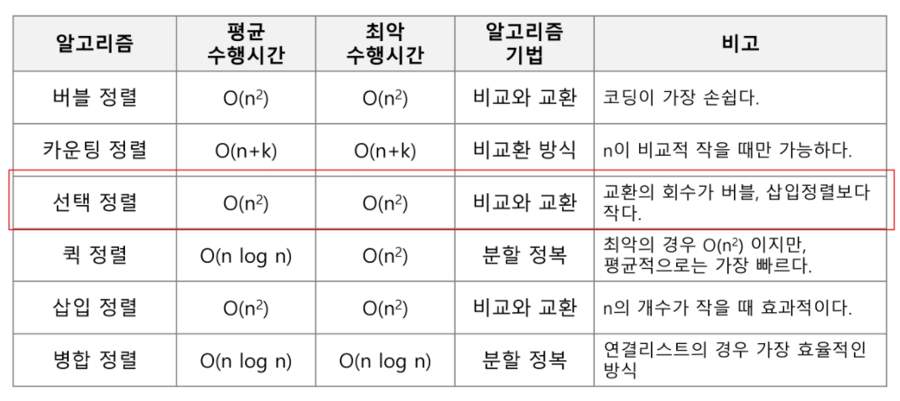

### 알고리즘




- 성능측정

  


### 정렬

- 정렬 방식

  

- 버블소트

```python
def bubble_sort(arr, N): # 정렬할 리스트, N 원소 수
    # 1. n-1 번째 부터 조사를 해나갈 거야.
    for i in range(len(arr)-1, 0, -1):
        for j in range(i):
            # 이전 요소가 이후 요소보다 크면
            # 교환을 해야지 버블 소트가 되겠지
            if arr[j] > arr[j+1]:
                arr[j], arr[j+1] = arr[j+1], arr[j]
    return arr

numbers = [9, 13, 64, 62, 3]

print(bubble_sort(numbers, 5))
```


- 카운팅소트

``` python
def counting_sort(input_arr, k):
    """
    input_arr : 입력 배열(1 to k)
    counting_arr : 카운트 배열
    k는 데이터의 개수가 아닌 데이터 원소의 범위
    """

    counting_arr = [0] * (k+1)
    
    # 1. counting array에 arr내 원소의 빈도수 담기

    for i in input_arr:
    	counting_arr[i] += 1
    
    # 2. 누적(counting_arr 업데이트)
    for i in range(1, len(counting_arr)):
        counting_arr[i] += counting_arr[i - 1]

    # 3. result_arr 생성
    result_arr = [-1] * len(input_arr)

    # 4. result_arr에 정렬하기(counting_arr를 참조)

    for i in input_arr:
    	counting_arr[i] -= 1
    	result_arr[counting_arr[i]] = i

    return result_arr


a = [0, 4, 1, 3, 1, 2, 4, 1]

print(counting_sort(a, 5)) # [0, 1, 1, 1, 2, 3, 4, 4]
```


### 완전 검색

- 고려할 수 있는 모든 경우의 수를 생각
- 시간은 오래걸리지만 해답을 못 찾을 확률이 적음

- 순열 만들기

  


### 탐욕 알고리즘

- 최적해를 구하는데 사용되는 근시안적 방법으로 하나를 결정해야 할 때마다 최적이라고 생각되는 것을 선택해 나가는 방식, 일반적으로 머리에 떠오르는 생각을 검증없이 구현하는 경우

  

### 배열에 담기

```markdown
444345 -> arr = list (map(int,input()))

4 4 4 3 4 5 -> arr = list(map(int,input().split()))
```


# 2차원 배열

### 입력방법




### 배열 순회

i = 행의 좌표 , j = 열의 좌표

- 행 우선 순회

```python
for i in range(n):
    for j in range(m):
        Array[i][j]
```

- 열 우선 순회

```python
for j in range(m):
    for i in range(n):
        Array[i][j]
```

- 지그재그 순회

```python
for i in range(n):
    for j in range(m):
        Array[i][j+(m-1-2*j)*(i%2)] 
        #i가 홀수 일때 거꾸로 순회
        # Array[i][m-1-j]
```


### 문제에서 주어지는 행렬이 1부터 시작할때 인덱스를 0부터 시작해도록 추가해주는 방법

```python
arr = [[0]*(N+1)] + [[0]+list(map(int,input().split())) for _ in range(N)] 
```



### 델타를 이용한 2차 배열 탐색

```python
di = [0,1,0,-1]
dj = [1,0,-1,0]
for k in range(4):
    ni = i + di[k]
    nj = j + dj[k]
    if 0 <=ni< N and 0 <= nj< M:#유효한 인덱스면
        arr[ni][nj]
```

```python
for di, dj in[(0,1), (1,0), (0,-1), (-1,0)]:
    ni = i + di
    nj = j + dj
    if 0<=ni<N and 0<=nj<M:
        arr[ni][nj]
```


### 전치행렬

```python
arr = [[1,2,3],[4,5,6],[7,8,9]]
for i in range(3):
    for j in range(3):
        if i<j:
            arr[i][j], arr[j][i] = arr[j][i], arr[i][j]
```


### 비트 연산자를 활용한 부분집합 생성방법

```python
arr = [3,6,7,1,5,4]
n = len(arr) #n:원소의 개수
for i in range(1<<n): #000000~111111 #부분집합의 개수
    for j in range(n): #원소의 수만큼 비트를 비교
        if i & (1<<j): #i의 j번 비트가 1인 경우
            print(arr[j], end=",") #j번 원소 출력
    print()
```


### 검색

1. 순차검색

- 정렬되어 있지 않은 경우

  ```python
  def sequentialSearch(a, n, key):
      i = 0
      while i<n and a[i]!=key: #i값이 n보다 작고, 키값이 동일하지 않을때(동일 키 값을 찾거나 i값이 n보다 커지면 반복문 stop)
          i = i+1 #순차적으로 조회
      if i<n : 
          return i # i값이 n보다 작을때 반복문이 멈춘다면 검색 성공
      else:
          return -1 # 검색 실패
  ```

  

- 정렬되어 있는 경우

  ```python
  def sequentialSearch2(a, n, key):
      i=0
      while i<n and a[i]<key: #정렬이 되어 있으므로 찾는 키값보다 작을때만 조회
          i = i+1
      if i<n and a[i] == key:
          return i
      else:
          return -1
  ```

  

2. 이진검색

- 정렬된 경우 가능

  ```python
  def binarySearch(a, N, key):
  	start = 0
      end = N-1
      while start <= end:
          middle = (start+end)//2
          if a[middle] == key: #검색성공
              return true
          elif a[middle] > key:
              end = middle -1
          else:
              start = middle + 1
      return false #검색 실패
  
  #재귀함수 이용
  def binarySearch2(a, low, high, key):
      if low > hign:
          return False
      else:
          middle = (low+high)//2
          if key == a[middle] :
              return True
          elif key < a[middle] :
              return binarySearch2(a, low, middle-1, key)
         	elif a[middle] < key:
              return binarySearch2(a, middle+1, high, key)
  ```


### 선택정렬

```python
def selectionSort(a,N):
    for i in range(N-1): #i는 0에서 N-2까지
        minidx = i
        for j in range(i+1,N): #j는 i자기자신 제외하고 N-1까지 비교해주면
            if a[minidx]>a[j]:
                minidx=j
        a[i],a[minidx] = a[minidx],a[i]
            
```


- 셀렉션 알고리즘

```PYTHON
#k번째로 작은 원소를 찾는 알고리즘
#1번부터 k번째까지 작은 원소들을 찾아 배열의 앞쪽으로 이동시키고, 배열의 k번째를 반환
def select(arr, k):
    for i in range(0,k): #0에서 k-1까지 비교하므로 오름차순으로 정렬되기 때문에
        minidx = i
        for j in range(i+1, len(arr)):
            if arr[minidx]>arr[j]:
                minidx = j
        arr[i],arr[minidx] = arr[minindex], arr[i]
    return arr[k-1] #k-1번째 값이 k번째로 작은 값이 된다(인덱스조회는 0부터 해주므로)
```


- 정렬알고리즘 빅오 및 특징 비교



