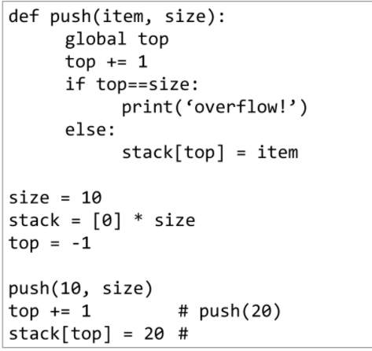
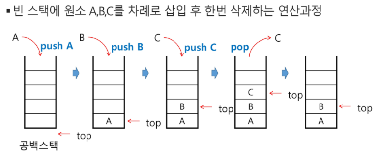
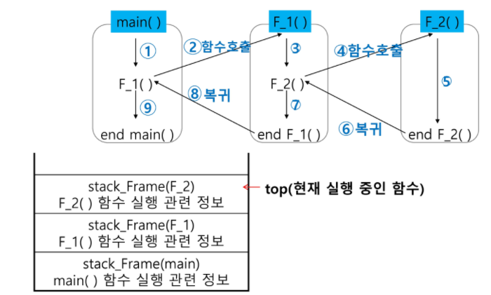
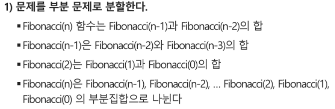
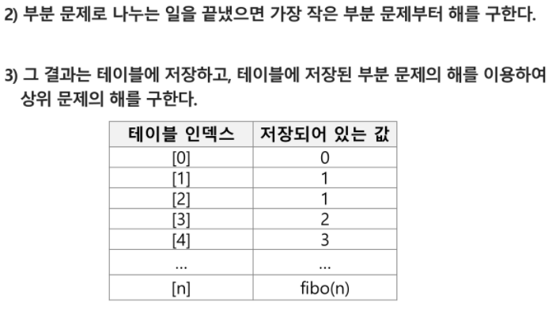

# Stack - 자료구조

### 특징

- 후입선출

### 구현

- class 사용

  `EX1`

  ```python
  class Stack:
  
      # stack이 최초 생성 될때 필요한 정보들
      # stack의 크기를 기본 값으로 받아와야 한다.
      def __init__(self, size):
          # stack의 크기
          self.size = size
          # stack을 저장할 자료 구조
          # 최초 stack 생성시 각 위치에는 값이 없다.
          self.arr = [None] * size # [0, 0, 0, 0] X
          # stack의 최상단
          self.top = -1
  
      # stack이 비어있는지 확인
      def is_empty(self):
          if self.top == -1:
              return True
          else:
              return False
  
      def is_full(self):
          if self.top == self.size - 1:
              return True
          else:
              return False
  
      # stack의 추가 연산 == push
      # top 위치에 값을 입력
      def push(self, n):
          # 어디에?
          self.top += 1
          self.arr[self.top] = n
  
      def pop(self):
          if not self.is_empty():
              result = self.arr[self.top]
              self.arr[self.top] = None
              self.top -= 1
              return result
          else:
              raise IndexError('범위를 벗어남')
  
  s1 = Stack(5)
  ```

  `EX2`

  ```python
  
  class Stack:
      def __init__(self, arr): #스택 객체 생성
          self.arr = arr
          self.top = -1
  
      def push(self, n): # 스택 요소 추가 push(.append())
          self.top += 1
          self.arr[self.top] = n
  
      def pop(self): # 스택 요소 삭제 pop()
          self.top -= 1
          return self.arr[self.top+1]
  
      def is_empty(self):  # 스택이 비었는지 확인(비었으면 True 리턴)
          if self.top == -1:
              return True
          else:
              return False
  
      def peek(self): # 스택 맨 앞 요소 리턴
          return self.arr[self.top]
  
  
  T = int(input())
  
  for tc in range(1, T+1):
      data = input()
  
      stack = Stack([0]*len(data))
  ```

  

- 함수사용

  

- 파이썬 특징 그대로 사용

  ```python
  stack = [] or stack=[0]*len(data)
  top = -1 
  stack.append()
  stack.pop
  ```

​	-> 사용자가 원하는 대로 stack 클래스를 디자인


- 스택의 삽입/삭제 과정

  


### function call



- 함수 내부에서 사용하는 변수또한 내부에서만 사용가능하므로 함수 호출 시  값을 넘겨주는 것
- 재귀호출 또한 자기자신과 같지만 또 다른 함수를 호출한다고 생각해보기


### 재귀호출

- 자기자신을 호출

  `ex1` 팩토리얼

  ```python
  def factorial(n):
      if n == 1:      # n이 1일 때
          return 1    # 1을 반환하고 재귀호출을 끝냄
      return n * factorial(n - 1)# n과 factorial 함수에 n - 1을 넣어서 반환된 값을 곱함
   
  print(factorial(5))
  ```

  `ex2` 피보나치

  ```python
  def fibo(n):
      if n<2:
          return n # 0 1 은 그대로
      else:
          return fibo(n-1) + fibo(n-2)
  ```


### memoization 과 DP(Dynamic Programming)

`ex` fibo의 memoization 버전 _ recursive

```python
def fibo(n):
    global cnt
    cnt += 1
    if n >= 2 and memo[n] == 0:
        memo[n] = fibo(n-1) + fibo(n-2)
    return memo[n]

n = 1000
memo = [0] * (n+1)
memo[0] = 0
memo[1] = 1
cnt = 0
print(fibo(n))
print(cnt) #재귀함수 보다 연산수가 현저히 줄어듦

##다양한 방식으로 가능
def fibo(n):
    global memo
    if n>=2 and len(memo) <=n:
        memo.append(fibo(n-1) + fibo(n-2))
    return memo[n]
memo = [0,1]
```


`ex` 파스칼 삼각형의 memoization

```python
memo = [[0 for _ in range(11)] for _ in range(11)]

for i in range(10):
    for j in range(i + 1):
        if j == 0 or i == j:
            memo[i][j] = 1
        else:
            memo[i][j] = memo[i - 1][j - 1] + memo[i - 1][j]

for tc in range(1, T + 1):
    N = int(input())
    N = 10 ###memoization을 활용하면 삼각형 크기를 다양하게 늘려가며 만들수 있음
    print(f'#{tc}')
    for i in range(N):
        for j in range(i + 1):
            print(f'{memo[i][j]}', end=" ")
        print()
```


`ex` fibo의 DP _ iterative  (내부 시스템 호출 스택이 없어서 효율적)





```python
def fibo(n):
    f = [0,1]
    
    for i in range(2, n+1):
        f.append(f[i-1]+f[i-2])
    return f[n]
```

