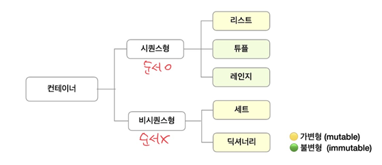
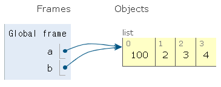
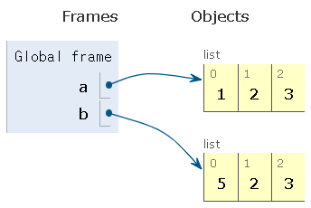
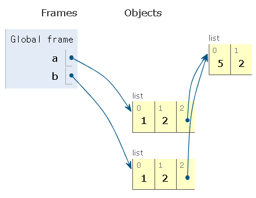
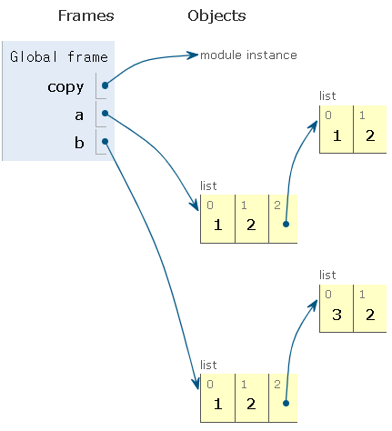
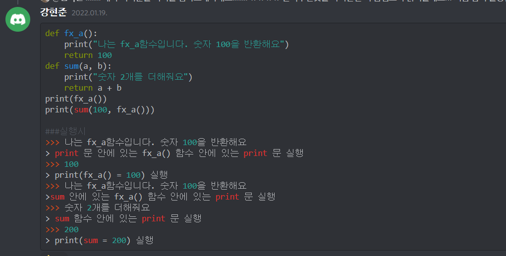

### 함수 헷갈리는 것 정리




##### `기본인자 vs 키워드인자`

* 기본인자

  - 기본인자는 매개변수에 입력

  - 입력된 값이 없을 때 그 상황에서 사용할 값

    ```python
    def greeting(age, name='john'):
        return f'{name}은 {age}살입니다.'
    ```

  - ***주의\* 단, 기본 인자값(Default Argument Value)을 가지는 인자 다음에 기본 값이 없는 인자를 사용할 수는 없다.**

    ```python
    #예시
    def greeting(name='john', age):
        return f'{name}은 {age}살입니다.'
    ```


* 키워드인자

  - 함수를 호출할 때 전달인자에 입력 -> 직접 변수의 이름으로 특정 인자를 전달

    ```python
    def greeting(age, name):
        return f'{name}은 {age}살입니다.'
    greeting(name='철수', age=24)
    greeting(24, name='철수') #위치인자와 함께 사용 가능
    ```

  - ***주의\* 단, 키워드 인자 다음에 위치인자를 사용할 수는 없다.**

    ```python
    # 예시
    greeting(age=24, '철수')
    ```


##### `패킹언패킹 & 함수 가변 인자`

- 가변 위치인자(*args)는 임의개수의 위치인자를 **tuple형태**의 변수로 저장합니다.
  가변 키워드인자(**kwargs)는 임의개수의 키워드인자를 **dictionary형태**로 저장합니다.

```
def func(*args, **kwargs):
    return print(*args, **kwargs)
```

- 함수 선언의 `*args`는 위치 인자로 들어온 값을 tuple타입으로 `packing`합니다.
  함수 호출의 `*args`는 tuple타입의 변수를 `unpacking`하여 줍니다.


##### `재귀함수`

- 재귀 함수는 함수 내부에서 자기 자신을 호출 하는 함수를 뜻합니다

- 1개 이상의 base case(종료상황) 존재, 최저점을 수렴하고 최고점으로 재귀하면서 값을 계산

  ```python
  #n! 계산
  def factorial(n):
      if n==1:
          return 1
      return n * factorial(n-1)
      
  ```

  


##### `map과 lambda`

- map

  map(function,iterable)

  ```python
  def cube(n):
      return n ** 3
  numbers = [1, 2, 3]
  new_numbers = list(map(cube, numbers))
  ```

  

- lambda

  lambda(parameter : expression)

  ```python
  list(map(lambda n: n%2, [1, 2, 3]))
  # 표현식을 계산한 결과 값을 반환하는 이름없는 익명함수
  # 함수 정의 보다 간결한 형태
  ```


`tip`

f-formating을 활용한 소수점 자리수 표현

f'{변수 : .xf}' ----> x자릿수만큼 소수점 표현

- dict에서 특정 value를 확인하는 방법
  
  
  
  ```
  1. [key] -> 대괄호에 key 넣어서 확인하기
  print(restorant['menus'])
  
  2. dict.get(key) -> get 함수 사용해서 확인하기
  
  print(restorant.get('menus'))
  ```
  
-   [], get 왜 2개지?

    \# 만약에 없는 키를 대괄호에 넣어보자.

  - print(restorant['age']) # -> KeyError: 'age'

  ​    -> 그 dict key 'age'가 없다. 오류 발생

  - print(restorant.get('age')) # -> None

  ​    -> dict.get() 도 get() 함수다!!

    get() 함수 호출할때 넘겨준 인자 'age'에 해당하는 값이 없을때 None 반환

  ​	그럼 get()이 최강이다? x

     상황에 따라서는 내가 원하는 값이 없을때, 코드가 멈춰야 할 수도 있다.

    오류가 안나고 다음 코드로 넘어가면 안될 수도 있다는 의미.

    혹은, 오류를 발생시키고, 그 상황에 대한 처리를 할 수 도 있다. -> error 파트에서 다룸.


`vsc 단축키`

ctrl + 백틱 :  실행창으로 옮겨감

ctrl + shift + 백틱 :  실행 터미널 여러개

alt + 방향키 : 문장전체 이동

alt + shift + 방향키 : 해당 문장 복사


`데이터 입출력`

```python
data = []
for i in range(3):
    data.append(list(map(int,input().split())))
print(data)
# input 1 2 3 을 3번 반복해서 출력 값
# [[1, 2, 3], [1, 2, 3], [1, 2, 3]]
```


`리스트에 값추가`

```python
 1. append
 genre_names.append(genre['name']) genre에서 name이라는 열쇠로 value 값에 접근
 2. 리스트 + 리스트
 genre_names += [genre['name']]
```


`딕셔너리 순회`

- dictionary에서 `for`를 활용하는 4가지 방법

```python
# 0. dictionary 순회 (key 활용)
for key in dict:
    print(key)
    print(dict[key])


# 1. `.keys()` 활용
for key in dict.keys():
    print(key)
    print(dict[key])


# 2. `.values()` 활용
# 이 경우 key는 출력할 수 없음
for val in dict.values():
    print(val)


# 3. `.items()` 활용
for key, val in dict.items():
    print(key, val)
```


`tip` 코딩 문제 안풀릴때

1. a4 종이에다가 손코딩 
2. 알고리즘 분류에 써있는 키워드 검색해서 공부 좀 해보고 코드 짜기
3. 구글링 해서 한번만 훓어보고 코드 짜보기
4. 그래도 안되면 똑같이 짜고 주석 쓰면서 따라가보기


### 문자열 method

| .find(xpri)                      | .index(x)                       |
| -------------------------------- | ------------------------------- |
| x의 첫번째 위치를 반환           | x의 첫번째 위치를 반환          |
| 리스트 내 x가 없으면 '-1'을 반환 | 리스트 내 x 가 없으면 오류 발생 |

`.replace(old,new[,count])`

바꿀 대상 글자를 새로운 글자로 바꿔서 반환합니다.

count를 지정하면 해당 갯수만큼만 시행합니다.

```python
a = 'yaya!'
b = 'wooooowoo'
a.replace('y', 'h') ==> 'haha!'
b.replace('o','_',2) ==> 'w__ooowoo'
```


`.split([chars])`

```python
a = 'a_b_c'
a.split('_') ==> ['a', 'b', 'c']
b = 1 2 3 4 #input 값
b.split() ==> [1,2,3,4]
```

`'separator'.join(iterable)`

iterable 의 문자열들을 separator(구분자)로 이어 붙인(`join()`) 문자열을 반환합니다.

다른 메서드들과 달리, **구분자**가 join 메서드를 제공하는 문자열입니다.

```python
word = '배고파'
words = ['안녕', 'hello']
'!'.join(word) ==> '배!고!파'
' '.join(words) ==> '안녕 hello'
```


### List method

| .append(x)                                                   | .extend(iterable)                                            |
| ------------------------------------------------------------ | ------------------------------------------------------------ |
| 리스트에 값을 추가합니다                                     | 리스트에 iterable이 추가됩니다                               |
| cafe = ['starbucks', 'tomntoms', 'hollys']<br />cafe.append('banapresso')<br />==> ['starbucks', 'tomntoms', 'hollys', 'banapresso'] | cafe.extend(['wcafe','빽다방'])<br/>==> ['starbucks', 'tomntoms', 'hollys', 'banapresso', 'wcafe', '빽다방']<br />cafe.extend('ediya')<br />==>  ['starbucks', 'tomntoms', 'hollys', 'banapresso', 'wcafe', '빽다방', 'e' , 'd', 'i', 'y', 'a'] |

| remove(x)                                   | pop([i])                                             |
| ------------------------------------------- | ---------------------------------------------------- |
| 리스트에서 값이 x인 첫번째 항목을 삭제      | 정해진 위치 `i`에 있는 값을 삭제하며, 그 항목을 반환 |
| 만일 그런 항목이 없으면 `ValueError`가 발생 | i가 지정되지 않으면 마지막 항목을 삭제, 반환         |

`sorted() vs .sort()`

- .sort() ---> 리스트를 정렬, 파라미터로는 `key`와 `reverse`가 있다

  원본 list를 변형, none을 리턴, 저장해서 쓰기보다 바로 사용

- sorted()

​		원본은 그대로, 정렬된 값을 반환

`.index(x)`

x 값을 찾아 해당 index 값을 반환

`.count(x)`

원하는 값의 개수를 반환

### set method

| .add(elem)            | .update(*others)          |
| --------------------- | ------------------------- |
| elem을 셋(set)에 추가 | iterable한 여러 값을 추가 |

| .remove(elem)                                                | .discard(elem)                                              |
| ------------------------------------------------------------ | ----------------------------------------------------------- |
| elem을 셋(set)에서 삭제하고, 셋(set) 내에 elem이 존재하지 않으면 KeyError가 발생 | elem이 셋(set) 내에 존재하지 않아도, 에러가 발생하지 않는다 |


### dictionary method

`.get(key[,default])`

key를 통해 value를 가져옵니다.

key가 존재하지 않을 경우 None을 반환합니다. KeyError가 발생하지 않습니다

**dict.get(key[,key가 없을때 반환해주고 싶은 값 지정가능])**


`.setdefault(key[,default])`

`dict.get()` 메서드와 비슷한 동작을 하는 메서드로, key가 딕셔너리에 있으면 value를 돌려줍니다.

get과 다른 점은 key가 딕셔너리에 없을 경우, **default 값을 갖는 key 를 삽입한 후** default 를 반환

만일 default가 주어지지 않을 경우, None 을 돌려줍니다.


`.pop(key[,default])`

key가 딕셔너리에 있으면 제거하고 그 값을 돌려줍니다. 그렇지 않으면 default를 반환합니다.

default가 없는 상태에서 해당 key가 딕셔너리에 없는 경우, KeyError가 발생합니다.


`.update([other])`

other 가 제공하는 key,value 쌍으로 딕셔너리를 덮어씁니다.
`other` 는 다른 딕셔너리나 key/value 쌍으로 되어있는 모든 iterable을 사용 가능합니다.

- `keyword argument`로 업데이트 하는 방법
  
    - 키워드 인자가 지정되면, 딕셔너리는 그 key/value 쌍으로 갱신됩니다.
    
      ```python
      my_dict = {'apple': '사과', 'banana': '바나나', 'melon': '멜론'}
      my_dict.update(apple='사과아') ===> {'apple': '사과아', 'banana': '바나나', 'melon': '멜론'} # 키워드 인자이므로 '' 불필요
      ```


### 얕은복사 & 깊은복사

```python
a = [1, 2, 3, 4]
b = a
b[0] = 100

print(a) ===> [100, 2, 3, 4]
print(b) ===> [100, 2, 3, 4]
```



변수만 복사하다 보니 바라보는 객체는 당연히 동일합니다.

즉, 두개의 중 하나만 변경되어도 나머지 하나도 동일하게 수정되는 현상이 발생하게 됩니다.

그래서 우리는 얕은 복사를 필요로합니다

```python
a = [1, 2, 3]
b = a[:]
b[0] = 5
print(a) ===> [1,2,3]
print(b) ===> [5,2,3]

###list()를 활용해서 또 다른 리스트를 만들어 주는 방법도 동일하죠
b = list(a)
b[0] = 5


```




하지만 예외는 존재하는 얕은 복사입니다.

2차원 리스트와 같이 mutable 객체 안에 mutable 객체가 있는 경우 문제가 됩니다

```python
a = [1, 2, [1, 2]]
b = a[:]
b[2][0] = 5
print(a) ===> [1, 2, [5, 2]]
print(b) ===> [1, 2, [5, 2]]
```



내부 리스트 객체가 서로 같은 주소를 여전히 바라보고 있습니다.

이러할 경우 깊은 복사를 해야 합니다

* 깊은 복사는 새로운 객체를 만들고 원본 객체 내에 있는 객체에 대한 복사를 재귀적으로 삽입합니다.

* 즉, 내부에 있는 모든 객체까지 새롭게 값이 변경되게 됩니다.

  ```python
  import copy
  
  a = [1, 2, [1, 2]]
  b = copy.deepcopy(a)
  
  b[2][0] = 3
  print(a)
  ```

  

값을 따로 변경하는 것이 가능해 졌군요!

`none의 return`



```python
class Person:
    def talk(self):
        print('안녕!')
p1=Person()
p2=Person()
print(p1.talk())
print(p2.talk())

###실행시
안녕!
None
안녕!
None
#why? print(p1.talk()) 에서 talk 메서드가 실행된 후에 talk 메서드에서 반환된 값이 print 되는 건데 talk 메서드 내에서 print('안녕')이 실행돼서 안녕이 출력되고 talk에서 반환되는 것은 없기때문

class Person:
    def talk(self):
        print('안녕!')
        return 1
p1=Person()
p2=Person()
print(p1.talk())
print(p2.talk())

### 실행시
안녕!
1
안녕!
1

class Person:
    def talk(self):
        print('안녕!')
        return 1
p1=Person()
p2=Person()
p1.talk()
p2.talk()
#### 실행시
안녕!
안녕!
1

##### 따라서 출력값을 볼려면 이렇게 실행해주면 된다
class Person:
    def talk(self):
        print('안녕!')
p1=Person()
p2=Person()
p1.talk()
p2.talk()
```

| 용어                     | 정의                                                         |
| ------------------------ | ------------------------------------------------------------ |
| 모듈                     | 특정 기능을 `.py` **파일 단위**로 작성한 것.                 |
| 패키지                   | 특정 기능과 관련된 여러 **모듈들의 집합**. 패키지 안에는 또다른 서브 패키지를 포함 할수도 있음. |
| 파이썬 표준 라이브러리   | 파이썬에 **기본적으로 설치된 모듈과 내장 함수**를 묶어서 파이썬 표준 라이브러리 (Python Standard Library, PSL) 라 불림. |
| 패키지 관리자(**`pip`**) | `PyPI` 에 저장된 외부 패키지들을 설치하도록 도와주는 패키지. |

## 모듈과 패키지 사용하기
### 모듈
```py
import module
from module import var, function, Class
from module import *
```

### 패키지
```py
from package import module
from package.module import var, function, Class

```
