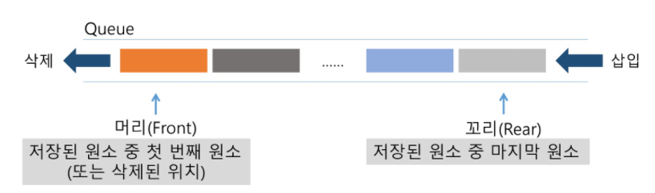

# Queue

- 선입선출
- 


- 구현방법

  listq, python q,  circleq.... 몹시 많으므로 폴더에서 직접 참고!


### BFS(Breadth First Search, BFS) 너비우선탐색

- 큐 활용

```python
import sys
sys.stdin = open('input.txt')

# 탐색 시작점v
def BFS(v):
    # 방문 가능 지점 = 정점의 개수
    visited = [0]*(V+1)
    queue = []
    # 탐색 시작점
    queue.append(v)
    # 작업할 일이 남아 있는 동안
    while queue: #큐가 비어있지 않은 동안
        # print(queue, end=' ')
        # queue의 첫 번째 원소 반환
        v = queue.pop(0)
        # 방문 하지 않았다면,
        if not visited[v]:
            visited[v] = True
            #visit(v) 정점 v에서 할일
            print('{} {}'.format(v, visited))
            for w in range(1, V+1): #v와 연결된 모든 w에 대해서
                if G[v][w] == 1 and visited[w] == 0: #w까지 가는길이 있고 방문한적이 없다면
                    queue.append(w) #큐에 추가


V, E = map(int, input().split()) #노드의 범위 1~7까지, E는 간선의 갯수
data = list(map(int, input().split())) #간선 정보

G = [[0 for _ in range(V + 1)] for _ in range(V + 1)] # 길정보 표시할 그리드

for i in range(V + 1):
    '''
    G[data[0]][data[1]] = 1
    G[data[1]][data[0]] = 1

    G[data[2]][data[3]] = 1
    G[data[3]][data[2]] = 1
    '''
    G[data[i * 2]][data[i * 2 + 1]] = 1 #방향성이 없으므로 양쪽다 번갈아가면서 그리드에 길표시
    G[data[i * 2 + 1]][data[i * 2]] = 1

BFS(1)
```


- 큐와 재귀 활용

```python
import sys
sys.stdin = open('input.txt')

def bfs():
    # 큐가 비었으면 끝
    if not queue:
        return

    # 뽑아서
    v = queue.pop(0)

    # 방문 체크
    if not visited[v]: visited[v] = 1

    # 인접 체크
    for w in G[v]:
        # 방문 안했다면
        if not visited[w]:
            # queue에 넣자
            queue.append(w)

    bfs()


V, E = map(int, input().split())

# 간선 정보 초기화
temp = list(map(int, input().split()))

# Graph 초기화
G = [[] for _ in range(V + 1)]
# [[], [2, 3], [4, 5], [7], [6], [6], [7], []] #길1은 2,3과 인접 / 길2는 4,5와 인접.. 이게 되네..
for i in range(len(temp) // 2):
    G[temp[i * 2]].append(temp[i * 2 + 1])


# 방문 표시 초기화
visited = [0] * (V + 1)

# bfs 탐색 시작
queue = [1]
bfs()

# 방문 확인
for visit, val in enumerate(visited):
    if val:
        print('{}'.format(visit), end='-')
```


- 5105 maze_  최단거리구하기

```python
import sys
sys.stdin = open('input.txt')
def fstart(N): #출발점 찾기
    for r in range(N):
        for c in range(N):
            if maze[r][c] == 2:
                return r, c
    return -1,-1 #못찾는다면 어쩔건데

def bfs(i,j,N):
    visited = [[0]*N for _ in range(N)] #미로의 크기만큼 생성
    queue = [] #큐생성
    queue.append((i,j)) #시작점 인큐
    visited[i][j] = 1# 시작점 방문표시
    #큐가 비어있지 않으면 반복
    while queue:
        i,j = queue.pop(0) #t <- 디큐

        if maze[i][j] == 3:#visit(t) : t에서 할일 처리
            return visited[i][j] - 2 #출발 도착 칸 제외한 최소거리를 반환해야하므로, #그냥 최솟값을 출력해라면 그냥 visited[i][j]

        for di,dj in [[0,1],[1,0],[0,-1],[-1,0]]:  #i,j에 인접한 칸에 대해 우하좌상 조사
            ni,nj = i+di, j+dj #주변 칸 좌표
            # 미로를 벗어나지 않고, 인접한 칸 중에서 벽이 아니라면,
            if 0<=ni<N and 0<=nj<N and maze[ni][nj]!=1 and visited[ni][nj]==0: #벽이아닌곳으로 검색해야 도착점인 3도 인식하기 때문에
                #인큐
                queue.append((ni,nj))
                visited[ni][nj] = visited[i][j] + 1 #거리를 구해줘야 하므로 이동할때마다 1씩 더해주면 그게 이동한 최단 거리가 된다.
    #도착지를 찾지 못한 경우
    return 0

T = int(input())
for tc in range(1, T+1):
    N = int(input())
    maze = [list(map(int,input())) for _ in range(N)]
    sti, stj = fstart(N)
    ans = bfs(sti,stj,N) #시작점과 크기정보가 있으면 bfs를 돌릴수 있을 것이다
    print(f'#{tc} {ans}')


```

