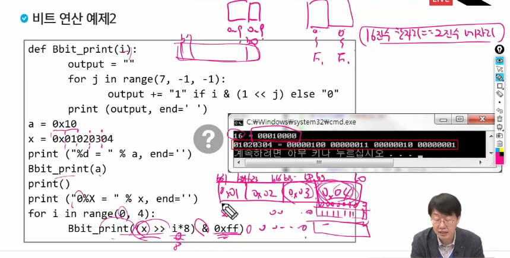
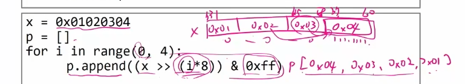
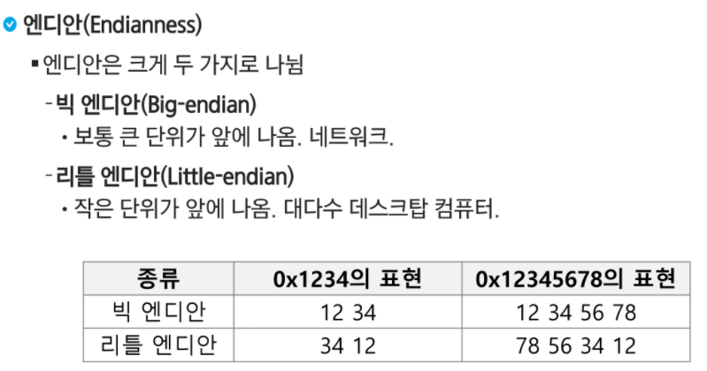

# 알고리즘 응용

## 복잡도분석

### 빅오표기

### 빅오메가 표기

### 세타표기

- 선형시간(좌) & 상수시간(우)

  

  		-	선형시간 : 입력이 늘어나는 만큼 연산도 늘어남
  		-	상수시간 : 입력의 크기와 상관없이 항상 같은 연산량

### 표준 입출력(read & write)

`참고` sampleinput이 현재는 크지 않아서 "r" 을 자주 사용하지 않지만, 1mb가 넘어가는 경우 마지막 테케가 첫 테케를 덮어쓰는 현상이 발생하므로 단순 복붙 형태 대신 위와 같이 표준 입출력 사용이 필요합니다.

## 비트연산

### 음수 vs 양수

- 제일 앞자리는 부호를 결정한다

  

### or

1개라도 1이면 1

 

### and

두개 다 1이어야 1

### not

0 <-> 1

### xor

서로 다른 값을 가진 비트만 1로 세팅 (참고 ^를 두번 반복하면 자기자신이 됨)

### shift

방향이 중요(해당 칸 수 만큼 밀어준다)

### 활용예시

1. 0000 으로만 xor을 하면 자기자신이 나온다

2. 1111 으로만 xor르르 하면 자기자신의 not이 나온다

   

3. 자기자신을 xor 하면 0000이 나온다

   

4. 0000 으로 & 연산하면 0만 나온다

   

   

5. 1111 으로 & 연산하면 자기자신이 나온다

   

6. 자기자신과 & 연산하면 자기자신이 나온다

   

7. 0000과 연산하면 자기자신이 나온다

   

8. 1111 과 or 연산하면 1111 이 나온다

   

   

9. 자기자신과 or 연산을 하면 자기자신이 나온다

### 참고

- logical vs arithmetic

  

  - 부호 고려 하지 않음

  

  - 제일 앞자리 sign 부호를 해치지 않는다

### GETBIT

- 내가 원하는 인덱스 자리의 비트 값을 알고 싶을 때

  해당 인덱스 값만 1 로 두고 & 연산을 해주면 인덱스 값은 그대로 내려오고 나머지는 0이 됨

  

- 그러면 원하는 인덱스 자리만 1 인 비트는 어떻게 만드는가?

  원하는 인덱스 값까지 쉬프트 시행

  

- 예시

  

- 결과가 0일때는 FALSE, 1일때는 TRUE를 반환하는 코드를 짜면 해당 인덱스에 해당하는 비트값이 0인지 1인지 알 수 있는 것

### SETBIT

- 해당인덱스를 1로 바꿔주기

  쉬프트 후 OR 연산 1이거나 0 이면 두개 중 하나만 1이어도 1이니까

  

### CLEAR BIT

- 해당 인덱스를 0으로 세팅

  해당 자릿수만 0이고 나머지는 1인 비트와 & 연산을 하면됨

  

- 그러면 해당자릿수만 0이고 나머지는 1인 비트는 어떻게 만드는가?

  쉬프트 후 낫

  

- 예시

### CLEAR LEFT BITS

- 해당 인덱스를 시작으로 왼쪽 비트를 모두 0으로 CLEAR

  

- 해당 인덱스 기준 좌측은 0으로 & 연산하면 0이 나오고 우측은 1로 & 연산해야 자기자신이 나옴

  

- 그러면 그 모양의 비트는 어떻게 만들어?

  시프트 후 낫과 모양이 비슷하지만 낫은 앞에있는 0들도 다 1로 뒤바뀌기 때문에  1을 빼주는 방식을 채택

  

  

### CLEAR RIGHT BITS

- 해당 인덱스를 기준으로 좌측은 자기자신 우측은 0으로 클리어

  

- 마스크 만들기

  -1 을 인덱스에 1을 더해준 값 만큼 시프트

  

  

### UPDATE BIT

- 해당 비트를 & 연산으로 클리어해준 뒤 OR 연산으로 넣고자 하는 value 값을 쏘옥 넣어줌

  

### 부분집합

### 비트연산 예제1

i 의 j번째 인자가 1이면 true니까 1 이되고 0이면 false니까 0이 되는 것을 총 7개의 자릿수를 채우기 위해 j 를 반복한다

**참고** 1byte 는 8bit , 16진수 한자리는 2진수 네자리(2진수 한자리가 1bit) , 16진수를 두자리씩 끊으면 바이트 단위를 끊는 격

### 비트연산 예제 2

bit를 7자리씩 끊어서 찍어주는게 Bbit_print(i) 함수 이다.

따라서 마지막 부분에서 x만 그냥 넣어주면 한번만 찍고 끝나게 됨

0xff를 0x04랑 제일 먼저 비교해준다면

11111111 & 00000100 을 해주는 것임 이러면 뭐야 마스킹이지 0xff 만 원래대로 찍히고 나머지는 다 0으로 찍힘

이걸 찍고 나서 i*8만큼 쉬프트 해주면 다음으로 0x03이 0x04자리에 들어가 있는 것임

차례대로 8,16,24 번 쉬프트까지 끝나면 0x01이 0x04칸 까지 오게되고 원하는 값을 얻을 수 있음

### 비트연산 예제3 - byte의 순서를 뒤집어야 할때 엔디안을 바꿔주자

중간 지점을 자세히 보면

이 과정에서 순서대로 쉬프트 되면서 바이트 단위로 남고 , 하나씩 담아주면 순서가 뒤집어지면서 p에 append되기 때문에 p를 찍어주면 엔디안이 change 되는 거임

### 엔디안

### 비트연산 예제4

- 여기서 첫번재 작업은 24번 쉬프트 하고 ff0000~ 으로 엔드 연산을 해준다 이것이 의미하는 것은

  0x04를 남기고 clear right bit를 해줌

  

- 2번째 작업은 8번 쉬프트하고 ff0000으로 앤드 연산을 하면 나머지는 0이되고 0x03만 남음

- 이걸 똑같이 3번 작업 해주면 0x02가 남고 , 4번작업해주면 0x01이 남음 이 놈들을 싹다 or 연산해주면 순서가 뒤집어짐

  

