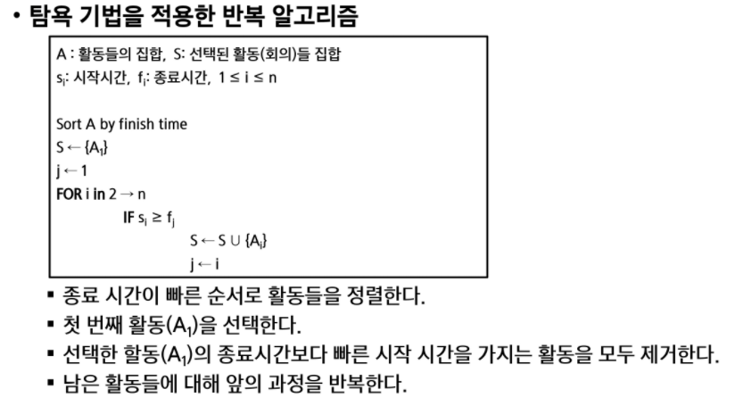

# 재귀

### 팩토리얼 재귀함수


### 순열


### 부분집합 생성


# 조합

### 조합1


이미포함 : n-1개에서 r-1개를 뽑고

미포함 :  n-1개에서 r개를 뽑아야함

`참고` nCr = nCn-r

`참고`값을 이용하고 싶으면 팩토리얼 계산이 용량이 크기 때문에 룩업테이블 처럼 사용해야 함


`참고` 포함시키고 나서 지워주지 않는 이유는  r-1 자리를  미포함할때의 다음 재귀를 불러오면서 덮어써지기 때문이다. 


### 조합-2 : 실용적인 반복 구조 버전


### 조합 - 3 : 재귀2 (계속 N과R에 변화가 생기는 등 반복 구조가 어려운 경우)


- 반복 버전을 재귀로 만든거라고 생각

- 뽑을게 없으면 종료
- COMB[] 에 r을 그대로 인덱스로 사용해서 뽑아줌
- 재귀로 3개 뽑았으면 다음은 2개 다음은 1개.. 이런식으로 뽑아야할 갯수를 줄여나가는 것임
- 시작지점은 한개 뽑을때마다 +1 되는 것은 반복구조와 같음


# 탐욕 알고리즘

### 활동 선택 문제



- swea 화물도크 문제를 풀면 금방 이해가 간다
- 활동 선택 재귀도 가능하지만 반복구조로 푸는걸 추천


# 분할정복

### 탑다운


### 병합정렬

```python
def merge(left, right):
    lp = rp = 0 #left position , rightposition
    result = []
    while lp < len(left) and rp < len(right): #lp와 rp가 리스트 길이보다 짧은 동안 # 하나가 끝날때까지 비교하며 병합
        if left[lp] < right[rp]:
            result.append(left[lp]) #작은 값을 result에 넣고
            lp += 1 #인덱스 오른쪽으로 이동
        else:
            result.append(right[rp]) #큰 값을 result에 넣고
            rp += 1 #인덱스 오른쪽으로 이동
   # 반복이 끝났을 때 -> 하나의 리스트 원소가 전부 추가 되었다.
    while lp < len(left): #왼쪽이 남아있으면
        result.append(left[lp])
        lp += 1
    while rp < len(right): #오른쪽이 남아있으면
        result.append(right[rp])
        rp += 1
    return result

def mergeSort(lst):
    if len(lst) <= 1:
        return lst  # 데이터 한개짜리 가되어서 더이상 반으로 나눌 수 없고 그 해당 한개의 데이터 들의 정렬이 끝났으니 머지하고 다시 위 스택으로 올라가라고 알려주는 역할을 함 재귀에 꼭 필요한 조건
    m = len(lst) // 2 #반씩 쪼갤거야요
    left = mergeSort(lst[:m])  # 반씩 나눠서 정렬시킴
    right = mergeSort(lst[m:])
    result = merge(left, right)
    return result

T = int(input())
for tc in range(1, T + 1):
    N = int(input())
    lst = list(map(int, input().split()))
    cnt = 0
    sorted_list = mergeSort(lst)

```


### 퀵정렬


**퀵정렬1_Hoare**

```python
import sys
sys.stdin = open('5205.txt')
def partition(s,e):
    lp = s+1 #left position
    rp = e #right position 은 end
    p = s #피봇은 start
    while lp<=rp: #같거나 교차되지 않는동안 반복
        while lp<=e and lst[p] >= lst[lp] : #lp가 내부에 위치하고, 피봇위치의 값보다 lp 값이 작은동안(같은 수 정렬 시 같다도 한쪽에 포함)
            lp += 1 #왼쪽에서 오른쪽으로 이동
        while rp>=s and lst[p] < lst[rp]: #rp가 내부에 위치하고, 피봇위치의 값보다 rp 값이 큰 동안
            rp -= 1 #오른쪽에서 왼쪽으로 이동
        if lp<rp: #while 문을 빠져나왔고 lp와 rp가 교차되지 않았으면
            lst[lp], lst[rp] = lst[rp],lst[lp] #swap
    lst[p],lst[rp] = lst[rp],lst[p] #lp,rp 교차 시 피봇위치 설정, 피봇보다 작은값인 rp와 교환해줘야 피봇을 기준으로 좌측이 작은값
    return rp
def qsort(s,e):
    if s<e: #길이가 최소한 1개이상은 되야함
        pivot = partition(s,e)  #[3개의데이터] < 12 < [5개의데이터]
        qsort(s,pivot-1)
        qsort(pivot+1,e)

T = int(input())
for tc in range(1,T+1):
    N = int(input())
    lst = list(map(int,input().split()))
    qsort(0,N-1)
    print(f'#{tc} {lst[N//2]}')
```


**퀵정렬2_Lomuto**

```python
def partition(s,e):
    i = s-1
    p = e
    for j in range(s,e):
        if lst[j] < lst[p]: #만약에 피봇보다 큰값을 만나면 i+=1 까지 못가기때문에 i와j 값이 같다가 이제 더이상 같지가 않고 차이가 생겨서 swap이 발생
            i += 1
            lst[i], lst[j] = lst[j], lst[i] #그 자리 그대로다가 #swap이 발생
    i += 1 #i에 +1을 해야 피봇 직전까지 인덱스가 이동함
    lst[i],lst[p] = lst[p],lst[i] #피봇과 자리를 바꿔줌 #그러면 오른쪽에는 큰 값만 남아있게 되는 것임
    return i


def qsort(s,e):
    if s<e: #길이가 최소한 1개이상은 되야함
        pivot = partition(s,e) #[3개의데이터] < 12 < [5개의데이터]
        qsort(s,pivot-1)
        qsort(pivot+1,e)

lst = [4,2,7,3,1,9,6,0,8]
qsort(0,len(lst)-1)
print(lst)
```


**퀵정렬3_파이썬 특징을 활용한 직관적인 방법**

```python
def quicksort(arr):
    if len(arr) < 2: #두개이상일때부터 정렬가능
        return arr
    else:
        pivot = arr[-1] #피봇은 제일 마지막 값
        smaller, equal, larger = [], [], []
        for num in arr:
            if num < pivot:
                smaller.append(num)
            elif num == pivot:
                equal.append(num)
            else:
                larger.append(num)

        return quicksort(smaller) + equal + quicksort(larger)


test_case = int(input())
for tc in range(1, test_case+1):
    n = int(input())
    unsorted_list = list(map(int, input().split()))
    print(f'#{tc} {quicksort(unsorted_list)')
```


# 백트래킹


### 상태공간트리


