# 그래프

### 상호 배타 집합 표현 - 트리

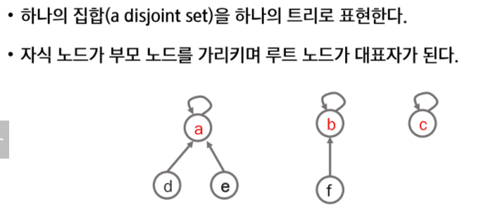


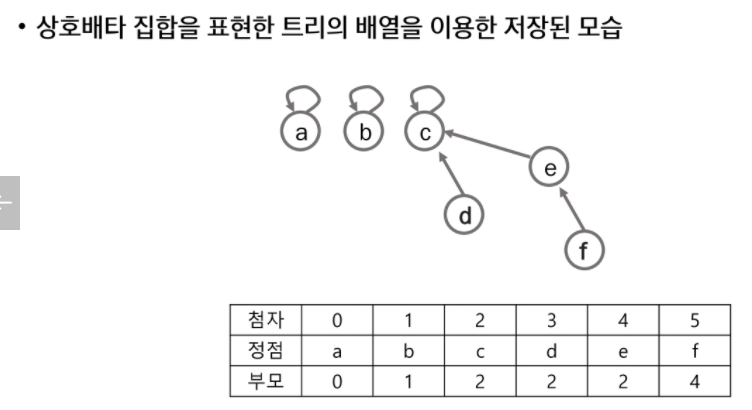

- 나의 부모가 나 자신이면 대표노드이다.


### Union

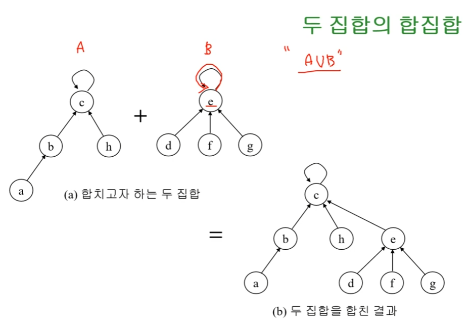


### 상호배타 집합에 대한 연산

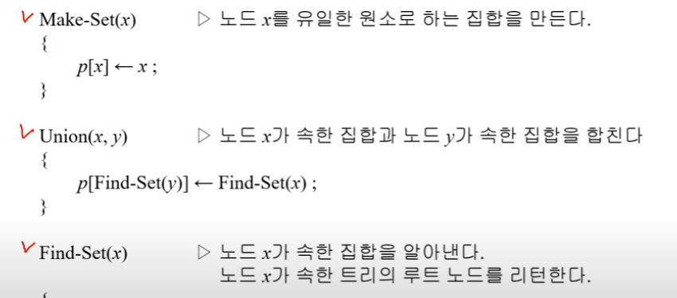

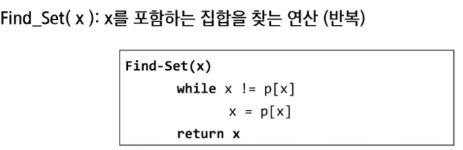

- find set : 나의 부모가 나 자신일때까지 즉 대표노드에 닿을 때까지 트리의 depth를 재귀적으로 타고 가서 루트 노드를 반환
- union : 각 집합의 대표 노드를 찾고 포인터를 이어서 합쳐줌


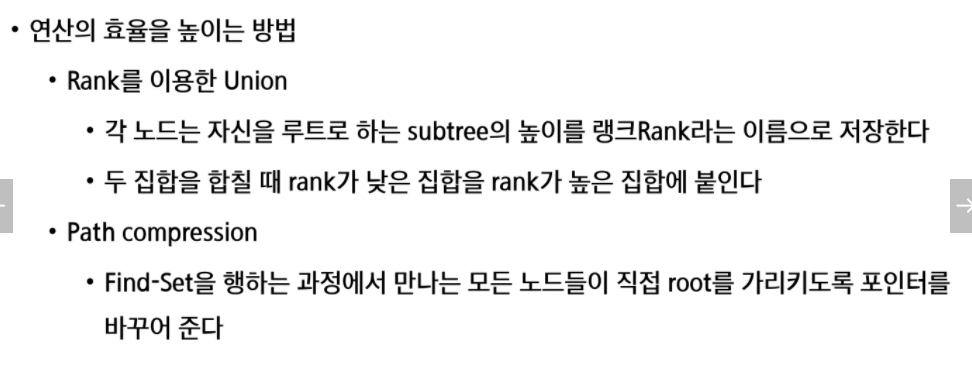


### rank union

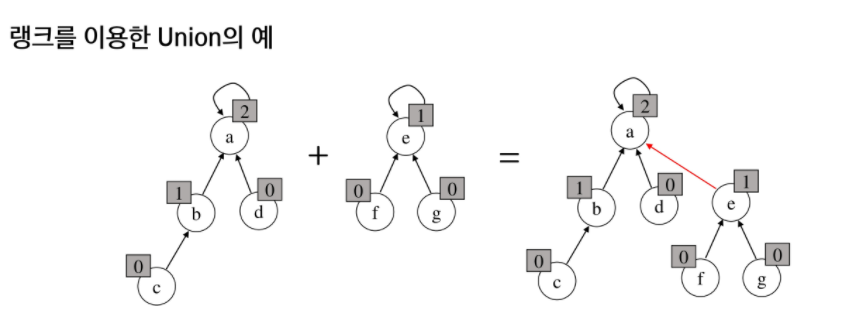

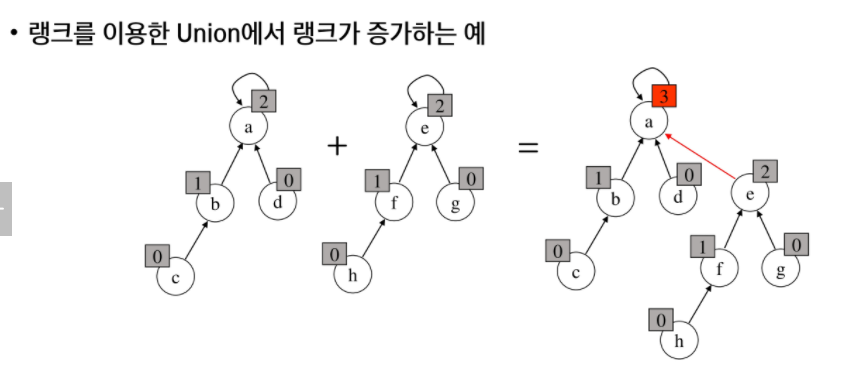

### 경로 압축

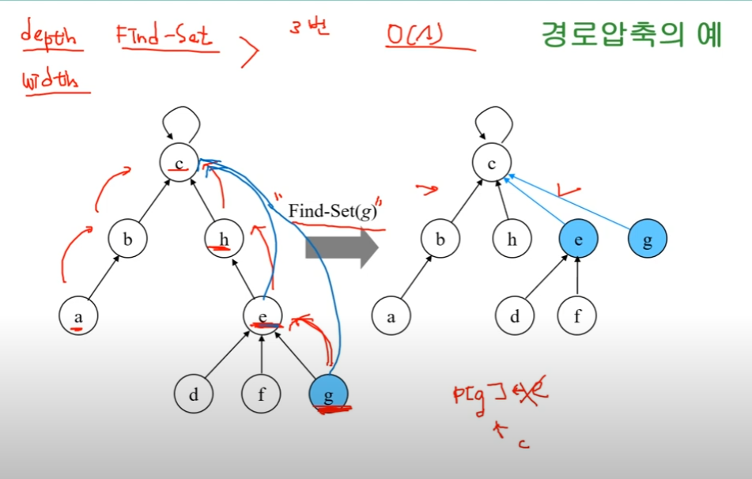

- depth 대신 width를 손해보기로함 
- 어차피 findset을 하면서 타고 들어간김에 재귀로 돌아오면서 c 대표 노드로 이어주는 작업을 해줌
- find set을 할수록 대표노드를 금방 찾을 수 있음 width가 넓어지니까 깊이는 얕아지겠지


### make set 연산

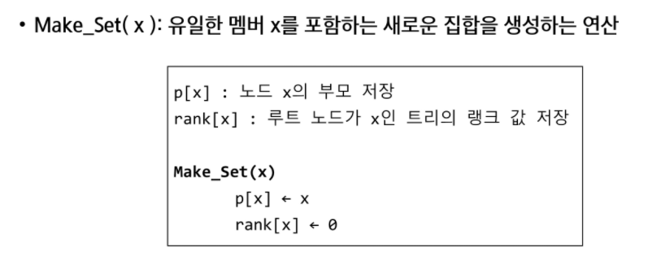


### find set 연산(재귀)_경로압축을 이용한 find-set

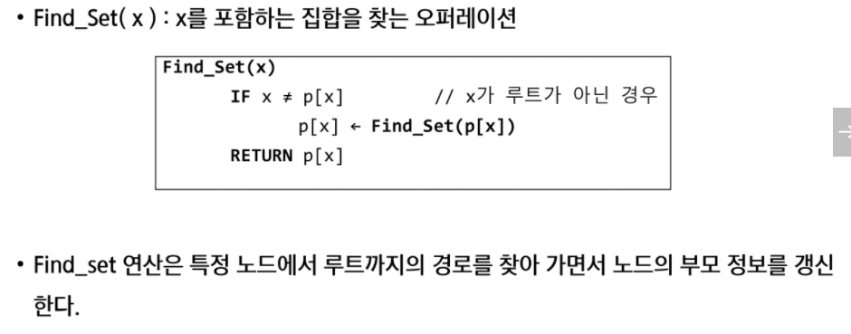

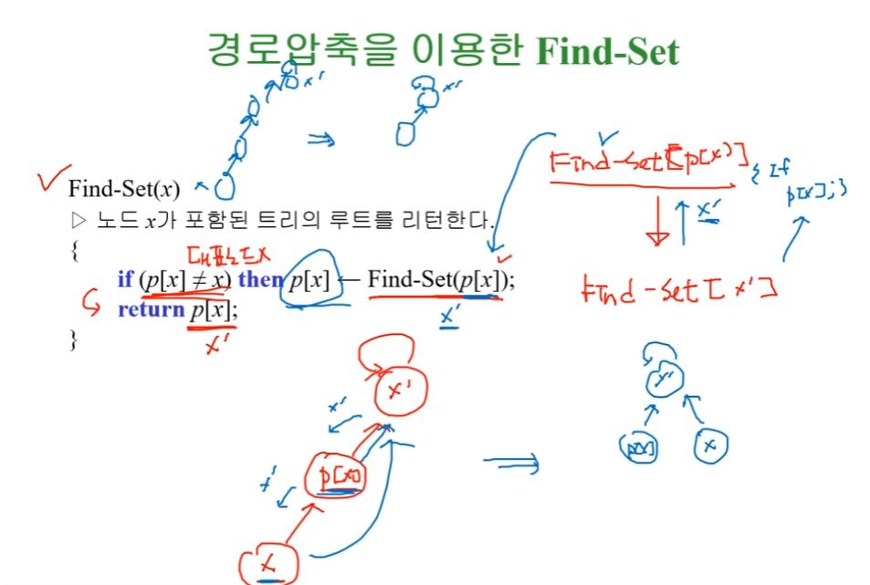


### rank를 이용한 union과 make-set

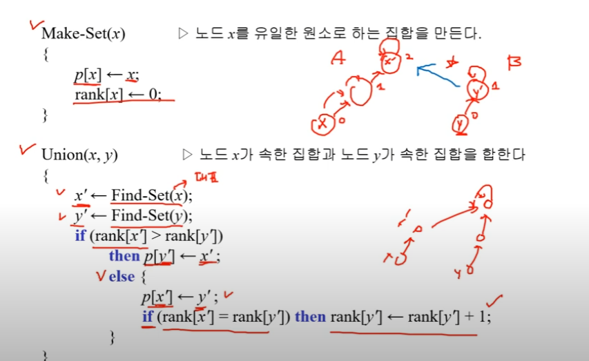


### 예시

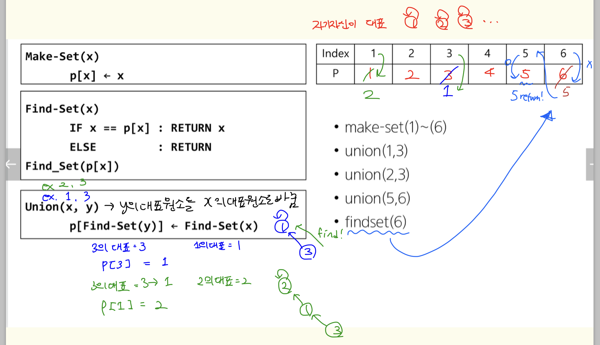


### 


# 최소 신장트리


### 크루스칼 알고리즘

https://www.youtube.com/watch?v=LQ3JHknGy8c

- 정점이 V개 라면 최소 간선 갯수는 V-1개
- 알고리즘 적용 순서
  1. 모든 간선들을 거리(비용) 기준 오름차수누 정렬
  2. 정렬된 순서에 맞게 그래프에 포함
  3. 포함시키기 전에 사이클 테이블을 확인
  4. 사이클을 형성하는 경우 간선에 포함X

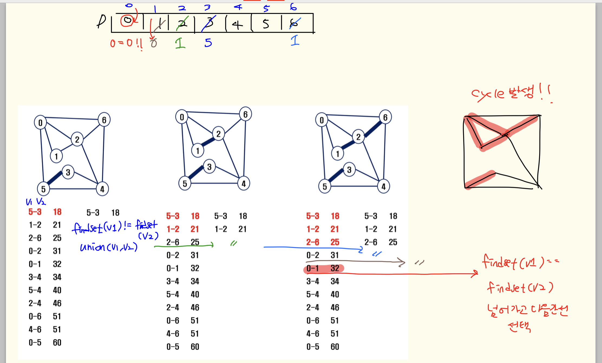


```python
def find_set(x):
    while x != rep[x]:
        x = rep[x]
    return x


def union(x, y):
    rep[find_set(y)] = find_set(x)


V, E = map(int, input().split())  # V 마지막 정점, 0~V번 정점, 개수(V+1)개
edge = []
for _ in range(E):
    u, v, w = map(int, input().split())  # 간선 연결 u-v 와 비용 w
    edge.append([w, v, u])
edge.sort()
rep = [i for i in range(V + 1)]  # 대표원소배열
# MST의 간선수 N = 정점수 -1 (V+1-1)
N = V + 1
cnt = 0  # 선택한 edge의 수
total = 0  # MST 가중치의 합

for w, v, u in edge:
    if find_set(v) != find_set(u):
        cnt += 1  # 그래프에 추가
        union(u, v)  # 사이클 발생시 제외해주기 위해 union 작업 필요
        total += w  # 비용 더하기
        if cnt == N - 1:  # V개가 되야하니까 간선수가 #MST 구성이 끝나면
            break
print(total)

```


### 프림 알고리즘

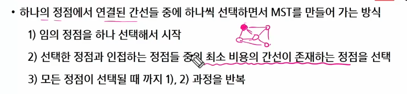


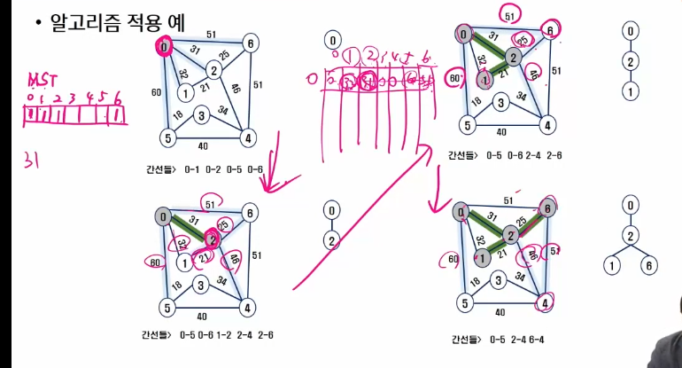

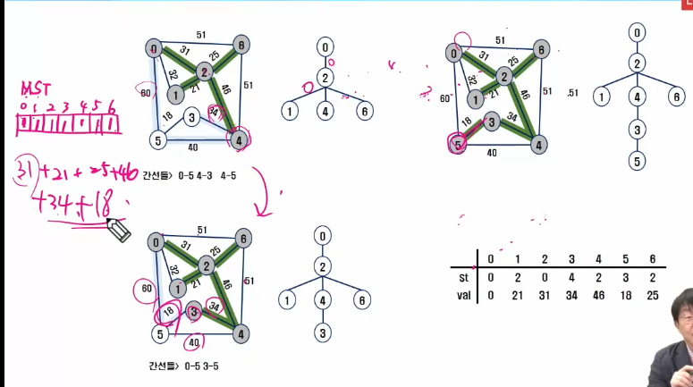


`프림1`

```python

def prim1(r,V):
    MST = [0]*(V+1) #MST 포함여부
    key = [10000]*(V+1) #가중치의 최대값 이상으로 초기화. key[v]는 v가 MST에 속한 정점과 연결될 때의 가중치
    key[r] = 0 #시작정점의 KEY
    for _ in range(V): #V+1개의 정점 중 V개를 선택
        #MST에 포함되지 않은 정점 중 (MST[u]==0), key가 최소인 u찾기
        u =  0 #시작점이 0일때만 가능한 초기화값
        minV = 10000 #extract min
        for i in range(V+1):
            if MST[i]==0 and minV>key[i]: #mst에 속하지 않았고 무한대가아니니까 인접하면서, 가장 최소거리의 인덱스를 찾아감
                u=i
                minV=key[i]
        MST[u] = 1 #정점 u를 MST에 추가
        #u에 인접인 v에 대해, mst에 포함되지 않은 정점이면
        for v in range(V+1):
            if MST[v] == 0 and adjM[u][v] > 0:
                key[v] = min(key[v], adjM[u][v]) #u를 통해 MST에 포함되는 비용과 기존 비용을 비교후 갱신

    return sum(key) #MST 가중치의 합


V,E = map(int,input().split()) #0번에서 V번까지 정점 #간선의갯수
adjM =  [[0]*(V+1) for _ in range(V+1)] #가중치를 기록할 인접행렬
#adjL = [[] for _ in range(V+1)] #인접리스트도 가능
for _ in range(E):
    u,v,w = map(int,input().split()) #정점 두개와 가중치 w
    adjM[u][v] = w
    adjM[v][u] = w
    #adjL[u].append((v,w)) #인접리스트도 가능
    #adjL[v].append((u,w))


print(prim1(0,V))
```


`프림2`

```python
#최솟값을 키값을 갱신하는 것 대신에 좀더 직접적으로 찾는 prim2

def prim2(r,V):
    MST = [0] * (V+1) #mst 포함 여부
    MST[r] = 1 #출발지 mst 표시
    s = 0 #최소 가중치의 합을 선택될때마다 기록해줄거임
    for _ in range(V): #1개는 미리 포함시켰으니까 V-1번 반복
        u = 0 #선택할 정점 번호
        minV = 10000
        for i in range(V+1):#extract min #MST에 포함된 정점i와 인접한 정점j 중
            if MST[i] == 1: #포함된 정점이 나오면
                for j in range(V+1): #나머지 정점에 대해서
                    if 0<adjM[i][j]<minV and MST[j]==0: #인접(무한대x,0도 아님)이고 and mst에 속하지 않은 정점중에서 값이 더 작을때만 갱신해 나감
                        u = j
                        minV = adjM[i][j]

        s += minV #최솟값을 더해줌
        MST[u] = 1 #MST에 방문했다고 추가
    return s


V,E = map(int,input().split()) #0번에서 V번까지 정점 #간선의갯수
adjM =  [[0]*(V+1) for _ in range(V+1)] #가중치를 기록할 인접행렬
#adjL = [[] for _ in range(V+1)] #인접리스트도 가능
for _ in range(E):
    u,v,w = map(int,input().split()) #정점 두개와 가중치 w
    adjM[u][v] = w
    adjM[v][u] = w
    #adjL[u].append((v,w)) #인접리스트도 가능
    #adjL[v].append((u,w))


print(prim2(0,V))
```


# 최단 경로 알고리즘

### 다익스트라

https://www.youtube.com/watch?v=acqm9mM1P6o

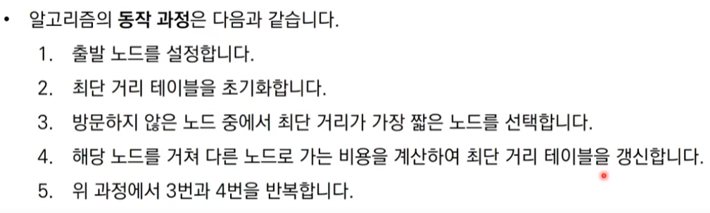


```python

def dijkstra(s,V): #s는 출발
    visited = [0]*(V+1)
    visited[s] = 1
    for i in range(V+1):
        D[i] = adjM[s][i]
        print(D[i]) #[0, 1, 6]
    for _ in range(V):#시작노드 제외 전체 노드에 대해 반복
        minV = INF
        w = 0
        for i in range(V+1):
            if visited[i] == 0 and minV > D[i]: #방문하지 않은 노드 중에서 가장 최단 거리가 짧은 노드의 번호를 찾는다
                minV = D[i]
                w = i
        visited[w] = 1 #방문표시
        for v in range(V+1):
            D[v] = min(D[v], D[w]+adjM[w][v]) #현재노드를 거쳐서 다른 노드로 이동하는 거리와 비교했을때 최솟값을 기록해놓는다
            print(D)

T = int(input())
for tc in range(1,T+1):
    V,E = map(int,input().split()) #V는 마지막정점번호 #E는 간선갯수 #V+1은 정점갯수,
    INF = 10000 #이어져있지 않으면 무한대로 초기화
    adjM = [[INF]*(V+1) for _ in range(V+1)]
    for i in range(V+1):
        adjM[i][i] = 0 #자기자신에게 가는 경로는 0
    for _ in range(E):
        u,v,w = map(int,input().split()) #start, end, 비용
        adjM[u][v] = w
    print(adjM)

    D = [0]*(V+1) #0번에서 각 노드마다 최소 거리를 구해보자
    dijkstra(0,V)
    print(f'#{tc} {D[-1]}') 
```

