# 트리

### 정의

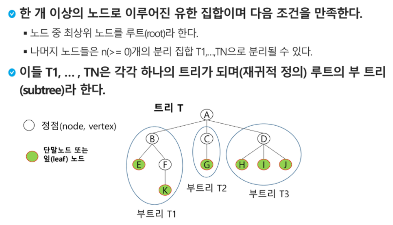

### 차수

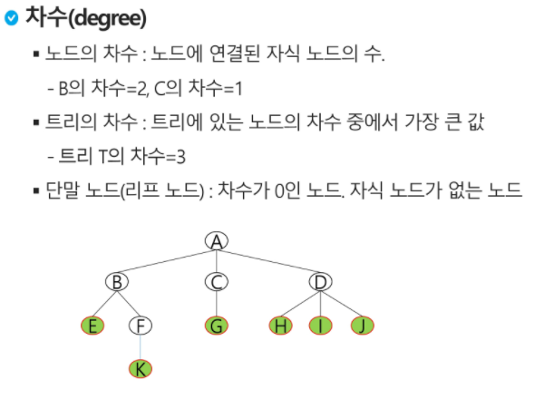


### 이진트리

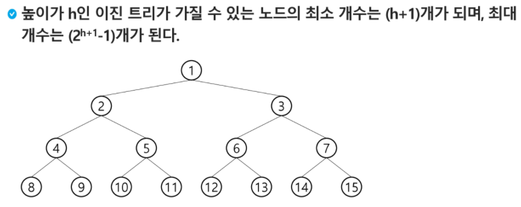

- 완전 이진트리

  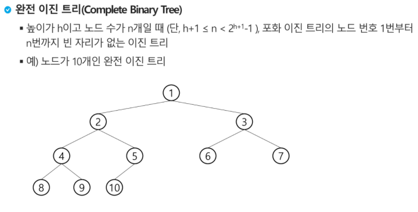

- 편향 이진트리

  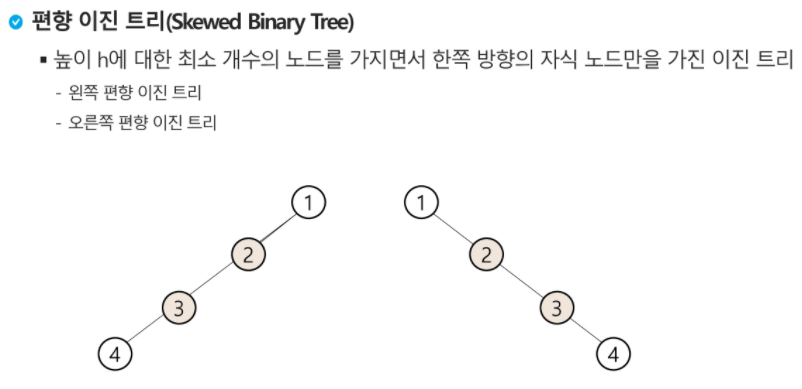


### 이진트리 - 순회

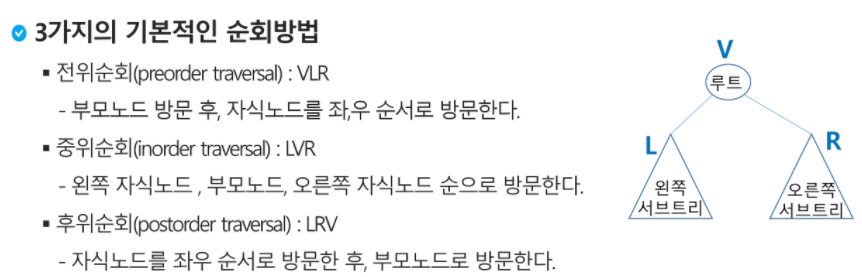

```python
def pre_order(node):
    #노드가 존재하면 냅다 가서 조사
    if node :  #내가 트리를 0으로 초기화 해줬으니까 0은 False
        print(node) #visit(node) node를 방문해서 해야할 일을 한다
        pre_order(ch1[node]) #왼쪽 자식 방문 #트리의 형태에 따라서 함수에 들어가는 값은 바뀜
        pre_order(ch2[node]) #오른쪽 자식 방문

def in_order(node):
    if node :
        in_order(ch1[node])
        print(node)
        in_order(ch2[node])

def post_order(node):
    if node:
        post_order(ch1[node])
        post_order(ch2[node])
        print(node)

        
lst = ['A','B','A','C','B','D','B','E','C','F','C','G','E','H','E','I']
ch1 = [0]*(V+1)
ch2 = [0]*(V+1)
for i in range(E):
    p,c = lst[i*2], lst[i*2+1]
    if ch1[p] == 0: #아직 자식이 없는 경우
        ch1[p] = c
    else:
        ch2[p] = c
```

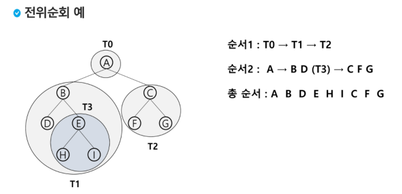


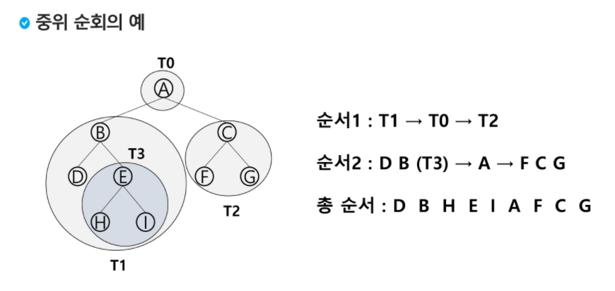


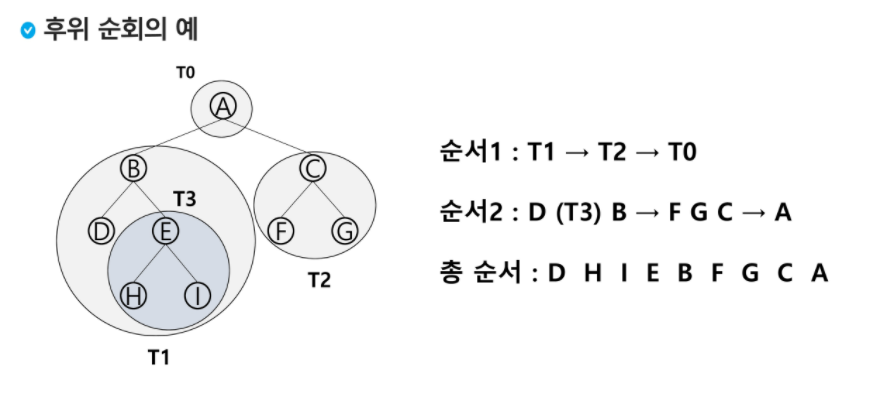


### 이진트리의 표현 - 배열

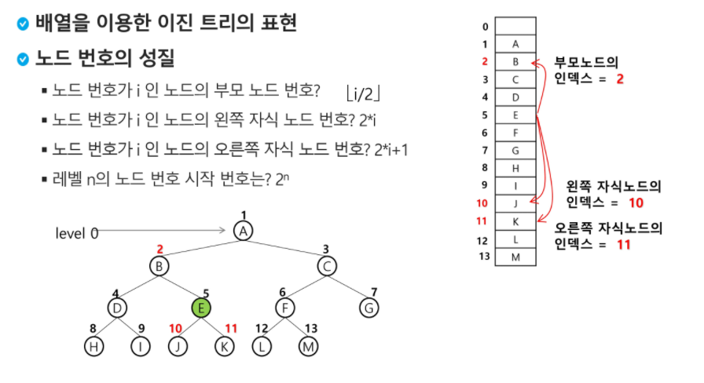


### 이진탐색트리

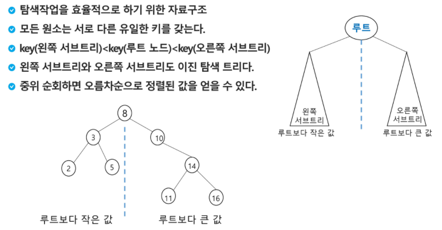


### 자연수 1~N까지 이진탐색트리 만드는법

```python
T = int(input())
def binary_tree(i):
    global cnt
    if i <= N: #배열크기가 넘어가지 않도록한다 #완전이진트리를 만들기 때문에 비워있는 노드번호가 없다는거고 트리의 최대크기가 N을 벗어날수 없음
        binary_tree(2*i) # 왼쪽 노드는 현재 index의 2배이다 #좌측 #cnt가 커지기 전에 왼쪽에 집어넣고
        tree[i] = cnt # 값넣기  #내 위치에 집어넣고
        cnt += 1 #다음 숫자로 증가시키기
        binary_tree(2*i+1)#오른쪽 노드는 현재 index의 2배 + 1 #cnt가 커지고 난 뒤 오른쪽에 집어넣어줌

for tc in range(1,T+1):
    N = int(input()) #N은 정점의 갯수 1~N까지

    tree = [0 for _ in range(N+1)]
    cnt = 1
    binary_tree(1)
    print(f'#{tc} {tree} {tree[1]} {tree[N//2]}')
    
'''
OUTPUT
#1 [0, 4, 2, 6, 1, 3, 5] 4 6
'''
```


### 이진탐색트리 - 연산

**1. 탐색연산**

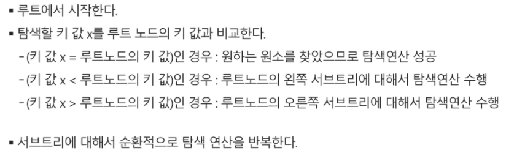

**ex**) 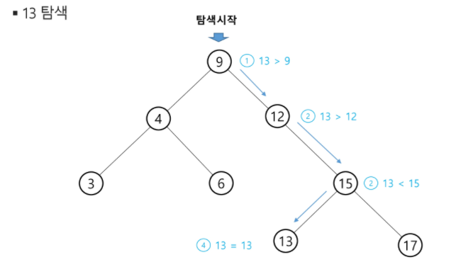


**2. 삽입연산**

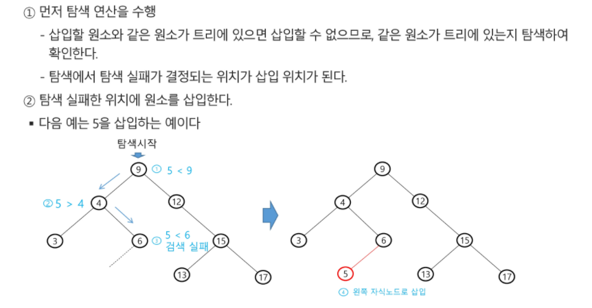


### 힙

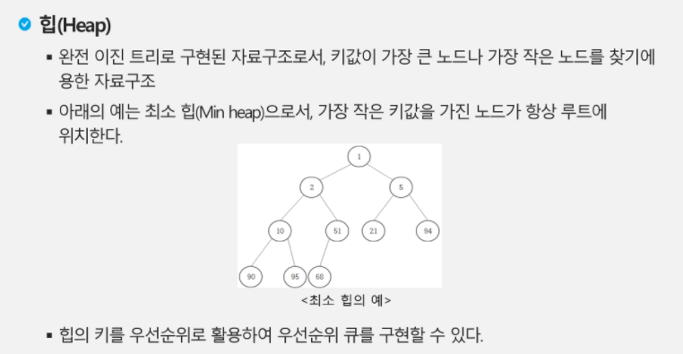


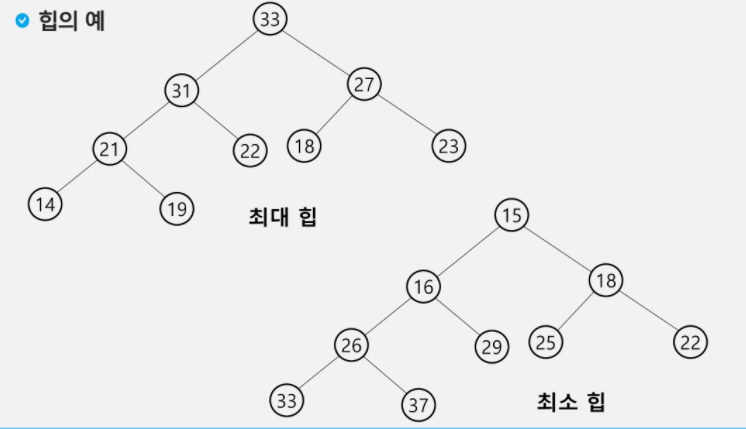

### 힙 생성(최소힙)

```python
V = 6
#각 노드가 가지고 있는 값
arr = [9,5,3,4,8,1]
# 주어진 노드를 트리에 순차적으로 집어 넣고
# heap 구조로 만들자
# tree가 있어야 한다.
tree = [0 for _ in range(V+1)]
#시작 노드 번호가 1이므로 라스트도 1로 시작
last = 1
for i in range(len(arr)): #노드리스트로 반복 돌리기
    if not tree[last]:
        tree[last] = arr[i] #처음들어오는 9를 1번째 트리에 넣어야 한다
        # 그게 아니라면 완전 이지트리 모양을 맞추기 위해서 last가 1씩 증가
    else:
        last += 1
        child = last #child와 parent 값을 비교해서 정렬해줘야 하니까
        parent = child//2
        tree[child] = arr[i]
        print(tree,parent,child) #정렬되지 않은 상태로 순차적으로 들어가고 있음
        #부모가 가진 값이 자식이 가진 값보다 큰 동안
        while tree[parent] > tree[child]: #반복문으로 정렬시켜주자 #부호만 바꾸면 최대힙
            # 부모와 자식의 값을 서로 바꾼다.
            tree[parent],tree[child] = tree[child], tree[parent]
            # 자식 위치를 부모로 변경
            child = parent
            # 부모 위의 조상노드 찾아가기 그렇게 다시 정렬 #제일 적은 값을 루트로 끌어 올리는 과정, 최소힙 모양을 위해 꼭 필요함
            parent = parent // 2
            #그러나 제일 위에 루트에만 최소힙이 오는 거지
            # 그 아래가  완전 정렬되는 것은 아님
            
print(tree)
'''output
[0, 9, 5, 0, 0, 0, 0] 1 2
[0, 5, 9, 3, 0, 0, 0] 1 3
[0, 3, 9, 5, 4, 0, 0] 2 4
[0, 3, 4, 5, 9, 8, 0] 2 5
[0, 3, 4, 5, 9, 8, 1] 3 6

[0, 1, 4, 3, 9, 8, 5] #최소힙 완성

Process finished with exit code 0

'''
```

