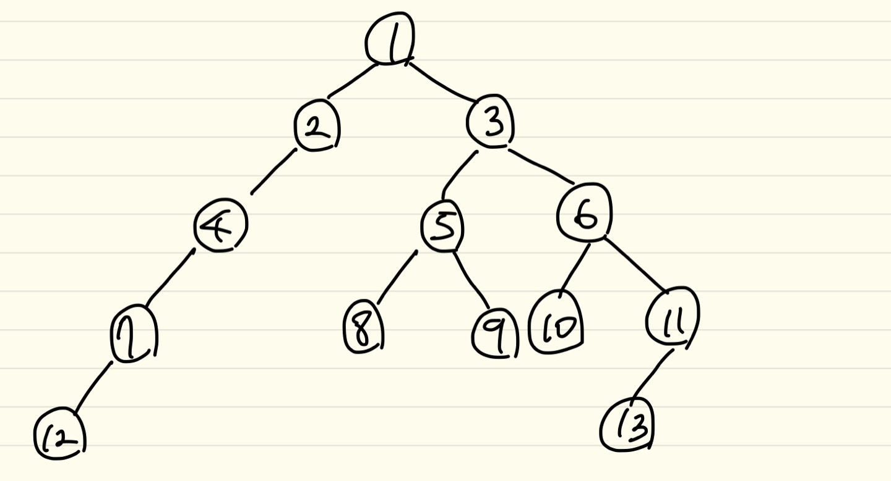
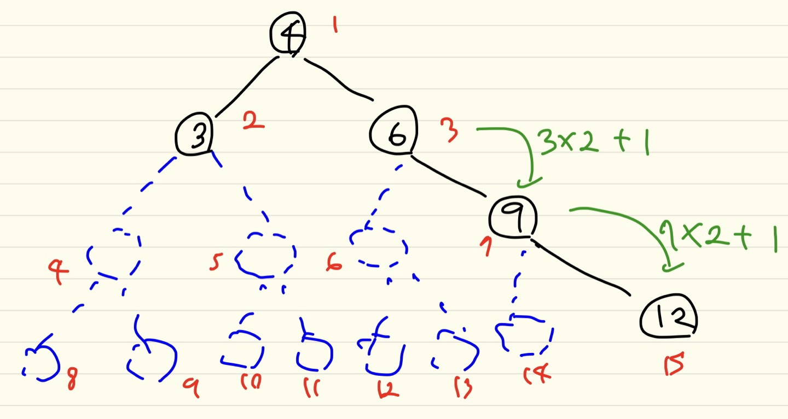
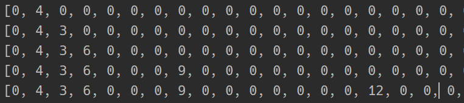

### input

```bash
13 12 #13은 정점 수, NODE or VERTAX / 12는 간선 수, EDGE --> E = V+1
1 2 1 3 2 4 3 5 3 6 4 7 5 8 5 9 6 10 6 11 7 12 11 13
```



### 방법 1 왼쪽 자식(ch1) 과 오른쪽 자식(ch2) 를 따로 저장

**1-1** 부모번호를 인덱스로 자식번호를 저장

```python
V, E = map(int,input().split())
lst = list(map(int,input().split()))
ch1 = [0]*(V+1) #인덱스 번호 1번 부터 사용하기 위해서 V+1개
ch2 = [0]*(V+1)
for i in range(E): #간선의 갯수만큼 반복해야함
    p,c = arr[i*2], arr[i*2+1]
    if ch1[p] == 0: #아직 자식이 없는 경우
        ch1[p] = c
    else:
        ch2[p] = c
print(ch1)
print(ch2) 
        
'''
output
[0, 2, 4, 5, 7, 8, 10, 12, 0, 0, 0, 13, 0, 0]
[0, 3, 0, 6, 0, 9, 11, 0, 0, 0, 0, 0, 0, 0]
'''
```


### 방법 2 자식 번호를 인덱스로 부모 번호를 저장

**2-1**

```python
par = [0] * (V + 1)
for i in range(E):
    p, c = lst[i * 2], lst[i * 2 + 1]
    par[c] = p
print(par)

'''
output
[0, 		0, 		1, 		1, 		2, 3, 3, 4, 5, 5, 6, 6, 7, 11]
	1은 부모가 없다 |	2와 3의 부모는 1 | ...
	->1은 루트	
'''
```

**2-2** 루트찾기에 이용 가능

```python
for i in range(1,V+1):
    if par[i] == 0: #부모가 0인 정점 == root
        root = i
        break
print(root)
```

**2-3** 조상찾기에 이용 가능

```python
c=5 #정점 5 의 조상찾기
res = []
while par[c] != 0: #부모가 있다면 계속 검색
    res.append(par[c])
    c = par[c] #부모가 있다면 부모가 다시 정점이 되서 위로위로 올라가면서 탐색
print(*res)
```


### 방법 3 - 2차원 배열에 인덱스 번호를 정점으로 활용하여 [ch1, ch2, 부모] 세가지 정보를 모두 넣어주기

```python
tree = [[0,0,0] for _ in range(V+1)]
for i in range(E):
    parent,child = lst[i*2], lst[i*2+1]
    if tree[parent][0] == 0:
    	tree[parent][0] = child
    else:
        tree[parent][1] = child
    #자식 노드에 부모 값 추가
    tree[child][2] = parent 
    # i=0 , tree[2][2] = 1 --> 2의 부모는 1 
print(tree)
'''
output
[[0, 0, 0], [2, 3, 0], [4, 0, 1], [5, 6, 1], [7, 0, 2], [8, 9, 3], [10, 11, 3], [12, 0, 4], [0, 0, 5], [0, 0, 5], [0, 0, 6], [13, 0, 6], [0, 0, 7], [0, 0, 11]]

'''
        
   
```


### 방법 4 - 비어있는 노드를 고려한 1차원 배열 트리



```python
def lst_Tree(value): #value 에는 4,3,6,9,12가 순서대로 들어옴
    pos = 1
    while TREE[pos]: #True면 반복 #빈 노드가 나오면 stop
        #비어있지 않은 노드를 반복해주면서 쌓아온 pos값을 조건을 나눠서 활용
        if TREE[pos] < value: # 더 큰 value가 들어오면
            pos = pos*2 + 1 #공식
        else: #더 작은 value가 들어오면
            pos = pos*2 #공식
    TREE[pos] = value #쌓아온 pos를 활용해서 비어있는 노드들을 뛰어넘고 value값을 입력 가능


lst = [4,3,6,9,12]
TREE = [0]*100
for value in lst:
    lst_Tree(value)
    print(TREE)

'''
output
아래 캡처 참고

'''
```

