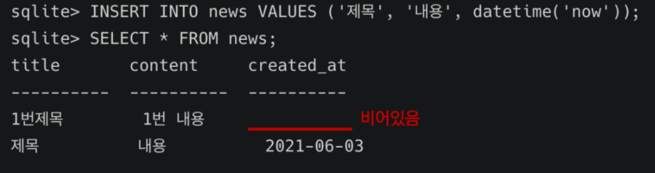

# Database

[toc]

## 1. SQL 개념

> SQL(StructuredQueryLanguage)는 관계형 데이터베이스 관리시스템(RDBMS)의데이터를 관리하기 위해 설계된 특수 목적의 프로그래밍 언어이다.


**SQL 문법의 세가지 종류**

- DDL - 데이터 정의 언어
  - CREATE
  - DROP
  - ALTER
- DML - 데이터 조작 언어
  - INSERT
  - UPDATE
  - DELETE
  - SELECT
- DCL - 데이터 제어 언어
  - GRANT
  - REVOKE
  - COMMIT
  - ROLLBACK


## 2. Database 생성

> 해당하는 데이터베이스 파일이 있으면 해당DB를 콘솔로 연다. 
>
> 만약 해당하는 파일이 없으면 새로 생성하고, 해당 DB를 콘솔로 연다.

```sqlite
$ sqlite3 database

ex)
$ sqlite3 tutorial.sqlite3    // 1. 콘솔로 DB를 열고,
sqlite> .databases            // 2.데이터베이스 목록을 확인한다.
```


**CSV 파일 불러오는 명령어**

> 주의사항)
>
> `.`으로 시작하는 모든 명령어는 SQLite에서 데이터베이스를 조금 더 편리하게 다루기 위해 제공하는 명령어이며, SQL 문법에 속하지 않습니다.

```sqlite
sqlite> .mode csv
sqlite> .import 파일명.csv 테이블명

ex)
sqlite> .import users.csv users_user
sqlite> .tables			// 테이블 목록 확인
```


## 3. 테이블 생성 및 삭제 

> 데이터 타입의 종류는 INTEGER, TEXT, REAL, NUMERIC, BLOB 등이 존재한다.
>
> 자세한 내용은 [SQLite3 공식문서](https://sqlite.org/datatype3.html)를 참조한다.


**테이블 생성 (CREATE)**

```sql
CREATE TABLE table (
	column1 datatype PRIMARY KEY,
  column2 datatype,
  ...
);
```

> 참고)
>
> SQLite는 따로 PRIMARY KEY 속성의 칼럼을 작성하지 않으면 값이 자동으로 증가하는 PK 옵션을 	가진 rowid 컬럼을 정의
>
> `rowid 조회 명령어`
>
> ```sqlite
> sqlite> SELECT rowid, * FROM 테이블명;
> ```

​	


**테이블 생성 with NOT NULL 조건 예시** -> 꼭 필요한 정보라면 공백이어서는 안됨

```sql
CREATE TABLE table (
	id INTEGER PRIMARY KEY,
  name TEXT NOT NULL,
  age INT NOT NULL,
  ...
);
```

 

**테이블 및 스키마 조회 명령어** **(!= SQL)**

```sqlite
sqlite> .tables          // 테이블 목록 조회
sqlite> .schema table    // 특정 테이블 스키마 조회
```


**테이블 제거 (DROP)**

```sql
sqlite> DROP TABLE classmates;
sqlite> .tables // 테이블 제거 확인
```


## 4. 데이터 추가, 읽기, 수정 및 삭제

**추가 (INSERT)**

```sql
INSERT INTO 테이블이름 (column1, column2, ...)
VALUES(value1, value2);
```

**모든 열에 데이터가 있는 경우 column을 명시하지 않아도 됨** 


**조회 (SELECT)**

> 참고)
>
> SQL은 세미콜론(;)을 만나기 전까지 절대 실행되지 않습니다.
>
> 따라서 아래 LIMIT 예시와 같이 들여쓰기를 비교적 자유롭게 할 수 있습니다.

```sql
-- 모든 컬럼 가져오기 --
SELECT * FROM table;

-- 특정 컬럼 가져오기 --
SELECT column1, column2 FROM table;

-- LIMIT: 원하는 개수(num)만큼 가져오기 -- 
SELECT column1, column2
FROM table
LIMIT num;

-- OFFSET: 특정 위치에서부터 가져올 때 --
-- (맨 위부터 num만큼 떨어진 값부터 가져온다는 의미)
-- 예를 들어 3번째 값을 조회 할려면 LIMIT 1 OFFSET 2
SELECT column1, column2
FROM table
LIMIT num OFFSET num;

-- WHERE: 조건을 통해 값 가져오기 --
-- 예를 들어 WHERE address='서울' #주소가 서울인 경우의 데이터를 조회
SELECT column1, column2
FROM table
WHERE column=value;

-- DISTINCT: 중복없이 가져오기 -- 
-- DISTINCT 절은 SELECT 키워드 바로 뒤에 작성
SELECT DISTINCT column FROM table;
```


**삭제 (DELETE)**

```sql
DELETE FROM table
WHERE condition;

ex)
-- 중복 불가능한 값인 rowid를 기준으로 삭제하기
-- 참고) SQLite는 기본적으로 삭제하고 다시 데이터를 입력하면 id를 재사용 --> 따라서 재사용을 안하게 할려면 테이블 생성단계에서 AUTOINCREMENT 속성을 추가한다(장고에서는 이값이 디폴트)
DELETE FROM classmates
WHERE rowid=5; 

DELETE FROM classmates
WHERE name='김싸피';

```


**수정 (UPDATE)**

```sql
UPDATE table
SET column1=value1, column2=value2, ...
WHERE condition;

ex)
-- 김싸피의 이름을 김삼성으로 바꾼다고 하면... --
UPDATE classmates
SET name='김삼성', address='대한민국'
WHERE name='김싸피';
```


**CRUD 요약**


**예시와 함께하는 WHERE문 심화 (READ)**

```sql
-- Q.users에서 age가 30이상인 사람만 가져온다면? --

SELECT * FROM users
WHERE age >= 30;
```

```sql
-- Q.users에서 age가 30이상인 사람의 이름만 가져온다면? --

SELECT first_name FROM users
WHERE age >= 30;
```

```sql
-- Q.users에서 age가 30이상이고 성이 김인 사람의 성과 나이만 가져온다면? --
SELECT age, last_name FROM users
WHERE age >= 30 and last_name='김';
```


## 5. 심화 SQL문

### Expressions_aggregation 함수

- COUNT (레코드 값들의 개수 반환)

  ```sql
  SELECT COUNT(*) FROM users;
  ```

- AVG (레코드 값들의 평균값 반환)

  ```sql
  SELECT AVG(age)
  FROM users
  WHERE age >= 30;
  ```

- MAX (레코드 값들의 최대값 반환)
- MIN (레코드 값들의 최소값 반환)
- SUM (레코드 값들의 합 반환)

​	**예시**

​		users TABLE

​		

​			

```sqlite
SELECT COUNT(*) FROM users;
SELECT AVG(age) FROM users WHERE age>=30;
SELECT first_name, MAX(balance) FROM users;
SELECT AVG(balance) FROM users WHERE age>=30;
SELECT SUM(*) FROM users;
```


### LIKE

> LIKE는 두 가지 와일드 카드(언더스코어 그리고 퍼센트 기호)와 함께 동작한다.

- `-` (반드시 이 자리에 한 개의 문자가 존재해야 한다는 뜻)

  ```sql
  -- 20대인 사람들만 가져올 때 --
  SELECT *
  FROM users
  WHERE age LIKE '2_';
  ```

- `%` (이 자리에 문자열이 있을 수도, 없을 수도 있다. 0개 이상이라는 뜻)

  ```sql
  -- 지역번호가 02인 사람만 가져올 때 --
  SELECT *
  FROM users
  WHERE phone LIKE '02-%';
  
   -- 지역번호가 02가 아닌 사람만 가져올 때 -- not 사용가능
   SELECT *
   FROM users
   WHERE phone not LIKE '02-%';
  ```

- 두 개를 조합해서 사용할 수도 있다.

  ```sql
  -- 핸드폰 중간 번호가 반드시 4자리면서 511로 시작되는 사람들 --
  
  SELECT * FROM users
  WHERE phone LIKE '%-511_-%';
  ```

- 사용예시

  


**정렬 (ORDER BY)**

```sql
SELECT columns FROM table
ORDER BY column1, column2 ASC | DESC;

-- ASC: 오름차순 / DESC: 내림차순 --
```

```sql
-- 나이, 성 순서로 오름차순 정렬하여 상위 10개만 뽑아보면? --
SELECT * 
FROM users
ORDER BY age, last_name ASC
LIMIT 10;
```


**GROUP BY**

> 지정된 기준에 따라 행 세트를 그룹으로 결합한다.
>
> 데이터를 요약하는 상황에서 주로 사용한다.
>
> 문장에 WHERE 절이 포함된 경우 반드시 WHERE 절 뒤에 작성

```sql
SELECT column1, aggregate_function(column_2)
FROM table
GROUP BY column1, column2;
```

```sql
-- 성(last_name)씨가 몇 명인지 조회할 때 --
SELECT last_name, COUNT(*)
FROM users
GROUP BY last_name;

-- AS를 활용해서 COUNT에 해당하는 컬럼 명을 바꿔서 조회할 수 있음
SELECT last_name, COUNT(*) AS name_count
FROM users
GROUP BY last_name;
```


**ALTER**

- 테이블명 변경

  ```sql
  ALTER TABLE 기존테이블명
  RENAME TO 새로운테이블명;
  ```

- 컬럼명 변경(new!)

  ```sqlite
  ALTER TABLE 테이블명
  RENAME COLUMN 기존컬럼명 TO 새로운컬럼명;
  ```

- 새로운 컬럼 추가

  ```sql
  ALTER TABLE 테이블명
  ADD COLUMN 컬럼명 datatype;
  
  -- 예시(1. NOT NULL 설정 없이 추가)
  ALTER TABLE news
  ADD COLUMN created_at TEXT;
  -- 예시(2. NOT NULL & DEFAULT값 설정)
  ALTER TABLE news
  ADD COLUMN subtitle TEXT NOT NULL DEFAULT '소제목';
  ```
  
  두가지 예시 실행 결과
  
  1. 
  
  
  
  2. 


