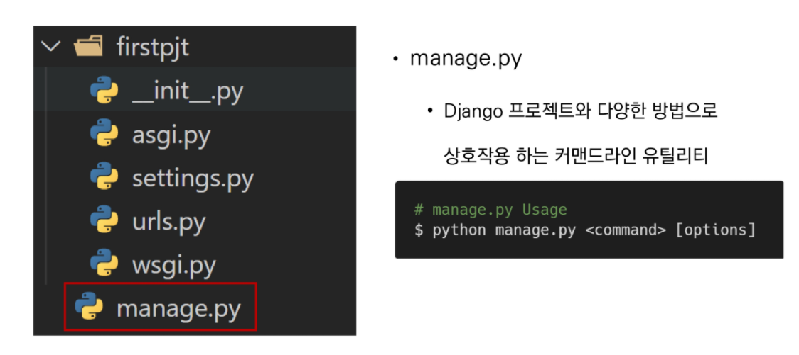
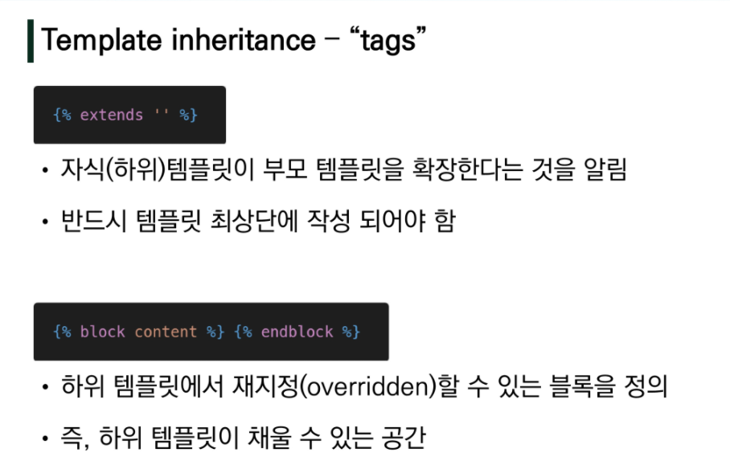

- 뒤에 . 은 폴더의 위치를 의미


### 프로젝트 구조





### 어플리케이션 생성


### 앱등록


- 반드시 생성 후 등록!!


- 순서를 지키는게 좋음


### 요청과 응답


### DTL (Django Template Language)


### 템플릿 상속




- block `content`는 `이름`으로 skeleton 템플릿과 자식 템플릿의 공간을 이어준다고 생각하면됨


- 이렇게 하면 _nav.html  에서는 skeleton 코드에서 nav 관련 코드만 따로 떼내서 관리가 가능하다는 것을 의미


### HTML Form


### Throw & Catch


### URL


## Namespace

> 개체를 구분할 수 있는 범위를 나타내는 namespace

**두번째 app의 index 페이지 작성**

```python
# pages/urls.py

from django.urls import path
from . import views 


urlpatterns = [
    path('index/', views.index, name='index'),
]
```

```python
# pages/views.py

def index(request):
    return render(request, 'index.html')
```

```django
<!-- pages/templates/index.html -->




  <h1>두번째 앱의 index</h1>

```

```django
<!-- articles/templates/index.html -->




  <h1>만나서 반가워요!</h1>
  <a href="">greeting</a>
  <a href="">dinner</a>
  <a href="">dtl-practice</a>
  <a href="">throw</a>

  <a href="">두번째 앱 index로 이동</a>

```

<br>

**2가지 문제**

1. articles app index 페이지에서 두번째 앱 index로 이동 하이퍼 링크를 클릭 시 현재 페이지로 이동
   - `URL namespace`
2. pages app index url로 이동해도 articles app의 index 페이지 출력
   - `Template namespace`

<br>

### URL namespace

**app_name attribute 작성**

```python
# pages/urls.py

app_name = 'pages'
urlpatterns = [
    path('index/', views.index, name='index'),
]
```

```python
# articles/urls.py

app_name = 'articles'
urlpatterns = [
    ...,
]
```

<br>

**`app_name` attribute**

- URL namespace를 사용하면 서로 다른 앱에서 동일한 URL 이름을 사용하는 경우에도 이름이 지정된 URL을 고유하게 사용 할 수 있음
- urls.py에 `app_name` attribute 값 작성

<br>

**참조**

- `:` 연산자를 사용하여 지정
  - 예를들어, app_name이 `articles`이고 URL name이 `index`인 주소 참조는 `articles:index`

<br>

**URL tag 변경**

```django
<!-- articles/templates/index.html -->




  <h1>만나서 반가워요!</h1>
  <a href="">greeting</a>
  <a href="">dinner</a>
  <a href="">throw</a>

  <h2><a href="">두번째 앱 index로 이동</a></h2>

```

<br>

### Template namespace

- Django는 기본적으로 `app_name/templates/` 경로에 있는 templates 파일들만 찾을 수 있으며, INSTALLED_APPS에 작성한 app 순서로 template을 검색 후 렌더링

- 임의로 templates의 폴더 구조를 `app_name/templates/app_name` 형태로 변경해 임의로 이름 공간 생성 후 변경된 추가 경로 작성

  ```python
  # articles/views.py
  
  return render(request, 'articles/index.html')
  ```

  ```python
  # pages/views.py
  
  return render(request, 'pages/index.html')
  ```


# Static files

**Static files**

- 정적 파일 
- 응답할 때 별도의 처리 없이 파일 내용을 그대로 보여주면 되는 파일 
- 사용자의 요청에 따라 내용이 바뀌는 것이 아니라 요청한 것을 그대로 보여주는 파일 
- 예를 들어, 웹 사이트는 일반적으로 이미지, 자바 스크립트 또는 CSS와 같은 미리 준비된 추가 파일(움직이지 않는)을 제공해야 함 
- Django에서는 이러한 파일들을 “static file”이라 함

> https://docs.djangoproject.com/en/3.1/howto/static-files/#managing-static-files-e-g-images-javascript-css

<br>

## Static files 구성

1. django.contrib.staticfiles 앱이 `INSTALLED_APPS`에 있는지 확인
2. setting.py에 `STATIC_URL` 정의
3. 템플릿에서 static 템플릿 태그를 사용하여 static file이 있는 상대경로를 빌드
4. 앱에 static file 저장하기 (`my_app/static/my_app/sample.jpg`)

<br>

**Django template tag**

- load
  - 사용자 정의 템플릿 태그 세트를 로드
  - 로드하는 라이브러리, 패키지에 등록된 모든 태그와 필터를 로드
- static
  - STATIC_ROOT에 저장된 정적 파일에 연결

<br>

- 이미지 파일 위치 - `articles/static/articles/images/`
- static file 기본 경로
  - `app_name/static/`

<br>

## The staticfiles app

> https://docs.djangoproject.com/en/3.1/ref/contrib/staticfiles/#module-django.contrib.staticfiles

**`STATICFILES_DIRS`**

```python
STATICFILES_DIRS = [
    BASE_DIR / 'static',
]
```

- app/static/ 디렉토리 경로를 사용하는 것(기본 경로) 외에 추가적인 정적 파일 경로 목록을 정의하는 리스트
- 추가 파일 디렉토리에 대한 전체 경로를 포함하는 문자열 목록으로 작성되어야 함

<br>

**`STATIC_URL`**

```python
STATIC_URL = '/static/'
```

- STATIC_ROOT에 있는 정적 파일을 참조 할 때 사용할 URL 
- 개발 단계에서는 실제 정적 파일들이 저장되어 있는 app/static/ 경로 (기본 경로) 및STATICFILES_DIRS에 정의된 추가 경로들을 탐색함 
- 실제 파일이나 디렉토리가 아니며, URL로만 존재 비어 있지 않은 값으로 설정 한다면 반드시 slash(/)로 끝나야 함

<br>

**`STATIC_ROOT`**

- collectstatic이 배포를 위해 정적 파일을 수집하는 디렉토리의 절대 경로 
- django 프로젝트에서 사용하는 모든 정적 파일을 한 곳에 모아 넣는 경로 
- 개발 과정에서 setting.py의 DEBUG 값이 True로 설정되어 있으면 해당 값은 작용되지 않음 
- 직접 작성하지 않으면 django 프로젝트에서는 setting.py에 작성되어 있지 않음 
- 실 서비스 환경(배포 환경)에서 django의 모든 정적 파일을 다른 웹 서버가 직접 제공하기 위함

> [참고] **collectstatic**
>
> - 프로젝트 배포 시 흩어져있는 정적 파일들을 모아 특정 디렉토리로 옮기는 작업
>
> ```python
> # settings.py 예시
> 
> STATIC_ROOT = BASE_DIR / 'staticfiles'
> ```
>
> ```bash
> $ python manage.py collectstatic
> ```

<b

<br>

### static file 사용하기

1. 기본경로

   - `article/static/articles/` 경로에 이미지 파일 위치

     ```django
     <!-- articles/index.html -->
     
     
     
     
     
       
       ...
     
     ```

     - 이미지 파일 위치 - `articles/static/articles/`

    - static file 기본 경로

      - `app_name/static/`

2. 추가 경로

   - `static/` 경로에 CSS 파일 위치

```django
<!-- base.html -->

<head>
  
</head>
```

```python
# settings.py

STATICFILES_DIRS = [
    BASE_DIR / 'static',
]
```

```django
<!-- articles/index.html -->





  <link rel="stylesheet" href="">

```

```css
/* static/style.css */

h1 {
    color: crimson;
}
```


<br>

**STATIC_URL 확인해보기**

****