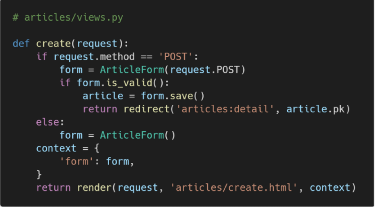

# Django Form

### django's foms


### Form 선언


### Form 사용


- ArticleForm 클래스의 인스턴스를 선언하고, form에 할당하여 context에 변수로 form을 넘겨줌
- 일일이 input과 label 태그로 form을 만들어주지 않아도 됨


### Form rendering options


### Django의 html input 요소 표현 방법 2가지


### widgets


### Form field 및 widget 예시


https://docs.djangoproject.com/en/3.1/ref/forms/widgets/


### ModelForm Class

- django Form 에서 model 필드를 재정의하는 행위 중복 방지

- model을 통해 form class를 만들 수 있는 helper

- 일반 form class와 완전히 같은 방식(객체 생성)으로 view에서 사용 가능

  

### ModelForm 선언


### Meta class


`참고` 메타데이터 - 사진을 찍으면 촬영시각, 렌즈, 조리개 값등이 함께 저장되듯 데이터에대한 데이터!


### create view 함수 구조 변경 - 대격변! 

`참고` 위에서 아래로 작성하는 것이 아닌, 논리구조 순서대로 작성 -> 외우지말고 데이터흐름을 읽으며 코드작성



```python
def create(request):
    if request.method == 'POST':
        #create
        form = ArticleForm(request.POST)
        # 유효성검사
        if form.is_valid():
            article = form.save() #save의 리턴값에 article이 존재 
            return redirect('articles:detail', article.pk)
        #print(form.errors) #글자크기가 넘었다고 에러를 알려주기도함
    else:
        #new
        form = ArticleForm()
    context = {
            'form' : form, #1.유효성 통과를 못한 FORM(에러메시지)과 2. 포스트 요청이 아닌 인스턴스 							form(비어있다거나) 따라서 인덴테이션을 마지막 리턴과 같은 선상에 둬야됨
    }
    return render(request, 'articles/create.html',context)

```

- **form.errors**

  


* **is-valid()**

  

  

* **save() method**

  

```python
#create a form instance from POST data
form = ArticleForm(request.POST)
#create
# save a new Article object from the form'sdata
new_article = form.save()
#update
#create a form to edit an existing Article, but use POST data to populate the form
article = Article.objects.get(pk=1)
form = ArticleForm(request.POST, instance=article) #인스턴스!!
form.save()
```


### update 함수 구조 변경


```python
def update(request, pk):
    if request.method == 'POST':
        #update
        article = Article.objects.get(pk=pk)
        form = ArticleForm(request.POST, instance=article) #인스턴스가 있어야 생성x 수정o 
        # 유효성검사
        if form.is_valid():
            article = form.save() #save함수 -> 리턴값 -> article이 존재 
            						#모델폼의 save 메소드 != article.save()
            return redirect('articles:detail', article.pk)

    else:
        #edit
        article = Article.objects.get(pk=pk)
        form = ArticleForm(instance=article)
    context = {
        'article': article,
        'form' : form,
    }
    return render(request, 'articles/update.html', context)
```


### DELETE 


### widgets 활용

- widgets 작성 기본 구조

  

- attrs -> attributes 속성값 
- 속성값에 class를 부여해주면, 해당 클래스에 부트스트랩 클래스 속성을 입력해서 styling 가능
- 일종의 커스터마이징

- 예시

  ```python
  class ArticleForm(forms.ModelForm):
      title = forms.CharField(
          widget=forms.TextInput(
              attrs={
                  'class' : 'my-title',
                  'placeholder' : 'enter the title'
                  'maxlength' : 10,
              }
          )
      )
      content = forms.CharField(
          widget=forms.Textarea(
              attrs={
                  #form-control은 부트스트랩 클래스 #CDN이 base.html에 있어야 동작
                  'class' : 'my-content form-control', 
                  'rows' : 5,
                  'cols' : 50,
              }
          ),
          error_messages={
              'required' : 'Please enter your content!!!',
          }
      )
  
      class Meta: 
          model = Article
          fields = '__all__' #사용자로부터 받는 모든 모델필드를 출력하게됨(지금은title,content)
          #exclude = ('title',) #제외하고 싶을 때는 한개를 제외하는게 더 효율적임
  ```

`참고` forms.py는 되도록 app폴더 내에 위치

`참고` https://docs.djangoproject.com/en/dev/internals/contributing/writing-code/coding-style/ ->장고 권장 코딩스타일

### Form vs ModelForm


`데이터만 처리 -> 폼`  ex. 로그인 --> cleaned_data 필요

`db에 값을 저장하는 등의 영향을 미침 -> 모델폼`  ex. 회원가입 --> 모델필드 속성에 맞는 html element를 만들어 주고 이를 통해 받은 데이터를 view함수에서 유효성 검사를 할 수 있도록 함

=> 무엇이 더 좋냐가 아닌, 역할에 맞춰서 취함


`참고` cleand_data구조


### 수동 Form 작성

**1. Rendering fields manually**


**1. Looping over the form;s fields ()**


### 부트스트랩 사용 두가지 방법

**1. Bootstrap class with widgets**

- Bootstrap Form 의 핵심 class를 widget에 작성(위에서 form-control 사용했던 것)

- 에러메시지 with Bootstrap alert 컴포넌트

  

**2. Django Bootstrap 5 Library**


`base.html` load 태그 , cdn 입력


`update.html` form변수를 따로 선언하지 않아도 부트스트랩 폼 형식을 선언해주면 자동으로 폼이 형성됨


-> 대신 개별 커스텀은 어려워짐

https://django-bootstrap-v5.readthedocs.io/en/latest/


# Handling HTTP requests

### get_object_or_404


### django view decorators


### Allowed HTTP methods


-> decorator를 통과해야 POST 요청이라는 의미이기 때문에 IF문 삭제가능


# Media files (이미지 업로드)

### `media file`


### `model field`


### `ImageField 작성`


### `ImageField 또는 FileField를 사용하기 위한 단계`


### 1. media_url & media_root 설정


### 2. url 추가


### 3. pillow 라이브러리 설치


### 4. form에 enctype 속성 지정


### 5. views.py 수정


### 6. 이미지 업로드 후 db 및 파일 트리 확인


### 7. 이미지 경로 불러오기(READ 단계)


### 8. 이미지 수정하기(UPDATE단계)


--> instance 와 달리 키워드 인자 형태로 써주지 않아도 되는 이유는 request.FILES가 인자가 두번째 위치가 기본값이기 때문임


--> IF문 필요


### 9. 이미지 리사이징


--> 200:가로 크기 / 300:세로 크기

---


-------


### `upload_to argument_참고`


### `Model field option - "blank" _참고`


### blank vs null


### `input 요소의 accept 속성__참고`


