HEAD -> 우리가 지금 어딜 보고 있는지를 의미( 가장 최신버전을 바라보고있음)

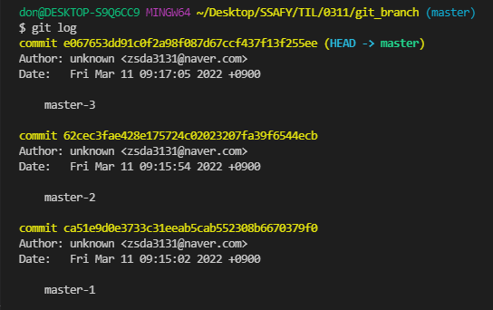

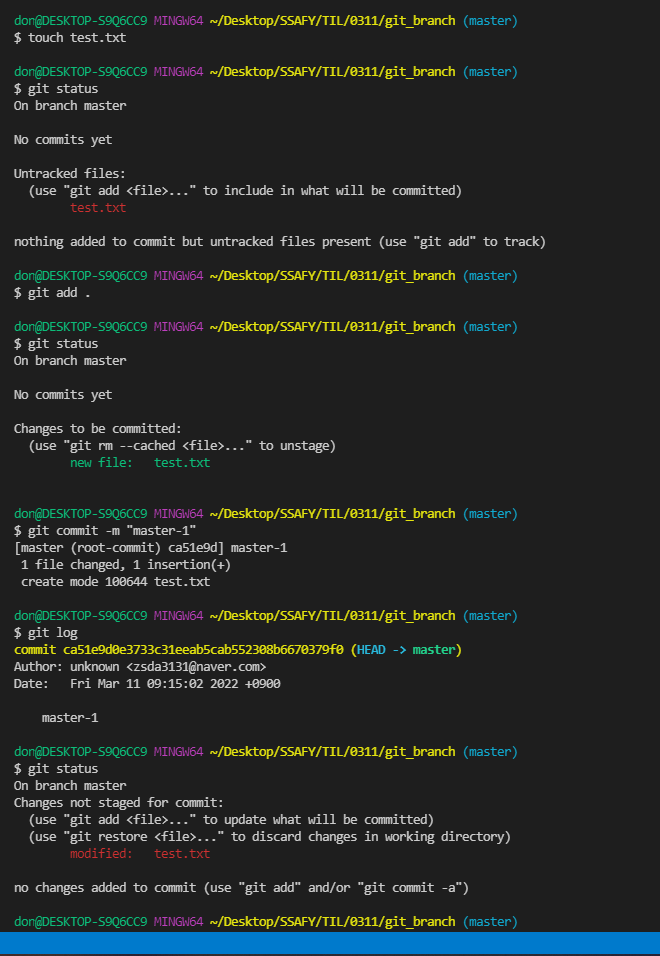

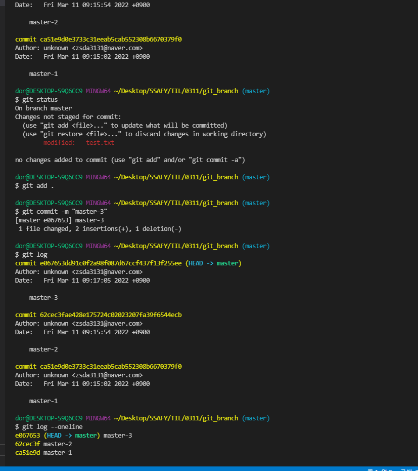

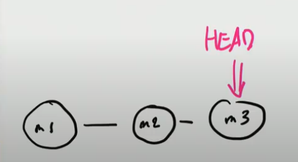

마스터에 손상주지 않고 브랜치로 로그인 페이지를 만들어보자

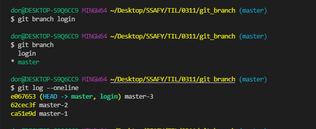

마스터3에서 브랜치를 만들었기 때문에 헤드가 같이 바라보고 있음

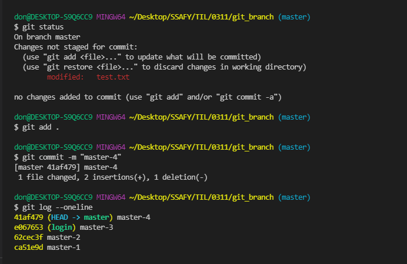

마스터4를 하나더만들면 head가 master4로 한발짝 더나감

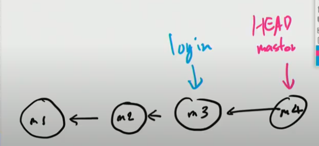

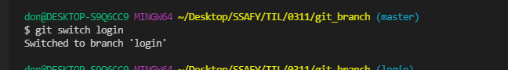

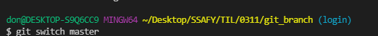

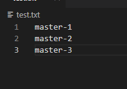

텍스트 내용도 바뀜

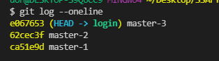

헤드도 바뀜

헤드가 가리키고 있는 브랜치의 최신버전 상태로 보이게됨

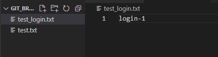

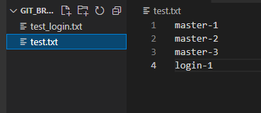

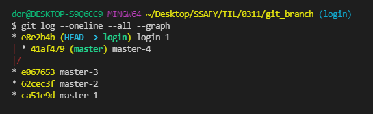

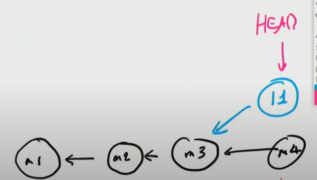

주의!! 워킹디렉토리가 모두 버전관리가 되어 있는지 확인하고 스위치! 

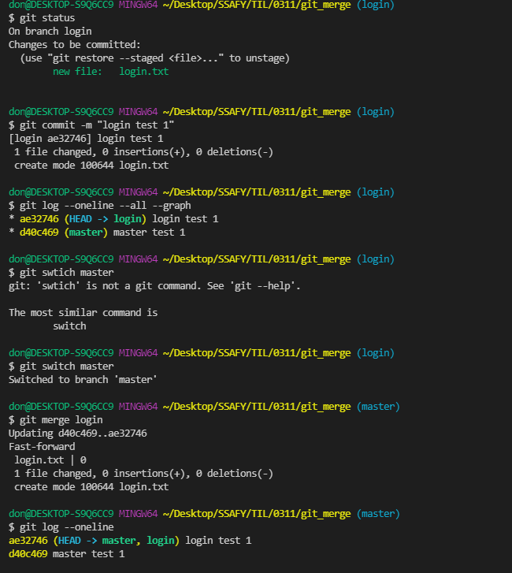

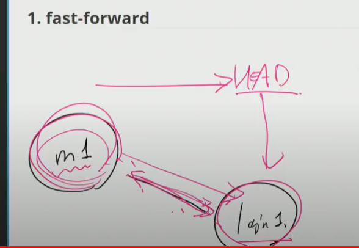

단순히 head가 앞으로 나갈뿐임 -> 머지를 했을 때 첫번째 상황 -> 병합을 해서 새로운 버전이 생기지 않음

머지가 된 브랜치는 쌓이지 않도록 삭제(-d)  강제삭제는 -D

브랜치가 갈라지고 난 뒤에 마스터에도 변화가 생겼을 때(그냥 빨리 감기로는 안됨)

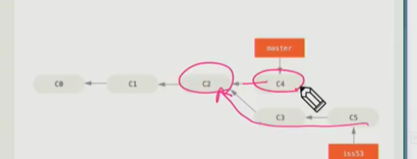

3-way merge

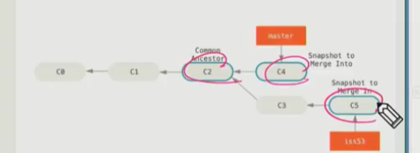

이렇게 3가지를 병합 , 마스터와 브랜치 그리고 공통된 조상까지 별도의 커밋을 하나 만들어냄

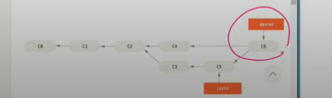

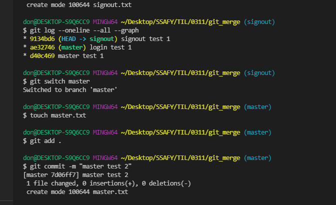

마스터에 변화를 일으켜보자

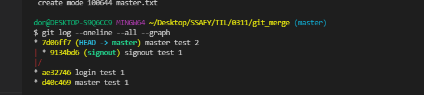

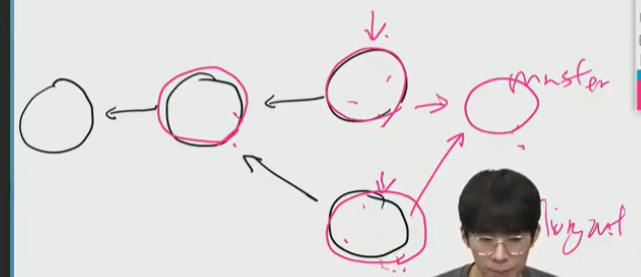

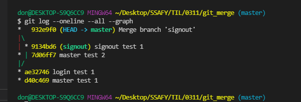

새로운 머지 커밋이 등장했다 merge branch signout 자동으로 이름이 지정이 됨

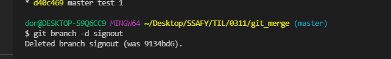

항상 머지가 되면 삭제 그 브랜치는 역할이 끝남

머지 컨플릭트

머지하는 두 브랜치에서 같은 파일의 같은 부분을 동시에 수정하고 머지하면, git은 해당 부분을 자동으로 머지 해주지 못함!!

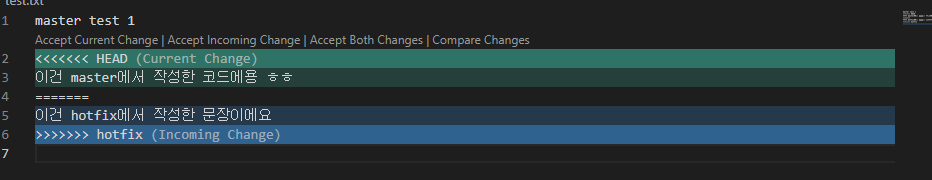

어디서 겹쳤는지 알려줌

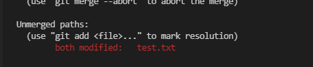

git status도 알려주고 있음

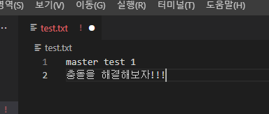

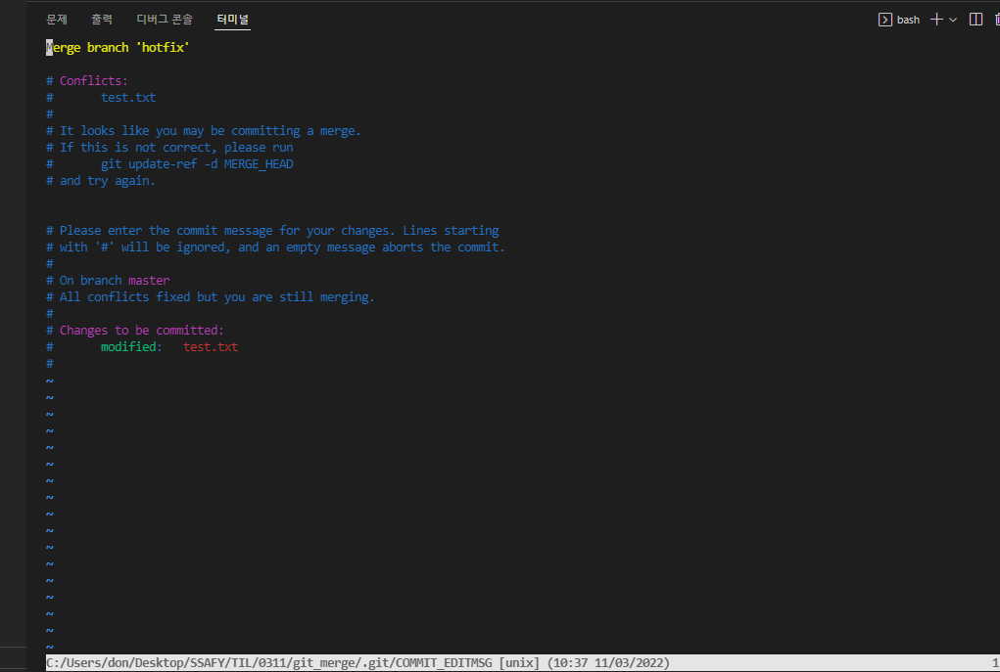

저장하고 add 후에 git commit 만 쳐주면 VIM 에디터 화면이 뜸 !!

VIM은 모든 텍스트 에디터의 조상이다.!

ESC(명령모드로나가기)->  : ->  writequick 저장하고 나감 (wq후 엔터)

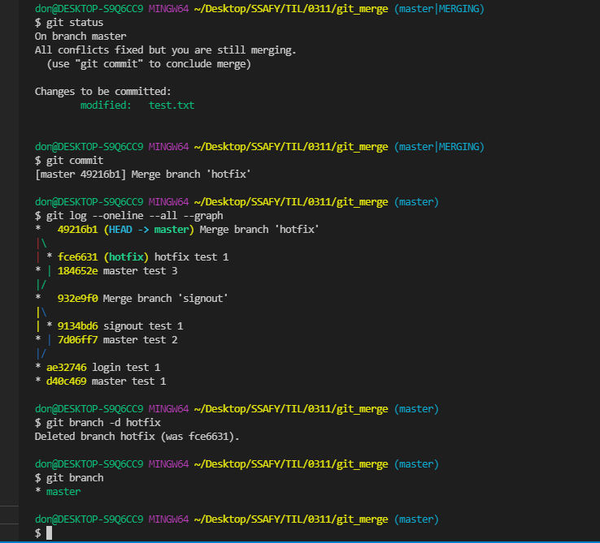

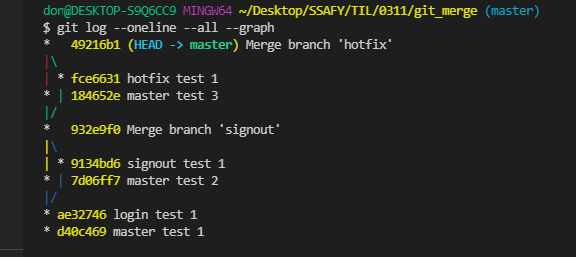

최종

스위치가 최근에 나왔다. 체크아웃은 옛날꺼, 체크아웃 나오면 당황하지말고 스위치라고 생각

