# CRUD

### READ 

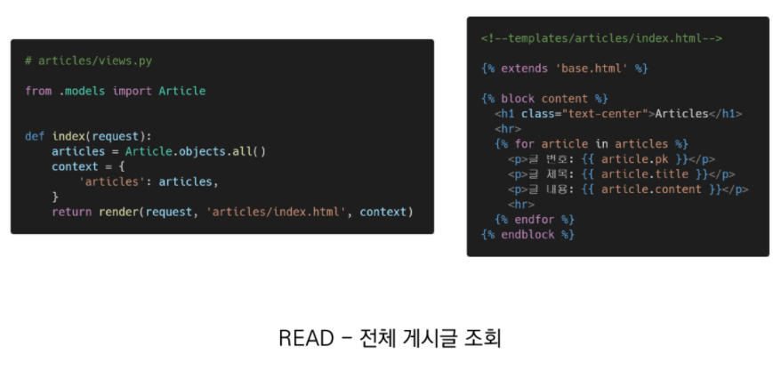

- Primary Key 즉, 여러개의 id 넘버를 가진 데이터를 순회해야 제대로 조회 할 수 있다.

  -> DTL for 태그 이용

- 게시글 정렬 순서 변경

  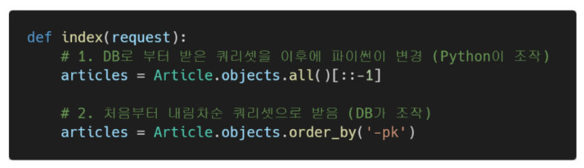

- GET

  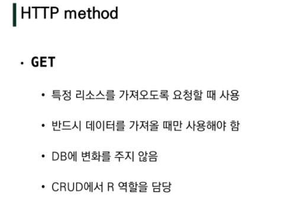

### CREATE

- urls.py

  ```python
  from django.urls import path
  from . import views
  
  app_name = 'articles'
  urlpatterns =[
      path('', views.index, name='index'),
      path('new/', views.new, name='new'),
      path('<int:article_pk>/', views.detail, name='detail'),
      path('<int:article_pk>/edit/', views.edit, name='edit'),
      path('<int:article_pk>/delete/', views.delete, name='delete'),
  ]
  #고유 정보인 경우 article_pk 가 variable routing 으로 url에 들어감
  ```

  

- views.py 

```python
from django.shortcuts import render, redirect, get_object_or_404
from .models import Article

def new(request):

    if request.method == 'POST': #요청이 POST라면,


        title = request.POST.get('title') #QueryDict 형태로 들어있음
        content = request.POST.get('content') #QueryDict 형태로 들어있음
        
 
        article = Article() #model.py 에서 import한 Article클래스의 인스턴스 생성
        article.title = title
        article.content = content
        #db에 반영
        article.save()

        return redirect('articles:detail', article.pk)
    	#제대로 작성됐는지 상세페이지로 이동하는 리다이렉트 함수
        #리다이렉트 함수는, PK를 인자로 갖는다. 고유 정보

    return render(request, 'articles/new.html')#POST가 아니라면 , ex.GET
```

-> **POST method**

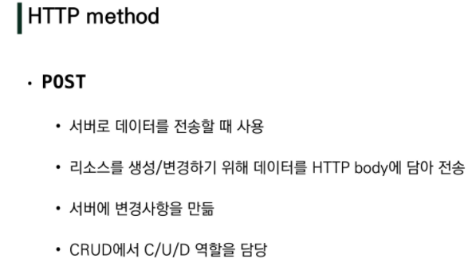

-> **Redirect**

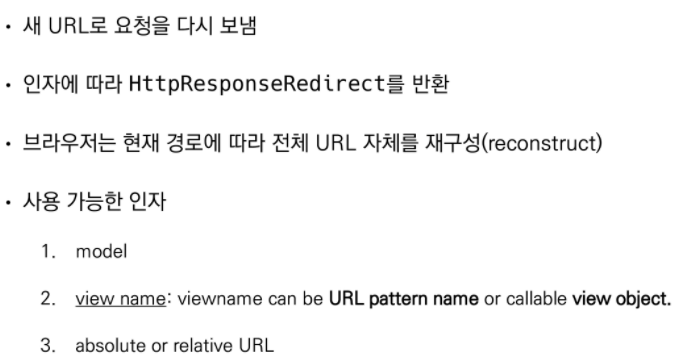


- new.html

  ```html
   <!--base.html 상속-->
  
    <h1>NEW</h1>
    <form action="" method='POST'> <!--form action은 비워두면됨-->
    
      
      <label for="title">TITLE : </label>
      <input type="text" id='title' name="title"> <br>
  
      <label for="content">CONTENT : </label>
      <textarea name="content" id="content" cols="30" rows="10"></textarea> <br>
  
      <input type="submit" value="작성">
    </form>
    <a href="  ">BACK</a>
  
  ```

  -> **CSRF token**

  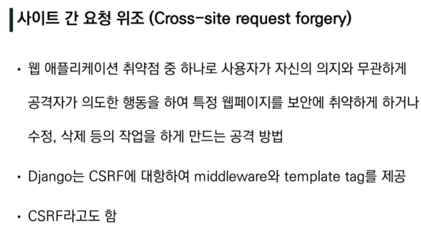

  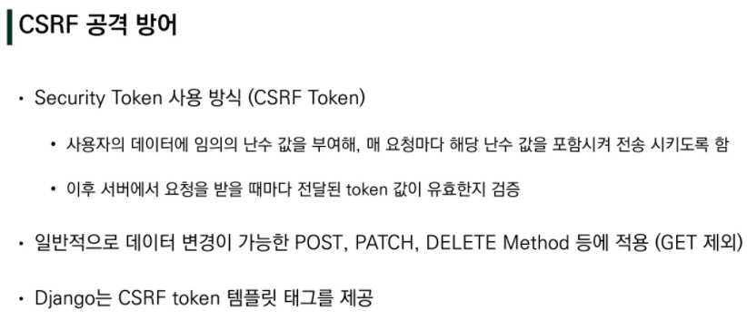

  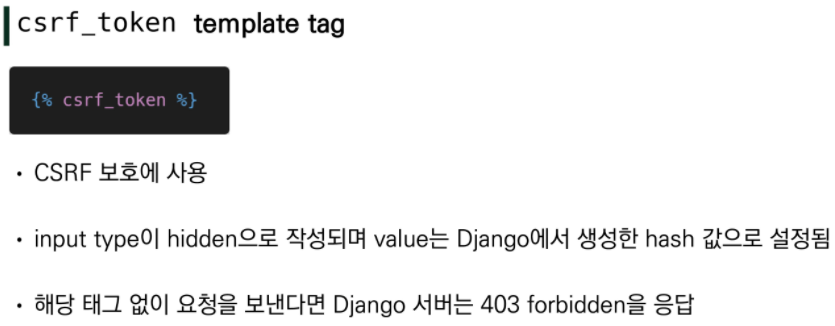

  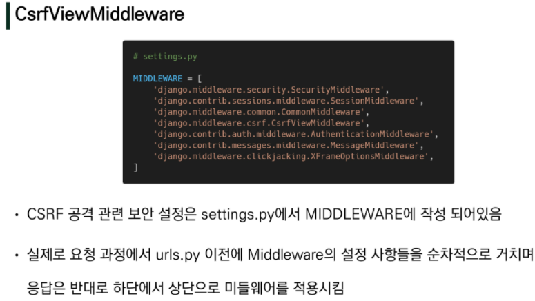


### CREATE _ DETAIL

- views.py

  ```python
  def detail(request, article_pk): #요청과 고유 pk 번호를 함께 인자로 받아야함
      article = get_object_or_404(Article, pk=article_pk)
      context = {
          'article' : article
      }
      return render(request, 'articles/detail.html', context)
  ```

  -> **get_object_or_404** : pk 와 일치하는 값이 존재하면 해당 object를 존재하지 않는다면 404 not found page를 반환하라는 함수

  -> **pk=article_pk** : pk는 DB에 저장된 레코드의 pk(id), article_pk는 variable routing을 통해 받은 pk

- detail.html

  ```html
  
  
    <h1>DETAIL</h1>
    <P>제목 : {{ article.title }}</P>
    <P>내용</P>
    <P> {{ article.content}} </P>
    <p>작성일 : {{ article.created_at }} </p>
    <p>수정일 : {{ article.updated_at }} </p>
    <hr>
    <a href="">EDIT</a>
  	<!--띄어 쓰기를 기준으로 article.pk 인자를 입력가능하다-->
  
    <!-- <form action="  " method="POST">
      
      <input type="submit" value="DELETE" style="background-color:transparent;  border:0px transparent solid;" >
    </form> -->
    <a href="  ">BACK</a>
  
  
  ```

  

### UPDATE

- views.py

  ```python
  def edit(request, article_pk):
      #1 article = Article.objects.get(pk=article_pk) 
   	#2 
      article = get_object_or_404(Article, pk=article_pk)
      #두가지 방법 다 기억해놓기
      if request.method == 'POST':
          #POST 요청에서의 title을 article 인스터스의 title에 입력함
          article.title = request.POST.get('title')
          article.content = request.POST.get('content')
          article.save() #db에 반영
  
          return redirect('articles:detail', article.pk)
      else: #기존에 수정해야할 내용이 무엇이었는지 보여주기 위해서 들어가야함
          context = {
              'article' : article
          }
      return render(request, 'articles/edit.html',context)
  
  ```

- edit.html

  ```html
  
  
  
   <h1>EDIT</h1>
   <form action="" method="POST">
    <!--input type:hidden--> 
    
    <label for="title">TITLE : </label>
    <input type="text" id="title" name="title" value="{{ article.title }}"> <br>
    
    <label for="content">CONTENT : </label>
    <textarea id="content" name="content" cols="30" rows="10" >{{ article.content }}</textarea>
    <br>
  
    <input type="submit" value="수정">
   </form>
  
  
  ```

  -> UX를 위해서 수정 전 내용을 띄워놓아야 함

  

### DELETE

- views.py

  ```python
  def delete(request, article_pk):
      #특정 게시글을 삭제 해야 하므로 article_pk 필요
      if request.method == 'POST': #조건분기!!!!
          # article = Article.objects.get(pk=article_pk)
          article = get_object_or_404(Article, pk=article_pk)
          article.delete()
      return redirect('articles:index')
  ```

- detail.html _ delete 폼태그

  ```html
  
  
    <!--<h1>DETAIL</h1>
    <P>제목 : {{ article.title }}</P>
    <P>내용</P>
    <P> {{ article.content}} </P>
    <p>작성일 : {{ article.created_at }} </p>
    <p>수정일 : {{ article.updated_at }} </p>
    <hr>
    <a href="">EDIT</a>-->
  
  <!--DELETE : 폼으로 POST요청일 때 삭제가능하도록 , a 태그는 GET만 가능-->
    <form action="  " method="POST">
      
      <input type="submit" value="DELETE" style="background-color:transparent;  border:0px transparent solid;" >
    </form>
    <a href="  ">BACK</a>
  
  
  ```


### 요약

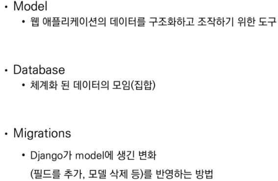

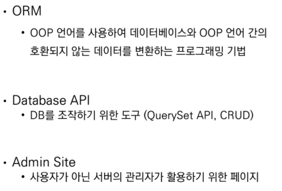