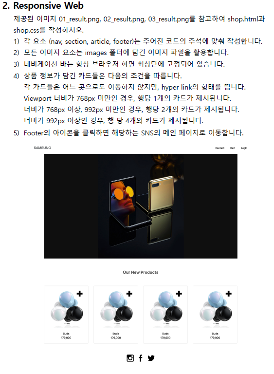

### CSS 우선순위

CSS는 우선 적용되는 순서가 존재한다. 우선순위가 높은 순으로 나열 하시오

```html
!important > inline > id > class > 요소 > 소스 순서
```


### img tag

아래 그림과 같은 폴더 구조가 있다. resume.html에서 코드를 작성 중일 때, image폴더 안의 my_photo.png를 보여주는  tag를 작성하시오.
단, 이미지가 제대로 출력되지 않을 때는 ssafy 문자열이 출력 되도록 작성하시오.


```html
<a href="https://www.ssafy.com"></a>
```


### element : nth-child(n)

element의 부모의 n번째 자식을 찾고 해당 element를 선택

**n번째 자식이 선택한 element가 아니라면 스타일이 적용되지 않는다.**

### element : nth-of-type(n)

해당 element 안에서 n번째


### input Tag

아래 이미지와 같이 로그인 Form을 생성하는 HTML코드를 작성하시오.
단, USERNAME 글자를 클릭하면 아이디를 입력하는 input에, PWD 글자를 클릭하면
비밀번호를 입력하는 input에 focusing 되도록 하시오.(시험x)


```html
<body>
  <form	action="">
    <label for="username">USERNAME : </label>
    <input id="username" type="text" palceholder="아이디를 입력하세요">
    <br>
    <label for="pwd">PWD : </label>
    <input id="pwd" type="password">
    <input type="submit" value="로그인">
  </form>
</body>
```


### 0204 실습 03 layout


### 0207 workshop

```html
  <section class="d-flex flex-column justify-content-center align-items-center py-5 my-5">
    <h2>Used Skills</h2>
    <article class="d-flex justify-content-center align-items-center text-center text-primary">
      <div>
        
        <p>Web</p>
      </div>
      <div>
        
        <p>HTML5</p>
      </div>
      <div>
        
        <p>CSS3</p>
      </div>
    </article>
  </section>
```


## 6. Breakpoint prefix

| breakpoint class | dimensions |
| :--------------: | :--------: |
|     None(xs)     |   <576px   |
|        sm        |  >=576px   |
|        md        |  >=768px   |
|        lg        |  >=992px   |
|        xl        |  >=1200px  |
|       xxl        |  >=1400px  |


### 0208 workshop

```html
    <!-- 2. -->
    <div class="row">
      <div class="item col-4 offset-md-4 offset-lg-7 col-lg-5">
        <p>item1</p>
      </div>
      <div class="item col-4 offset-4 offset-md-0 offset-lg-2 col-lg-8">
        <p>item2</p>
      </div>
    </div>
    

    <!-- 3. -->
    <div class="row">
      <div class="item col-md-3">
        item1
      </div>
      <div class="item col-md-9">
        <div class="row">
          <div class="item col-6 col-lg-3">item2</div>
          <div class="item col-6 col-lg-3">item3</div>
          <div class="item col-6 col-lg-3">item4</div>
          <div class="item col-6 col-lg-3">item5</div>
        </div>
      </div>
```


2번 실행


3번 실행


### 0208 practice

```html
/* 아래에 코드를 작성하시오. */
<!DOCTYPE html>
<html lang="en">
<head>
  <meta charset="UTF-8">
  <meta name="viewport" content="width=device-width, initial-scale=1.0">
  <link rel="stylesheet" href="shop.css">
  <link href="https://cdn.jsdelivr.net/npm/bootstrap@5.1.3/dist/css/bootstrap.min.css" rel="stylesheet" integrity="sha384-1BmE4kWBq78iYhFldvKuhfTAU6auU8tT94WrHftjDbrCEXSU1oBoqyl2QvZ6jIW3" crossorigin="anonymous">
  <title>Title</title>
  <style>
    .img {
      background-image: url(images/main.png);
      height: 500px;
      background-position: center;
      background-size: cover;
      color: transparent;
    }
  </style>
</head>
<body style="height: 10000px;" >
  <!-- nav -->
  <nav class="bg-white sticky-top fw-bold p-3 d-flex justify-content-between align-items-center">
    <div class="fs-3">SAMSUNG</div>
    <div>
      <a href="" class="text-dark text-decoration-none me-4">contact</a>
      <a href="" class="text-dark text-decoration-none me-4">cart</a>
      <a href="" class="text-dark text-decoration-none me-4">login</a>
    </div>
  </nav>

  <div class="container">
    <!-- section -->
    <section>
      
      <!-- <hr>
      <div class="img"></div> -->
    </section>

    <!-- article -->
    <article class="text-center">
      <div class="fw-bold display-3 my-5">Our New Products</div>
      <div class="row row-cols-1 row-cols-md-2 row-cols-lg-4 g-4"> <!--row-cols-md-2 : 너비가 768px 이상, 992px 미만인 경우 행당 2개-->
        <a href="#" class="text-decoration-none text-dark col">
          <div class="card">
            
            <div class="card-body">
              <h5 class="fw-bold card-title">Buds</h5>
              <p class="fw-bold card-text">179,000</p>
            </div>
          </div>
        </a>
        <a href="#" class="text-decoration-none text-dark col">
          <div class="card">
            
            <div class="card-body">
              <h5 class="fw-bold card-title">Buds</h5>
              <p class="fw-bold card-text">179,000</p>
            </div>
          </div>
        </a>
        <a href="#" class="text-decoration-none text-dark col">
          <div class="card">
            
            <div class="card-body">
              <h5 class="fw-bold card-title">Buds</h5>
              <p class="fw-bold card-text">179,000</p>
            </div>
          </div>
        </a>
        <a href="#" class="text-decoration-none text-dark col">
          <div class="card">
            
            <div class="card-body">
              <h5 class="fw-bold card-title">Buds</h5>
              <p class="fw-bold card-text">179,000</p>
            </div>
          </div>
        </a>
      </div>
    </article>

    <!-- footer -->
    <footer class="text-center mt-5">
      <a href="" class="mx-3">
        
      </a>
      <a href="" class="mx-3">
        
      </a>
      <a href="" class="mx-3">
        
      </a>
    </footer>
  </div>
  <script src="https://cdn.jsdelivr.net/npm/bootstrap@5.1.3/dist/js/bootstrap.bundle.min.js" integrity="sha384-ka7Sk0Gln4gmtz2MlQnikT1wXgYsOg+OMhuP+IlRH9sENBO0LRn5q+8nbTov4+1p" crossorigin="anonymous"></script>
</body>
</html>

```


