1>

i = 0

i+k-1 까지

mmax = 0

for 행 우선순회

​	값 더하기 위한 초기화 위치

​		for j 순회 범위가 i번째부터 i+K까지 순회를 하도록

​	여기서 if문으로 최댓값 비교


2>

모든 요소에 대해서 전부 조사

이중 포문

델타 탐색으로 상하좌우


3*3도 델타 탐색으로 가능하네..


델타에 한번에 싹다 넣어주는 구나...

3*3 은 0으로 초기화 할때 continue 또는 break 사용 가능 ##이게 어려우면 그냥 다 더하고 임시변수를 변하게 해서 그 임시변수가 변해있는 경우에는 비교하지 않도록 하기...

상하좌우는 벗어나는것만 빼고 더하기


3*3 에 대해서 더해놓을 변수

네방향에 대해서 더해놓을 변수

그리고 최종 비교할 result = 0 하나

tmp1, tmp2, result


---

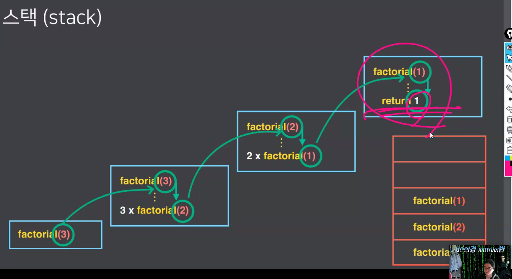

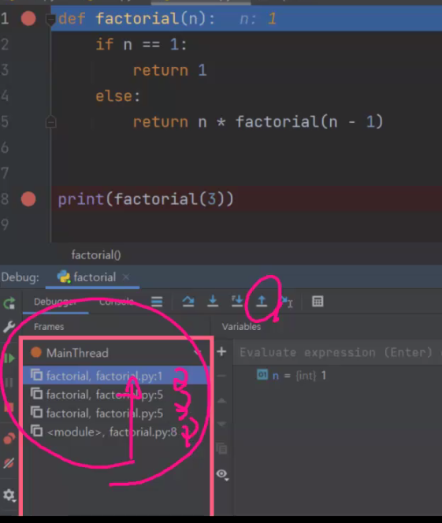

																									### 															예시 팩토리얼 함수


pop 후 꼭 지우는 동작을 할 필요 없이 다시 push 하면 덮어씌어짐??!!

근데 아까 교수님이 arr는 그대로 라고 했는데..??


사이즈가 너무 작거나 푸쉬가 너무 많았거나 ---> 프린트 오버플로우


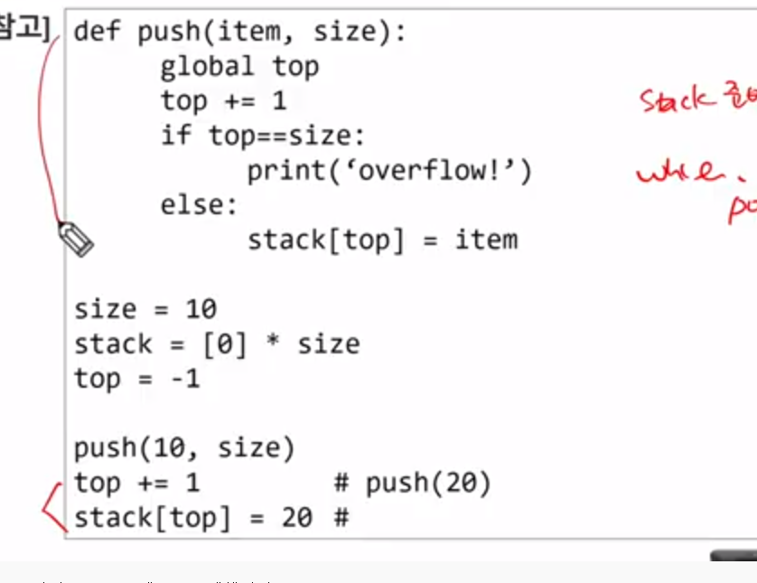

함수 호출 방법 하나  맨 마지막에 아래 두줄 방법 도 있음


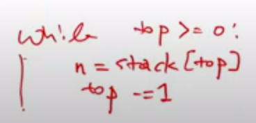 if문보다는 while로


문제풀이에 한해서는 필요한 크기만큼 stack을 만들어서 사용


재귀 호출이 헷갈리면 그냥 나랑 이름이 같은 다른 함수를 부른다고 생각

예시

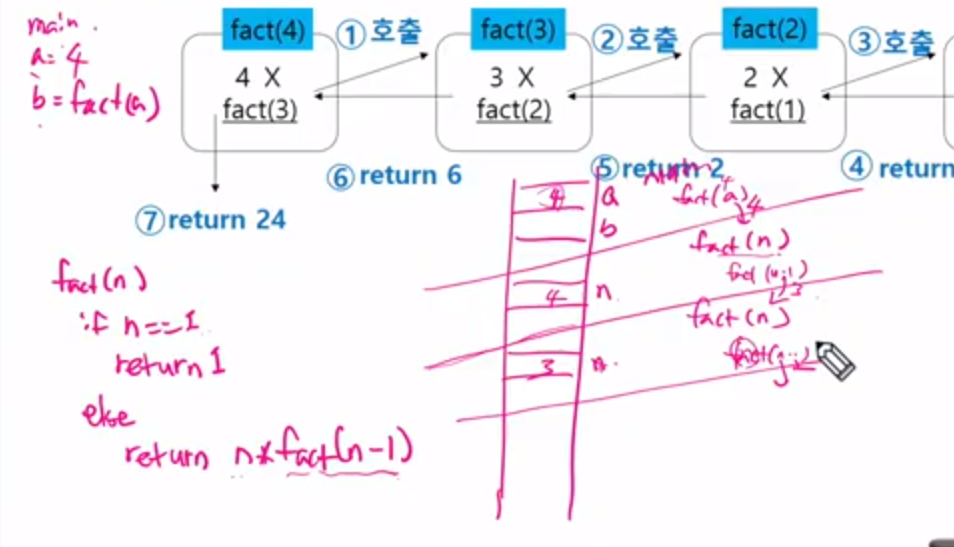

벽을 기준으로 내가 사용하는 구역의 n 만을 사용하기 때문에 계속 n 사용해도 됨


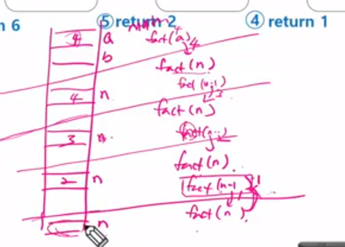

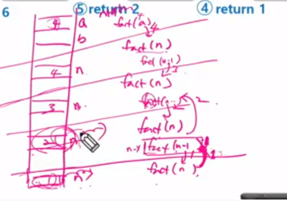


재귀호출의 기본형

f(i,N) i= now , N= 목표

피보나치나 팩토리얼의 경우 1,0이면 멈추고, 1이되면 RETURN 등 목표가 정해져 있으므로 따로 함수에 인자로 안 들어가는 것


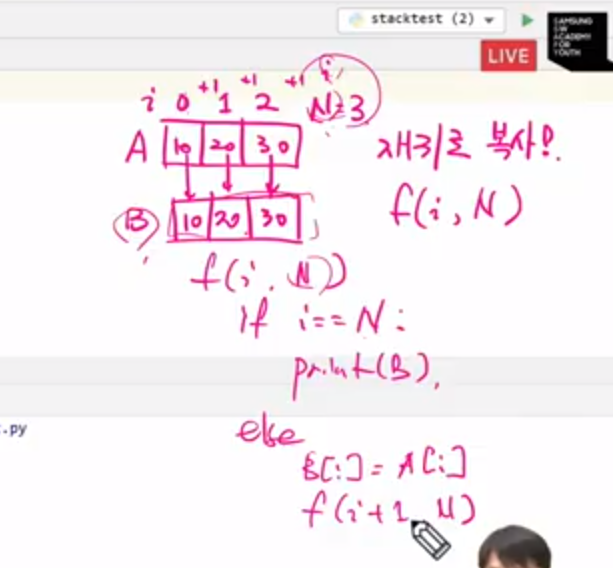


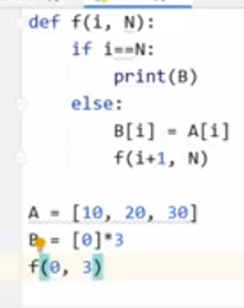

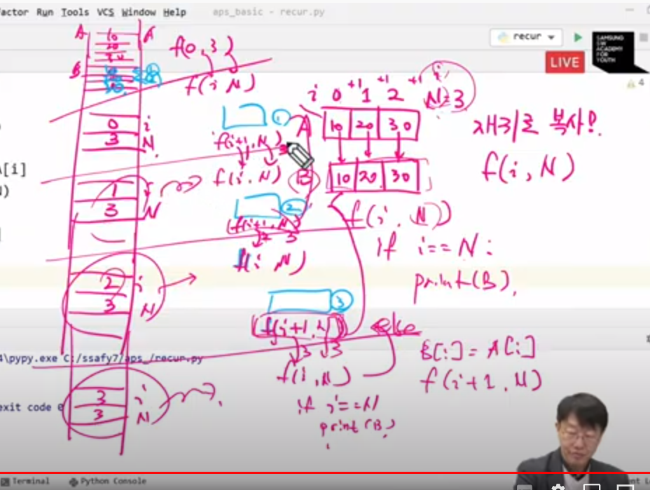


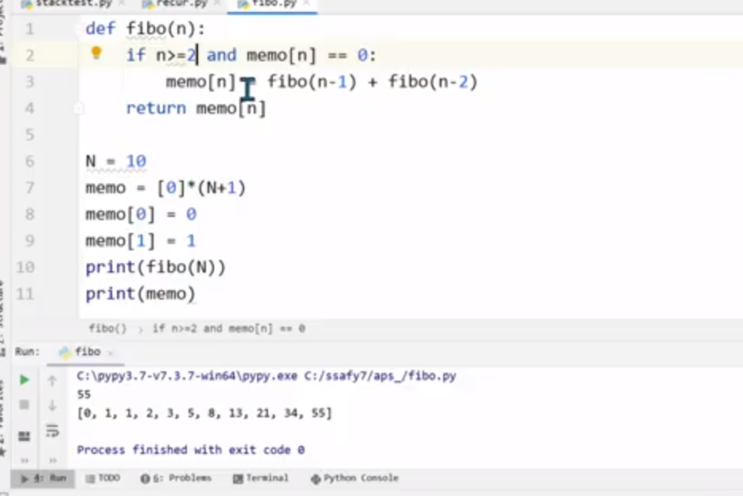

왜 메모는 재귀호출 횟수가 비약적으로 줄지??


메모

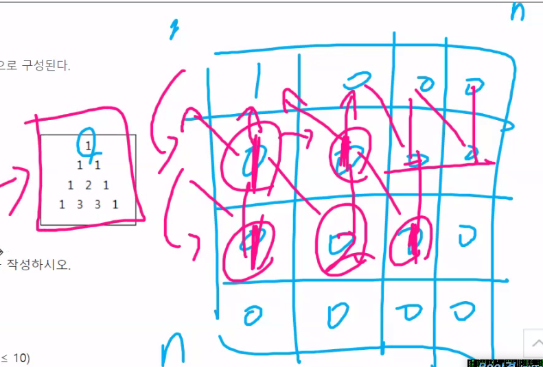

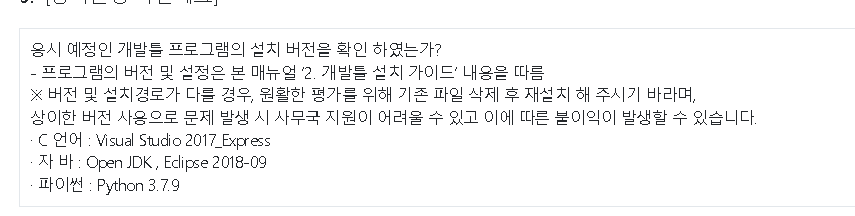


```python
김혜라 — 오늘 오후 8:06
t = int(input())
for tc in range(1, t + 1):
    n = int(input())
    arr = [list(map(int, input().split())) for _ in range(n)]

    # print(arr)
    #상하좌우 대각선 포함 델타 탐색 구간 설정
    di = [-1, -1, -1, 0, 0, 0, 1, 1, 1]
    dj = [-1, 0, 1, -1, 0, 1, -1, 0, 1]

    #최고합 저장할 sol
    sol = 0
    for i in range(n):
        for j in range(n):
            #부분합 저장할 summ
            summ = 0
            for k in range(9):
                ni = i + di[k]
                nj = j + dj[k]
                #범위를 넘어가지 않는 선에서 부분합
                if 0 <= ni < n and 0 <= nj < n:
                    summ += arr[ni][nj]
                #하나라도 범위를 넘어가면 0
                if ni>= n or nj >= n:
                    summ = 0
                # print(summ)
                #부분합과 최고합 비교해서 최고합을 저장
                if sol < summ:
                    sol = summ
    #네방향 지정
    di = [0, 1, 0, -1, 0]
    dj = [1, 0, -1, 0, 0]


    for i in range(n):
        for j in range(n):
            summ = 0
            for k in range(5):
                ni = i + di[k]
                nj = j + dj[k]
                #벗어나지 않은 값들은 더함
                if 0<= ni < n and 0 <= nj < n:
                    summ += arr[ni][nj]
                #앞에 저장해둔 sol값보다 크면 갱신
                if sol < summ:
                    sol = summ
    print(f'#{tc}',sol)
    
    
    
    # 3x3 합을 구해 주는 함수
def ninesum(arr, N):
    max_nine = 0  # 순회를 시작하기 전 최종 반환할 3x3배열 최대합 변수 설정
    for i in range(N):
        for j in range(N):
            nine_sum = 0  # 주어진 (i, j)에 대한 3x3배열 합을 구하기 전 초기화
            for ni in range(i - 1, i + 2):  # i-1행부터 i+1행까지
                for nj in range(j - 1, j + 2):  # j-1열부터 j+1열까지
                    if 0 <= ni < N and 0 <= nj < N:
                        nine_sum += arr[ni][nj]
                    else:
                        nine_sum = 0
            if max_nine < nine_sum: # 새로 구한 3x3배열 합이 직전 최대합보다 크다면
                max_nine = nine_sum # 갱신
    return max_nine

김지현
# 4방향 원소의 합을 구해주는 함수
def disum(arr, N):
    max_di = 0  # 순회를 시작하기 전 최종 반환할 4방향 원소 최대합 변수 설정
    di = [-1, 0, 1, 0]  # 상우하좌(시계방향) 순
    dj = [0, 1, 0, -1]
    for i in range(N):
        for j in range(N):
            di_sum = arr[i][j]  # 주어진 (i, j)에 대한 4방향 원소 합을 구하기 전 초기화(출발점인 (i, j) 값 미리 assign)
            for nd in range(4):  # 갈 수 있는 방향은 4개이므로 0,1,2,3
                for k in range(1, arr[i][j]):  # (i, j)의 값만큼 4방향으로 이동
                    if 0 <= i + di[nd] * k < N and 0 <= j + dj[nd] * k < N:  # 리스트 범위 내에서
                        di_sum += arr[i + di[nd] * k][j + dj[nd] * k]  # (i, j)를 기준으로 (i, j) 값의 크기만큼 상우하좌로 이동할 것
            if max_di < di_sum:  # 새로 구한 4방향 원소 합이 직전 최대합보다 크다면
                max_di = di_sum  # 갱신
    return max_di

T = int(input())

for tc in range(1, T+1):
    N = int(input())
    arr = [list(map(int, input().split())) for _ in range(N)]
    # print(N)
    # print(arr)

    if ninesum(arr, N) < disum(arr, N):
        print(f'#{tc} {disum(arr,N)}')
    else:
        print(f'#{tc} {ninesum(arr,N)}')
        
        
# 박지현
# 테스트 케이스
T = int(input())

# 테스트 케이스 순회..
for tc in range(1,T+1):
    N = int(input())
    # N*N 배열 만들기
    arr = [list(map(int, input().split())) for _ in range(N)]

    # 3*3 배열 합 찾기
    # 최댓값 저장할 변수 max_a
    max_a = 0
    # 아예 행, 열 범위 지정
    # 3*3배열이니까 .. N-3까지 갈 수 있다(==range(N-2))
    for i in range(N-2):
        for j in range(i, N-2):
            add = 0
            # i, j에 ~3 범위까지 더해서 배열의 합 구하기
            for x in range(3):
                for y in range(3):
                    if i+x <= N-1 and j+y <= N-1:
                        add += arr[i+x][j+y]
            # 구한 배열 합이 기존보다 크면 최대값 변경
            if add > max_a:
                max_a = add


    # 델타 합 찾기
    # 단 ,, 얘는 해당되는 애들만 더해준다
    # 자기 자신 포함..
    max_d = 0
    di = [0, -1, 0, 1, 0]
    dj = [0, 0, 1, 0, -1]

    # 전체 범위
    for i in range(N):
        for j in range(N):
            add = 0
            # 자기 자신 포함해 다섯 방향
            for d in range(5):
                ni = i + di[d]
                nj = j + dj[d]
                # 리스트 안에 있는 것들만 더해준다
                if 0 <= ni < N and 0 <= nj < N:
                    add += arr[ni][nj]
                else:
                    continue
            # 구한 델타합이 기존 최대값보다 크면 최대값 변경
            if add > max_d:
                max_d = add

    # 두 최대값들 비교해 더 큰 수 출력
    if max_d > max_a:
        print(f'#{tc} {max_d}')
    else:
        print(f'#{tc} {max_a}')
        
        
#이호준
T = int(input())
for tc in range(1, T+1):
    di = [0, -1, 1, 0, 0, -1, 1, 1, -1] # 현재위치 상 하 좌 우 우상 우하 좌하 좌상
    dj = [0, 0, 0, -1, 1, 1, 1, -1, -1]
    N = int(input()) # N : 배열의 가로세로 길이
    arr = [list(map(int, input().split())) for _ in range(N)] # N*N 배열로 변환
    max_sum = 0 # 최대 구간합을 저장할 변수 설정
    
    # 3*3 배열의 합 구하기
    for i in range(N):
        for j in range(N):
            ssum = 0
            for k in range(9): # 9개의 모든 합을 구할때까지 순회
                ni = i + di[k] # 현재위치 상하좌우 우상 우하 좌하 좌상 순서로 탐색
                nj = j + dj[k]
                if 0 <= ni < N and 0 <= nj < N: # 만약 범위 내에 있다면
                    ssum += arr[ni][nj] # 합에 더해준다.
                else: # 만약 범위 내에 없다면
                    ssum = 0 # 합은 0으로 하고
                    break # 반복문 종료
            if ssum > max_sum: # 최대값인지 판별
                max_sum = ssum
                
    # 4방향 원소의 합 구하기
    for i in range(N):
        for j in range(N):
            ssum = 0
            for k in range(5): # 현재위치와 상하좌우의 인덱스만 가져오면 되니 범위를 5만큼 넣어준다.
                ni = i + di[k]
                nj = j + dj[k]
                if 0 <= ni < N and 0 <= nj < N:
                    ssum += arr[ni][nj]
            if ssum > max_sum: # 최대값인지 판별
                max_sum = ssum
    print(f'#{tc} {max_sum}')
    
    
    
#박제학

for tc in range(1, T+1):
    N = int(input())
    # index에러 방지용 [0]패딩
    lists = [[0] + list(map(int, input().split())) + [0] for _ in range(N)]
    lists = [[0]*(N+2)] + lists + [[0]*(N+2)]

    # 델타탐색
    # 3*3배열(자신부터 위로 올라가고 시계방향)
    dx_3x3 = [0, 0, 1, 1, 1, 0, -1, -1, -1]
    dy_3x3 = [0, -1, -1, 0, 1, 1, 1, 0, -1]

    max = 0
    for i in range(1, N+1):
        for j in range(1, N+1):
            # max랑 비교할 변수
            temp_3x3 = 0
            # 탐색하는 값이 0이 아니면 더하고 0이면 temp = 0으로 초기화
            for k in range(9):
                n = lists[i+dy_3x3[k]][j+dx_3x3[k]]
                if n == 0:
                    temp_3x3 = 0
                    break
                temp_3x3 += n
            # 4방향 합 구하기
            n = lists[i][j]
            # n을 2번 더할거라 -n으로 설정
            temp_4 = -n
            # 구간합 계산
            for m in range(2*n-1):
                # 더해줄 x, y의 인덱스
                x = j-n+1+m
                y = i-n+1+m
                # 범위 벗어나는지 확인
                if 0 <= x <= N:
                    temp_4 += lists[i][x]
                if 0 <= x <= N:
                    temp_4 += lists[y][j]
            # 계산된 temp max랑 비교
            temp = temp_3x3 if temp_3x3 > temp_4 else temp_4
            if max < temp:
                max = temp
    # 결과출력
    print(f'#{tc} {max}')
    
    
    
    
    
    
    
    
    ## 김혜라
    
    t = int(input())
for tc in range(1, t + 1):
    n, k = map(int, input().split())
    arr = [list(map(int, input().split())) for _ in range(n)]

    #sol은 최대값을 저장하기 위함
    #초기화 위치가 for문 밖이어야 for를 돌 때 초기화가 안된다.
    sol = 0
    for i in range(n):
        #각 행에서 더한 값을 저장하기 위함
        cnt = 0
        for j in range(i, i + k):
            #구간의 끝까지 가면 멈춰야함
            #마지막 인덱스가 n-1 이라는 뜻
            if j <= n - 1:
                cnt += arr[i][j]

            if sol < cnt:
                sol = cnt

    print(f'#{tc}', sol)
김지현 — 오늘 오후 8:06
T = int(input())

for tc in range(1, T+1):
    N, K = map(int, input().split())
    arr = [list(map(int, input().split())) for _ in range(N)]
    # print(arr)

    max_sum = 0 # 최종 반환할 최대 구간합
    for i in range(N): # 행을 먼저 고정한다
        row_sum = 0 # 새로운 행을 순회하기 전 초기화
        for j in range(i, i+K): # 열은 i 이상 i+K-1이하를 순회한다
            if j < N: # 주어진 리스트의 범위를 벗어나지 않도록
                row_sum += arr[i][j] # 구간에 맞추어 구간합 구하기
            # print(row_sum)
        if max_sum < row_sum: # 새로 구한 구간합과 직전의 최대 구간합을 비교
            max_sum = row_sum # 더 큰 값이 나오면 갱신
    print(f'#{tc} {max_sum}')
박지현 — 오늘 오후 8:07
# 테스트케이스
T = int(input())

# 테스트 케이스 순회
for tc in range(1, T+1):
    N, K = map(int, input().split())
    arr = [list(map(int, input().split())) for _ in range(N)]

    # 최대값
    max_sum = 0
    # 행 먼저 순회
    for i in range(N):
        add = 0
        # 조사할 행의 인덱스..? 번호가 N-K 이하라면
        if i <= N-K:
            # 구간 행 인덱스 i, (i+K-1 까지 조사해야해서) i+K
            # 해당하는 숫자 다 더해준다
            for j in range(i, i+K):
                add += arr[i][j]
            # print(add)
        # 구간 범위가 인덱스 벗어나는경우
        else:
            # 행 인덱스 ~ 리스트의 마지막까지만
            # 더해준다
            for j in range(i, N):
                add += arr[i][j]

        # 각 행 더한 값과 최대값 비교하기
        if add > max_sum:
            max_sum = add

    # 출력 형식 맞추기
    print(f'#{tc} {max_sum}')
이호준 — 오늘 오후 8:07
T = int(input())
for tc in range(1, T+1):
    N, K = map(int, input().split()) # N: 2차원 리스트의 가로세로 크기 K: 특정 구간의 합의 길이
    arr = [list(map(int, input().split())) for _ in range(N)] # 2차원 리스트 저장
    max_sum = 0 # 최종적으로 출력할 구간합 최대값을 저장할 변수 설정
    for i in range(N): # 행 순회
        ssum = 0 # 행의 구간합을 임시적으로 저장할 변수
        for j in range(i, i+K): # 구간합의 범위는 행의 인덱스인 i부터 i+K-1까지
            if j < N: # 만약 j 인덱스가 범위 내에 있다면
                ssum += arr[i][j] # 구간합에 더해준다.
        if ssum > max_sum: # 구간합의 최대값을 구하는 단계
            max_sum = ssum
    print(f'#{tc} {max_sum}')
박제학 — 오늘 오후 8:07
for tc in range(1, T+1):
    # N = 배열 크기
    # K = 구간 길이
    N , K = map(int, input().split())
    lists = [list(map(int, input().split())) for _ in range(N)]
    # 구간합들 더할 리스트
    sum_list = []
    # i는 N까지, j는 (i~i+K) 까지
    for i in range(N):
        # 구간 더해줄 변수
        plus = 0
        for j in range(i,i+K):
            # 인덱스 벗어나면 이후로 확인x break
            if j > N-1:
                break
            plus += lists[i][j]
        sum_list += [plus]

    # max찾기
    max = sum_list[0]
    for k in range(N):
        if sum_list[k] > max:
            max = sum_list[k]
    # 결과출력
    print(f'#{tc} {max}')
```


3시부터 코드 리뷰

그래프 경로와 길찾기는 DFS 를 알아야함

오늘 과제는 괄호검사이다!!!

3조

반복문자 지우기 STACK을 활용해서 풀기 모든 문자열을 처음 부터 조회하면서

스택에 집어넣기

TOP에 나랑 같은글자가 있으면 중복되니까 나랑 같은 존재를 스택에서 제거함

스택활용해서 코드로 옮기는 작업


종이붙이기

메모이제이션...!DP....! 동적 계획법

이전에 이미 내가 계산해놓은 모양을 가지고 다음 계산할때 사용할 수 있을 것이다아아앙

ㅜㅜ

수식으로 풀수있지만

수식으로 이 문제를 풀면

이 문제 밖에 못품...!!!!!!!!

우리가 필요한건 자료구조!!!!!

개별적인 특징을 지우고 얘네들을 잘 다룰수 있는 방법들을 알아보기!!!!

안되겠으면 다른 규칙을 찾아도됨~~~~


그래프

V개 노드는 동그라미 하나하나 E개의 간선은 노드와 노드를 잇는 사이선을 의미함

1번 노드에서 4번 노드와 3번 노드로 이동이 가능하다 

방향성 그래프는 방향이 정해져이는것 1번에서만 4번으로 갈수 있고 4번에서는 1번으로 갈수 X

특정한 두개의 노드의 경로가 존재하는지 확인하는 프로그램을 만들어보시게!!!

우리는 결국 내가 다음 탐색 가능한 여부, 방문여부를 확인

탐색 가능 여부는 노드의 갯수가 V개로 정해져있을 때, 6개의 노드를 가지고 

2차원 배열 6*6에서

0번은 없으니까 제거..!

나 1번 노든데,,,! 내가 갈수있는 곳 

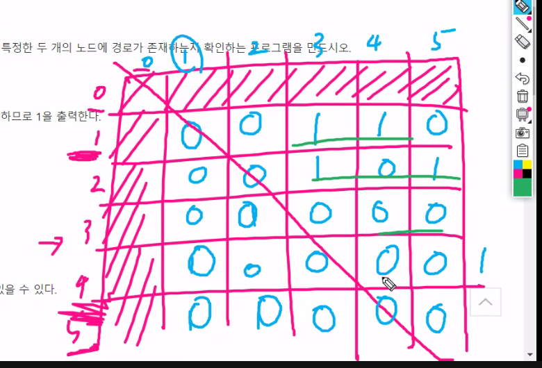

갈수 있는 방향을 체크

1차원 visited로 방문 체크


stack안이 현재 어케 생겼는지 못확인하나???
