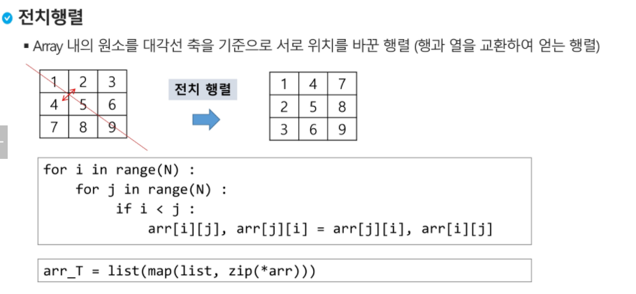

# 오답노트

### 0209 P - babygin
### 0214 H - snail
### 


### counting sort

```python
def counting_sort(input_arr, k):
    """
    input_arr : 입력 배열(1 to k)
    counting_arr : 카운트 배열
    k는 데이터의 개수가 아닌 데이터 원소의 범위
    """

    counting_arr = [0] * (k+1)
    
    # 1. counting array에 arr내 원소의 빈도수 담기

    for i in input_arr:
    	counting_arr[i] += 1
    
    # 2. 누적(counting_arr 업데이트)
    for i in range(1, len(counting_arr)):
        counting_arr[i] += counting_arr[i - 1]

    # 3. result_arr 생성
    result_arr = [-1] * len(input_arr)

    # 4. result_arr에 정렬하기(counting_arr를 참조)

    for i in input_arr:
    	counting_arr[i] -= 1 ##빼는게 먼저여야 result_arr에 배치해줄때 오류 발생x
    	result_arr[counting_arr[i]] = i

    return result_arr


a = [0, 4, 1, 3, 1, 2, 4, 1]

print(counting_sort(a, 5)) # [0, 1, 1, 1, 2, 3, 4, 4]
```


### 비트연산

```python
arr = [3,6,7,1,5,4]
n = len(arr) #n:원소의 개수
for i in range(1<<n): #000000~111111 #부분집합의 개수
    for j in range(n): #원소의 수만큼 비트를 비교
        if i & (1<<j): #i의 j번 비트가 1인 경우
            print(arr[j], end=",") #j번 원소 출력
    print()
```


### 선택정렬

```python
def selectionSort(a,N):
    for i in range(N-1): #i는 0에서 N-2까지  
        minidx = i
        for j in range(i+1,N): #j는 i자기자신 제외하고 N-1까지 비교해주면
            if a[minidx]>a[j]:
                mindix=j
        a[i],a[mindix] = a[mindix],a[i] #N번째는 자동으로 가장 큰 수 
        
        
        
#k번째로 작은 원소를 찾는 알고리즘
#1번부터 k번째까지 작은 원소들을 찾아 배열의 앞쪽으로 이동시키고, 배열의 k번째를 반환
def select(arr, k):
    for i in range(0,k): #0에서 k-1까지 비교하므로 오름차순으로 정렬되기 때문에
        minidx = i
        for j in range(i+1, len(arr)):
            if arr[minidx]>arr[j]:
                minidx = j
        arr[i],arr[minidx] = arr[minindex], arr[i]
    return arr[k-1] #k-1번째 값이 k번째로 작은 값이 된다(인덱스조회는 0부터 해주므로)
```


### BruteForce

```python
p = 'is' #찾을 패턴
t = 'This is a book'
M = len(p) #찾을 패턴의 길이
N = len(t) #전체 텍스트의 길이

def BruteForce(p,t):
    i = 0 #t의 인덱스
    j = 0 #p의 인덱스
    while j<M and i<N:#패턴의 인덱스가 패턴의 길이보다 작고, 타겟의 인덱스가 타겟의 길이보다 작은동안
        if t[i] != p[j]:
            i = i-j #타겟의 인덱스는 타겟인덱스 - 패턴인덱스 +1 부터 다시시작하므로
            j = -1 #패턴의 인덱스는 0점에서 다시 시작하도록
        i = i+1 #조사대상 타겟과 패턴인덱스 모두 1 이동
        j = j+1
    	if j==M: #타겟의 인덱스와 타겟의 길이가 같아지면 찾은거임
            return True #검색 성공
        	#j = 0 #만일 테스트 케이스가 여러개라면 다음 대조 대상으로 넘어가기전에 패턴인덱스 초기화 
    else:
    	return -1 #검색 실패
```


### 보이어-무어 : 설명영상 한번더 보기

```python
import sys
sys.stdin = open('input.txt')

def search(pattern, char):
    # 어디까지 동일한 값을 가지고 있는지 확인
    for i in range(len(pattern)-2, -1, -1):
        # 동일한 값이 있다면
        if pattern[i] == char:
            # 확인한 위치까지 이동
            return len(pattern)-i-1
    # 없다면 패턴 길이만큼 이동
    return len(pattern)

def boyer_moore(pattern, target):
    p_len = len(pattern)
    t_len = len(target)
    t_idx = 0
    # 조사 대상은 idx가 전체 길이 - 패턴길이를 넘기 전까지
    while t_idx <= t_len-p_len:
        p_idx = p_len-1
        # 보이어 무어는 뒤에서부터 조사하므로
        # 패턴의 조사 대상이 0보다 큰 동안
        # 즉, 뒤에서부터 처음까지 조사할동ㅇ나 반복
        while p_idx >= 0:
            a = pattern[p_idx]
            b = target[t_idx + p_idx]
            # 만약 두 대상이 현재 같지 않다면
            if a != b:
                # 다음 조사 위치로 이동하기 위한 값 색출
                next = search(pattern, target[t_idx+p_len-1])
                break
            # 아니라면 조사대상 index -= 1
            p_idx -= 1
        # 끝까지 조사했다면
        if p_idx == -1:
            # 매칭
            return 1
        # 아니라면 다음 조사 위치로 이동
        else:
            t_idx += next
    return 0

T = int(input())

for tc in range(1, T+1):
    pattern = input()
    target = input()
    result = boyer_moore(pattern, target)
    print(f'#{tc} {result}')
```


### 전치행렬




---------------------------------------------

# 질문

### 0210 HWS flatten

https://swexpertacademy.com/main/code/problem/problemDetail.do?contestProbId=AV139KOaABgCFAYh

```python
import sys
sys.stdin = open('input.txt')

for tc in range(1, 11):
    dump = int(input())
    boxes = list(map(int, input().split()))

    # 높이 카운트 -> 100이라는 높이를 이용할 것이므로 101
    h_cnt = [0] * 101
    # 최소, 최대 비교 대상 초기화
    min_v = 101
    max_v = 0

    # 박스의 높이를 카운트 하면서(h_cnt) 최고점과 최저점을 찾기
    for i in range(100):
        # boxes의 i번째가 1이라면
        # box의 높이가 1 -> 높이가 1인 박스의 수 1 증가
        h_cnt[boxes[i]] += 1
        # 최대, 최소 값 갱신
        if boxes[i] > max_v:
            max_v = boxes[i]
        if boxes[i] < min_v:
            min_v = boxes[i]

    # 덤프 횟수가 다했거나
    # 덤프 횟수는 남았지만 (최대 - 최소) 크기 차이가 1 이상인경우
    while dump > 0 and max_v - min_v > 1:
        # 평탄화를 한다 == 제일 높은 곳에서 제일 낮은 곳으로 박스를 하나 옮긴다.
        # 박스 높이가 1이었던 박스가 하나 적어진다
        # 박스 높이가 2인 박스가 하나 증가한다
        h_cnt[min_v] -= 1
        h_cnt[min_v+1] += 1

        # 박스 높이가 100이었던 박스가 하나 적어진다.
        # 박스 높이가 99인 박스가 하나 증가한다
        h_cnt[max_v] -= 1
        h_cnt[max_v-1] += 1

        # 지금 조사중인 제일 작은 박스가 더 이상 안남았다면
        # 다음 작은 박스로 조사 대사 이동
        if h_cnt[min_v] == 0:
            min_v += 1

        # 위와 동일
        if h_cnt[max_v] == 0:
            max_v -= 1

        # 한 번 덤프
        dump -= 1

    result = max_v - min_v
    print(f'#{tc} {result}')
```


### 0215 P 부분집합의 합

https://swexpertacademy.com/main/learn/course/lectureProblemViewer.do

```python
import sys
sys.stdin = open('input.txt')

def dfs(idx, arr):
    global result
    # 전체를 돌았을 때
    if idx == 12:
        # 해당 경우의 수의 요소 개수가 r개와 같다면
        if len(arr) == N and sum(arr) == K:
            result += 1
        return
    # 자기 자신을 포함시킬 경우
    arr.append(nums[idx])
    dfs(idx+1, arr)
    # 자기 자신을 포함시키지 않을 경우
    arr.pop()
    dfs(idx+1, arr)

T = int(input())

for tc in range(1, T+1):
    # 만들 조합의 수 N
    # 모든 수의 합 K
    N, K = map(int, input().split())

    # 숫자 목록
    nums = list(range(1, 13))
    result = 0
    dfs(0, [])
    print(result)
```


### 0215 P 특별한정렬

```PYTHON
def bubble_sort():
    for x in range(N):
        for y in range(N-1, x, -1):
            if x % 2:
                if arr[x] > arr[y]:
                    arr[x], arr[y] = arr[y], arr[x]
            else:
                if arr[x] < arr[y]:
                    arr[x], arr[y] = arr[y], arr[x]
                    
'''
#1 10 1 9 2 8 3 7 4 6 5
#2 89 8 85 11 67 16 60 28 49 39
#3 98 3 97 9 88 17 75 18 71 21'''

def bubble_sort():
    for x in range(N-1,0,-1):
        for y in range(x):
            if x % 2:
                if arr[x] > arr[y]:
                    arr[x], arr[y] = arr[y], arr[x]
            else:
                if arr[x] < arr[y]:
                    arr[x], arr[y] = arr[y], arr[x]
                    
'''
#1 6 5 7 4 8 3 9 2 10 1
#2 49 39 60 28 67 16 85 11 89 8
#3 59 46 60 43 62 36 64 30 69 26

'''
#두개가 뭔차이일까
```


### kmp

교수님이 올려주신 kmp 코드 에스크 싸피 연관해서 질문드리기..ㅜ


### 전기버스, 회문 2 꼭 안보고 풀어보기


### 파이참 

idea 파일이 있고 없고는 무슨 차이일까??
